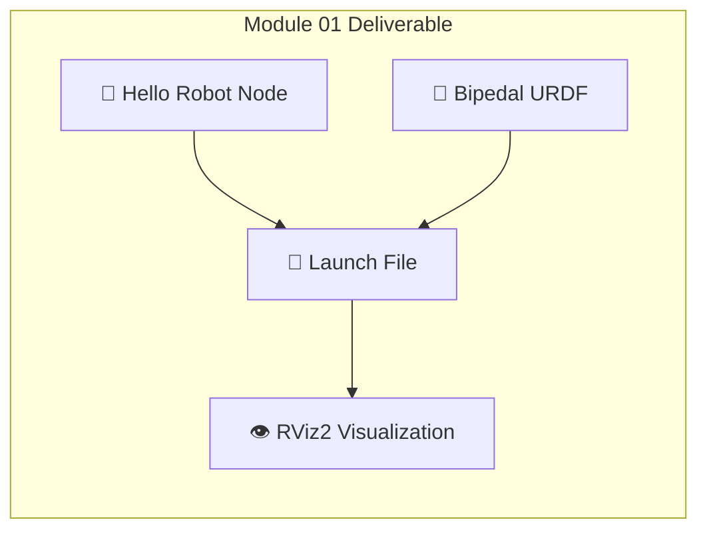

# Module 01 Deliverable: Hello Robot

Congratulations on completing the ROS 2 fundamentals! Now it's time to put everything together into a working system. In this hands-on chapter, you'll create:

1. ✅ A functional ROS 2 Python node
2. ✅ A bipedal URDF robot model
3. ✅ A launch file to bring it all together



---

## 📁 Project Setup

### Create the Package

```bash
# Navigate to your workspace
cd ~/ros2_ws/src

# Create the package with dependencies
ros2 pkg create --build-type ament_python hello_robot \
  --dependencies rclpy std_msgs geometry_msgs sensor_msgs

# Create additional directories
cd hello_robot
mkdir -p urdf launch rviz
```

### Final Package Structure

```
hello_robot/
├── hello_robot/
│   ├── __init__.py
│   └── hello_robot_node.py
├── urdf/
│   └── simple_biped.urdf
├── launch/
│   └── display.launch.py
├── rviz/
│   └── config.rviz
├── resource/
│   └── hello_robot
├── test/
├── package.xml
└── setup.py
```

---

## 🐍 Part 1: The Hello Robot Node

Create the main node that will control your robot.

### hello_robot/hello_robot_node.py

```python
#!/usr/bin/env python3
"""
Hello Robot Node - Your first humanoid controller!

This node demonstrates:
- Publishing joint states
- Subscribing to commands  
- Basic robot control loop
"""

import rclpy
from rclpy.node import Node
from sensor_msgs.msg import JointState
from std_msgs.msg import String
from geometry_msgs.msg import Twist
import math


class HelloRobotNode(Node):
    """A simple humanoid robot controller node."""
    
    def __init__(self):
        super().__init__('hello_robot')
        
        # ============ Parameters ============
        self.declare_parameter('robot_name', 'SimpleBiped')
        self.declare_parameter('publish_rate', 50.0)
        
        self.robot_name = self.get_parameter('robot_name').value
        self.rate = self.get_parameter('publish_rate').value
        
        # ============ Publishers ============
        # Publish joint states for RViz visualization
        self.joint_pub = self.create_publisher(
            JointState, 
            'joint_states', 
            10
        )
        
        # Publish robot status
        self.status_pub = self.create_publisher(
            String,
            'robot_status',
            10
        )
        
        # ============ Subscribers ============
        # Listen for velocity commands
        self.cmd_sub = self.create_subscription(
            Twist,
            'cmd_vel',
            self.cmd_callback,
            10
        )
        
        # Listen for text commands
        self.text_sub = self.create_subscription(
            String,
            'text_command',
            self.text_callback,
            10
        )
        
        # ============ State Variables ============
        self.joint_names = [
            'neck_joint',
            'left_hip_yaw', 'left_hip_pitch', 'left_knee', 'left_ankle',
            'right_hip_yaw', 'right_hip_pitch', 'right_knee', 'right_ankle'
        ]
        self.joint_positions = [0.0] * len(self.joint_names)
        self.joint_velocities = [0.0] * len(self.joint_names)
        
        self.time = 0.0
        self.walking = False
        self.walk_speed = 1.0
        
        # ============ Timer ============
        self.timer = self.create_timer(
            1.0 / self.rate, 
            self.control_loop
        )
        
        # ============ Startup ============
        self.get_logger().info(f'🤖 {self.robot_name} initialized!')
        self.get_logger().info(f'   Publishing joint states at {self.rate} Hz')
        self.get_logger().info(f'   Listening for commands on /cmd_vel and /text_command')
        
        self.publish_status('READY')
    
    def control_loop(self):
        """Main control loop - runs at publish_rate Hz."""
        self.time += 1.0 / self.rate
        
        if self.walking:
            self.update_walking_motion()
        
        self.publish_joint_states()
    
    def update_walking_motion(self):
        """Generate a simple walking gait pattern."""
        t = self.time * self.walk_speed
        
        # Simple sinusoidal walking pattern
        # Left leg
        self.joint_positions[2] = 0.3 * math.sin(t)  # left_hip_pitch
        self.joint_positions[3] = 0.6 * (1 - math.cos(t)) / 2  # left_knee
        self.joint_positions[4] = 0.2 * math.sin(t)  # left_ankle
        
        # Right leg (opposite phase)
        self.joint_positions[6] = 0.3 * math.sin(t + math.pi)  # right_hip_pitch
        self.joint_positions[7] = 0.6 * (1 - math.cos(t + math.pi)) / 2  # right_knee
        self.joint_positions[8] = 0.2 * math.sin(t + math.pi)  # right_ankle
        
        # Subtle head movement
        self.joint_positions[0] = 0.1 * math.sin(t * 0.5)  # neck
    
    def publish_joint_states(self):
        """Publish current joint states for visualization."""
        msg = JointState()
        msg.header.stamp = self.get_clock().now().to_msg()
        msg.name = self.joint_names
        msg.position = self.joint_positions
        msg.velocity = self.joint_velocities
        msg.effort = [0.0] * len(self.joint_names)
        
        self.joint_pub.publish(msg)
    
    def publish_status(self, status: str):
        """Publish robot status."""
        msg = String()
        msg.data = f'[{self.robot_name}] {status}'
        self.status_pub.publish(msg)
        self.get_logger().info(f'Status: {status}')
    
    def cmd_callback(self, msg: Twist):
        """Handle velocity commands."""
        linear = msg.linear.x
        angular = msg.angular.z
        
        if abs(linear) > 0.1:
            self.walking = True
            self.walk_speed = abs(linear) * 2.0
            self.publish_status(f'WALKING (speed: {self.walk_speed:.1f})')
        else:
            self.walking = False
            self.reset_pose()
            self.publish_status('STOPPED')
    
    def text_callback(self, msg: String):
        """Handle text commands."""
        command = msg.data.lower().strip()
        
        self.get_logger().info(f'Received command: "{command}"')
        
        if command == 'walk':
            self.walking = True
            self.publish_status('WALKING')
        elif command == 'stop':
            self.walking = False
            self.reset_pose()
            self.publish_status('STOPPED')
        elif command == 'wave':
            self.get_logger().info('👋 Waving!')
            self.publish_status('WAVING')
        elif command == 'hello':
            self.get_logger().info('🤖 Hello, Human!')
            self.publish_status('GREETING')
        else:
            self.get_logger().warn(f'Unknown command: {command}')
    
    def reset_pose(self):
        """Reset to neutral standing pose."""
        self.joint_positions = [0.0] * len(self.joint_names)


def main(args=None):
    """Entry point."""
    rclpy.init(args=args)
    
    node = HelloRobotNode()
    
    try:
        rclpy.spin(node)
    except KeyboardInterrupt:
        node.get_logger().info('Shutting down...')
    finally:
        node.destroy_node()
        rclpy.shutdown()


if __name__ == '__main__':
    main()
```

---

## 🤖 Part 2: The Bipedal URDF

Save the complete bipedal URDF from the previous chapter to `urdf/simple_biped.urdf`.

:::tip Quick Reference
The URDF includes:
- **9 joints**: neck, 4 per leg (hip_yaw, hip_pitch, knee, ankle)
- **11 links**: base, torso, head, and leg segments
- **Proper inertial properties** for physics simulation
:::

---

## 🚀 Part 3: The Launch File

### launch/display.launch.py

```python
#!/usr/bin/env python3
"""Launch file for Hello Robot visualization."""

import os
from ament_index_python.packages import get_package_share_directory
from launch import LaunchDescription
from launch.actions import DeclareLaunchArgument
from launch.substitutions import LaunchConfiguration, Command
from launch_ros.actions import Node
from launch_ros.parameter_descriptions import ParameterValue


def generate_launch_description():
    """Generate the launch description."""
    
    # Get package directory
    pkg_dir = get_package_share_directory('hello_robot')
    
    # URDF file path
    urdf_file = os.path.join(pkg_dir, 'urdf', 'simple_biped.urdf')
    
    # Read URDF content
    with open(urdf_file, 'r') as file:
        robot_description = file.read()
    
    # Declare launch arguments
    use_sim_time = DeclareLaunchArgument(
        'use_sim_time',
        default_value='false',
        description='Use simulation time'
    )
    
    # Robot State Publisher - publishes TF transforms
    robot_state_publisher = Node(
        package='robot_state_publisher',
        executable='robot_state_publisher',
        name='robot_state_publisher',
        parameters=[{
            'robot_description': robot_description,
            'use_sim_time': LaunchConfiguration('use_sim_time')
        }],
        output='screen'
    )
    
    # Joint State Publisher GUI - interactive joint control
    joint_state_publisher_gui = Node(
        package='joint_state_publisher_gui',
        executable='joint_state_publisher_gui',
        name='joint_state_publisher_gui',
        output='screen'
    )
    
    # Hello Robot Node - our custom controller
    hello_robot_node = Node(
        package='hello_robot',
        executable='hello_robot_node',
        name='hello_robot',
        parameters=[{
            'robot_name': 'SimpleBiped',
            'publish_rate': 50.0
        }],
        output='screen'
    )
    
    # RViz2 - visualization
    rviz_config = os.path.join(pkg_dir, 'rviz', 'config.rviz')
    rviz = Node(
        package='rviz2',
        executable='rviz2',
        name='rviz2',
        arguments=['-d', rviz_config] if os.path.exists(rviz_config) else [],
        output='screen'
    )
    
    return LaunchDescription([
        use_sim_time,
        robot_state_publisher,
        # Uncomment ONE of the following:
        joint_state_publisher_gui,  # For manual joint control
        # hello_robot_node,         # For programmatic control
        rviz,
    ])
```

---

## 📦 Part 4: Package Configuration

### setup.py

```python
from setuptools import setup
import os
from glob import glob

package_name = 'hello_robot'

setup(
    name=package_name,
    version='0.1.0',
    packages=[package_name],
    data_files=[
        ('share/ament_index/resource_index/packages',
            ['resource/' + package_name]),
        ('share/' + package_name, ['package.xml']),
        # Include launch files
        (os.path.join('share', package_name, 'launch'), 
            glob('launch/*.py')),
        # Include URDF files
        (os.path.join('share', package_name, 'urdf'), 
            glob('urdf/*.urdf')),
        # Include RViz config
        (os.path.join('share', package_name, 'rviz'), 
            glob('rviz/*.rviz')),
    ],
    install_requires=['setuptools'],
    zip_safe=True,
    maintainer='Your Name',
    maintainer_email='you@example.com',
    description='Hello Robot - First humanoid controller',
    license='Apache License 2.0',
    tests_require=['pytest'],
    entry_points={
        'console_scripts': [
            'hello_robot_node = hello_robot.hello_robot_node:main',
        ],
    },
)
```

### package.xml

```xml
<?xml version="1.0"?>
<?xml-model href="http://download.ros.org/schema/package_format3.xsd" schematypens="http://www.w3.org/2001/XMLSchema"?>
<package format="3">
  <name>hello_robot</name>
  <version>0.1.0</version>
  <description>Hello Robot - First humanoid controller</description>
  <maintainer email="you@example.com">Your Name</maintainer>
  <license>Apache License 2.0</license>

  <depend>rclpy</depend>
  <depend>std_msgs</depend>
  <depend>geometry_msgs</depend>
  <depend>sensor_msgs</depend>
  <depend>robot_state_publisher</depend>
  <depend>joint_state_publisher_gui</depend>
  <depend>rviz2</depend>

  <test_depend>ament_copyright</test_depend>
  <test_depend>ament_flake8</test_depend>
  <test_depend>ament_pep257</test_depend>
  <test_depend>python3-pytest</test_depend>

  <export>
    <build_type>ament_python</build_type>
  </export>
</package>
```

---

## 🏗️ Build and Run

### Build the Package

```bash
# Build the workspace
cd ~/ros2_ws
colcon build --packages-select hello_robot

# Source the workspace
source install/setup.bash
```

### Launch the System

```bash
# Launch with joint control GUI
ros2 launch hello_robot display.launch.py
```

### Test Commands

Open a new terminal and try these commands:

```bash
# Source workspace first
source ~/ros2_ws/install/setup.bash

# Send text commands
ros2 topic pub --once /text_command std_msgs/String "data: 'walk'"
ros2 topic pub --once /text_command std_msgs/String "data: 'stop'"
ros2 topic pub --once /text_command std_msgs/String "data: 'hello'"

# Send velocity command
ros2 topic pub --once /cmd_vel geometry_msgs/Twist "{linear: {x: 0.5}}"

# Check robot status
ros2 topic echo /robot_status
```

---

## ✅ Verification Checklist

Use this checklist to verify your deliverable is complete:

| Item | Command | Expected Result |
|------|---------|-----------------|
| Package builds | `colcon build` | No errors |
| Node runs | `ros2 run hello_robot hello_robot_node` | "initialized!" message |
| URDF loads | Launch file | Robot visible in RViz |
| Joints move | Joint State Publisher GUI | Sliders control robot |
| Topics work | `ros2 topic list` | See `/joint_states`, `/robot_status` |
| Commands work | Publish to `/text_command` | Robot responds |

---

## 🎉 Congratulations!

You've completed **Module 01: The Robotic Nervous System**! You now have:

- ✅ Understanding of ROS 2 architecture
- ✅ Python skills with `rclpy`
- ✅ Knowledge of URDF structure
- ✅ A working robot visualization


:::info Next Module
Ready to simulate your robot in realistic environments?

**[Continue to Module 02: The Digital Twin →](../digital-twin/)**
:::
