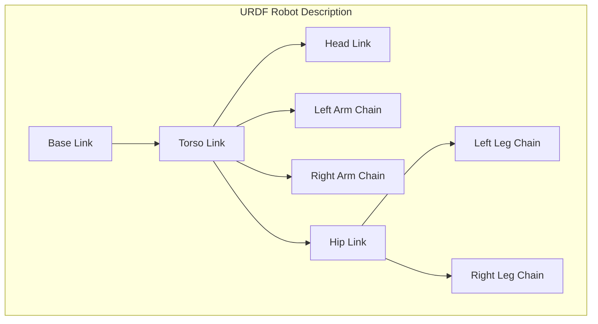
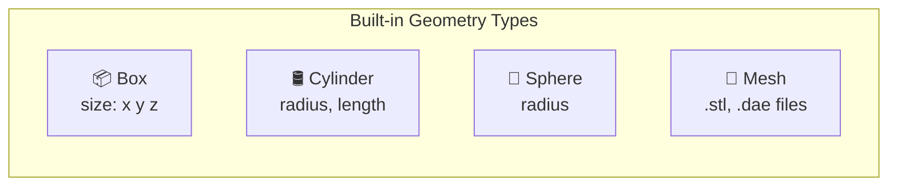
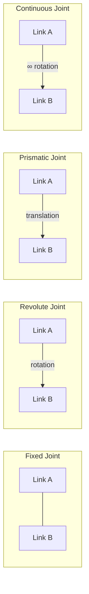
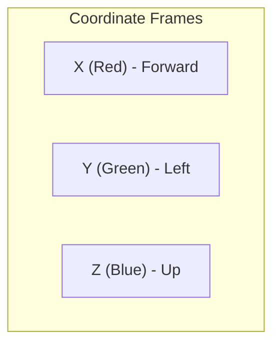
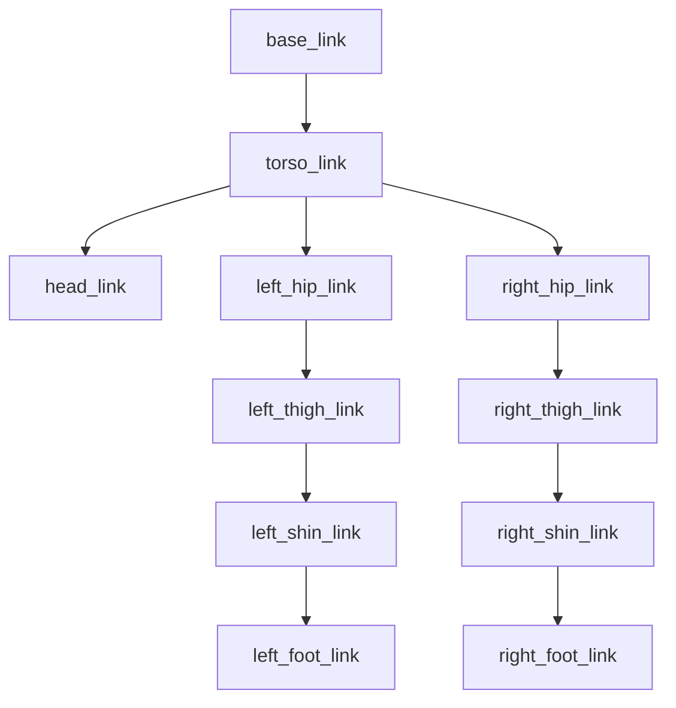

# Anatomy of a Humanoid: URDF Deep Dive

The **Unified Robot Description Format (URDF)** is an XML specification that describes a robot's physical structure. Think of it as the blueprint that defines every bone, joint, and sensor of your humanoid robot.



## 🦴 Links: The Bones of Your Robot

A **Link** represents a rigid body in your robot. Each link has three key properties:

### Link Properties

| Property | Description | Purpose |
|----------|-------------|---------|
| **Visual** | 3D mesh or primitive shape | How the robot looks in visualization |
| **Collision** | Simplified geometry | Physics simulation and collision detection |
| **Inertial** | Mass and moment of inertia | Dynamics simulation |

### Link Definition Structure

```xml
<link name="torso_link">
  <!-- Visual: What you see in RViz -->
  <visual>
    <origin xyz="0 0 0" rpy="0 0 0"/>
    <geometry>
      <box size="0.3 0.2 0.5"/>
    </geometry>
    <material name="blue">
      <color rgba="0.2 0.4 0.8 1.0"/>
    </material>
  </visual>
  
  <!-- Collision: For physics simulation -->
  <collision>
    <origin xyz="0 0 0" rpy="0 0 0"/>
    <geometry>
      <box size="0.3 0.2 0.5"/>
    </geometry>
  </collision>
  
  <!-- Inertial: Mass and inertia tensor -->
  <inertial>
    <origin xyz="0 0 0" rpy="0 0 0"/>
    <mass value="10.0"/>
    <inertia ixx="0.1" ixy="0.0" ixz="0.0"
             iyy="0.1" iyz="0.0"
             izz="0.1"/>
  </inertial>
</link>
```

### Geometry Primitives



```xml
<!-- Box: Great for torsos, feet -->
<geometry>
  <box size="0.3 0.2 0.5"/>
</geometry>

<!-- Cylinder: Arms, legs, fingers -->
<geometry>
  <cylinder radius="0.05" length="0.4"/>
</geometry>

<!-- Sphere: Head, joints -->
<geometry>
  <sphere radius="0.15"/>
</geometry>

<!-- Mesh: Custom detailed models -->
<geometry>
  <mesh filename="package://my_robot/meshes/hand.stl" scale="1 1 1"/>
</geometry>
```

:::tip Collision Simplification
Use **simplified collision geometry** for faster physics simulation:
- Visual: Detailed mesh with 10,000 triangles
- Collision: Simple box or cylinder approximation
:::

---

## 🔗 Joints: Connecting the Links

**Joints** define the kinematic relationships between links—how they move relative to each other.

### Joint Types



| Joint Type | Motion | Limits | Use Case |
|------------|--------|--------|----------|
| **fixed** | None | N/A | Sensor mounts, rigid connections |
| **revolute** | Rotation | Yes | Elbows, knees, fingers |
| **continuous** | Rotation | No | Wheels, wrists |
| **prismatic** | Translation | Yes | Linear actuators, grippers |
| **floating** | 6-DOF | No | Free-floating base |
| **planar** | 2D | No | XY movement |

### Joint Definition

```xml
<joint name="shoulder_pitch_joint" type="revolute">
  <!-- Parent and child links -->
  <parent link="torso_link"/>
  <child link="upper_arm_link"/>
  
  <!-- Joint position relative to parent -->
  <origin xyz="0.15 0 0.2" rpy="0 0 0"/>
  
  <!-- Axis of rotation -->
  <axis xyz="0 1 0"/>
  
  <!-- Motion limits (for revolute/prismatic) -->
  <limit lower="-1.57" upper="1.57" 
         effort="100" velocity="1.0"/>
  
  <!-- Dynamics (optional) -->
  <dynamics damping="0.5" friction="0.1"/>
</joint>
```

### Understanding Origins and Axes



:::danger Common URDF Mistakes
1. **Incorrect axis direction** — Double-check your joint axes
2. **Missing inertia** — Required for Gazebo simulation
3. **Zero mass** — Causes physics instability
4. **Self-collision** — Links intersecting at rest pose
:::

---

## 🤖 Building a Bipedal Humanoid

Let's build a minimal bipedal robot step by step.

### Kinematic Chain



### Complete Bipedal URDF

```xml
<?xml version="1.0"?>
<robot name="simple_biped">
  
  <!-- ============ BASE LINK ============ -->
  <link name="base_link">
    <visual>
      <geometry>
        <box size="0.01 0.01 0.01"/>
      </geometry>
    </visual>
  </link>

  <!-- ============ TORSO ============ -->
  <link name="torso_link">
    <visual>
      <origin xyz="0 0 0" rpy="0 0 0"/>
      <geometry>
        <box size="0.25 0.35 0.4"/>
      </geometry>
      <material name="blue">
        <color rgba="0.2 0.4 0.8 1.0"/>
      </material>
    </visual>
    <collision>
      <geometry>
        <box size="0.25 0.35 0.4"/>
      </geometry>
    </collision>
    <inertial>
      <mass value="15.0"/>
      <inertia ixx="0.5" ixy="0" ixz="0" 
               iyy="0.5" iyz="0" izz="0.3"/>
    </inertial>
  </link>
  
  <joint name="base_to_torso" type="fixed">
    <parent link="base_link"/>
    <child link="torso_link"/>
    <origin xyz="0 0 0.9" rpy="0 0 0"/>
  </joint>

  <!-- ============ HEAD ============ -->
  <link name="head_link">
    <visual>
      <geometry>
        <sphere radius="0.12"/>
      </geometry>
      <material name="gray">
        <color rgba="0.7 0.7 0.7 1.0"/>
      </material>
    </visual>
    <collision>
      <geometry>
        <sphere radius="0.12"/>
      </geometry>
    </collision>
    <inertial>
      <mass value="3.0"/>
      <inertia ixx="0.02" ixy="0" ixz="0" 
               iyy="0.02" iyz="0" izz="0.02"/>
    </inertial>
  </link>
  
  <joint name="neck_joint" type="revolute">
    <parent link="torso_link"/>
    <child link="head_link"/>
    <origin xyz="0 0 0.3" rpy="0 0 0"/>
    <axis xyz="0 0 1"/>
    <limit lower="-1.0" upper="1.0" effort="10" velocity="0.5"/>
  </joint>

  <!-- ============ LEFT LEG ============ -->
  <!-- Left Hip -->
  <link name="left_hip_link">
    <visual>
      <geometry>
        <sphere radius="0.06"/>
      </geometry>
      <material name="gray"/>
    </visual>
    <inertial>
      <mass value="1.0"/>
      <inertia ixx="0.01" ixy="0" ixz="0" 
               iyy="0.01" iyz="0" izz="0.01"/>
    </inertial>
  </link>
  
  <joint name="left_hip_yaw" type="revolute">
    <parent link="torso_link"/>
    <child link="left_hip_link"/>
    <origin xyz="0 0.12 -0.2" rpy="0 0 0"/>
    <axis xyz="0 0 1"/>
    <limit lower="-0.5" upper="0.5" effort="50" velocity="1.0"/>
  </joint>

  <!-- Left Thigh -->
  <link name="left_thigh_link">
    <visual>
      <origin xyz="0 0 -0.2" rpy="0 0 0"/>
      <geometry>
        <cylinder radius="0.05" length="0.4"/>
      </geometry>
      <material name="blue"/>
    </visual>
    <collision>
      <origin xyz="0 0 -0.2" rpy="0 0 0"/>
      <geometry>
        <cylinder radius="0.05" length="0.4"/>
      </geometry>
    </collision>
    <inertial>
      <mass value="5.0"/>
      <inertia ixx="0.1" ixy="0" ixz="0" 
               iyy="0.1" iyz="0" izz="0.02"/>
    </inertial>
  </link>
  
  <joint name="left_hip_pitch" type="revolute">
    <parent link="left_hip_link"/>
    <child link="left_thigh_link"/>
    <origin xyz="0 0 0" rpy="0 0 0"/>
    <axis xyz="0 1 0"/>
    <limit lower="-1.57" upper="0.5" effort="100" velocity="1.0"/>
  </joint>

  <!-- Left Shin -->
  <link name="left_shin_link">
    <visual>
      <origin xyz="0 0 -0.2" rpy="0 0 0"/>
      <geometry>
        <cylinder radius="0.04" length="0.4"/>
      </geometry>
      <material name="blue"/>
    </visual>
    <collision>
      <origin xyz="0 0 -0.2" rpy="0 0 0"/>
      <geometry>
        <cylinder radius="0.04" length="0.4"/>
      </geometry>
    </collision>
    <inertial>
      <mass value="3.0"/>
      <inertia ixx="0.05" ixy="0" ixz="0" 
               iyy="0.05" iyz="0" izz="0.01"/>
    </inertial>
  </link>
  
  <joint name="left_knee" type="revolute">
    <parent link="left_thigh_link"/>
    <child link="left_shin_link"/>
    <origin xyz="0 0 -0.4" rpy="0 0 0"/>
    <axis xyz="0 1 0"/>
    <limit lower="0" upper="2.5" effort="80" velocity="1.0"/>
  </joint>

  <!-- Left Foot -->
  <link name="left_foot_link">
    <visual>
      <origin xyz="0.05 0 0" rpy="0 0 0"/>
      <geometry>
        <box size="0.2 0.1 0.05"/>
      </geometry>
      <material name="gray"/>
    </visual>
    <collision>
      <origin xyz="0.05 0 0" rpy="0 0 0"/>
      <geometry>
        <box size="0.2 0.1 0.05"/>
      </geometry>
    </collision>
    <inertial>
      <mass value="1.5"/>
      <inertia ixx="0.01" ixy="0" ixz="0" 
               iyy="0.01" iyz="0" izz="0.01"/>
    </inertial>
  </link>
  
  <joint name="left_ankle" type="revolute">
    <parent link="left_shin_link"/>
    <child link="left_foot_link"/>
    <origin xyz="0 0 -0.4" rpy="0 0 0"/>
    <axis xyz="0 1 0"/>
    <limit lower="-0.5" upper="0.5" effort="50" velocity="1.0"/>
  </joint>

  <!-- ============ RIGHT LEG (mirror of left) ============ -->
  <link name="right_hip_link">
    <visual>
      <geometry>
        <sphere radius="0.06"/>
      </geometry>
      <material name="gray"/>
    </visual>
    <inertial>
      <mass value="1.0"/>
      <inertia ixx="0.01" ixy="0" ixz="0" 
               iyy="0.01" iyz="0" izz="0.01"/>
    </inertial>
  </link>
  
  <joint name="right_hip_yaw" type="revolute">
    <parent link="torso_link"/>
    <child link="right_hip_link"/>
    <origin xyz="0 -0.12 -0.2" rpy="0 0 0"/>
    <axis xyz="0 0 1"/>
    <limit lower="-0.5" upper="0.5" effort="50" velocity="1.0"/>
  </joint>

  <link name="right_thigh_link">
    <visual>
      <origin xyz="0 0 -0.2" rpy="0 0 0"/>
      <geometry>
        <cylinder radius="0.05" length="0.4"/>
      </geometry>
      <material name="blue"/>
    </visual>
    <collision>
      <origin xyz="0 0 -0.2" rpy="0 0 0"/>
      <geometry>
        <cylinder radius="0.05" length="0.4"/>
      </geometry>
    </collision>
    <inertial>
      <mass value="5.0"/>
      <inertia ixx="0.1" ixy="0" ixz="0" 
               iyy="0.1" iyz="0" izz="0.02"/>
    </inertial>
  </link>
  
  <joint name="right_hip_pitch" type="revolute">
    <parent link="right_hip_link"/>
    <child link="right_thigh_link"/>
    <origin xyz="0 0 0" rpy="0 0 0"/>
    <axis xyz="0 1 0"/>
    <limit lower="-1.57" upper="0.5" effort="100" velocity="1.0"/>
  </joint>

  <link name="right_shin_link">
    <visual>
      <origin xyz="0 0 -0.2" rpy="0 0 0"/>
      <geometry>
        <cylinder radius="0.04" length="0.4"/>
      </geometry>
      <material name="blue"/>
    </visual>
    <collision>
      <origin xyz="0 0 -0.2" rpy="0 0 0"/>
      <geometry>
        <cylinder radius="0.04" length="0.4"/>
      </geometry>
    </collision>
    <inertial>
      <mass value="3.0"/>
      <inertia ixx="0.05" ixy="0" ixz="0" 
               iyy="0.05" iyz="0" izz="0.01"/>
    </inertial>
  </link>
  
  <joint name="right_knee" type="revolute">
    <parent link="right_thigh_link"/>
    <child link="right_shin_link"/>
    <origin xyz="0 0 -0.4" rpy="0 0 0"/>
    <axis xyz="0 1 0"/>
    <limit lower="0" upper="2.5" effort="80" velocity="1.0"/>
  </joint>

  <link name="right_foot_link">
    <visual>
      <origin xyz="0.05 0 0" rpy="0 0 0"/>
      <geometry>
        <box size="0.2 0.1 0.05"/>
      </geometry>
      <material name="gray"/>
    </visual>
    <collision>
      <origin xyz="0.05 0 0" rpy="0 0 0"/>
      <geometry>
        <box size="0.2 0.1 0.05"/>
      </geometry>
    </collision>
    <inertial>
      <mass value="1.5"/>
      <inertia ixx="0.01" ixy="0" ixz="0" 
               iyy="0.01" iyz="0" izz="0.01"/>
    </inertial>
  </link>
  
  <joint name="right_ankle" type="revolute">
    <parent link="right_shin_link"/>
    <child link="right_foot_link"/>
    <origin xyz="0 0 -0.4" rpy="0 0 0"/>
    <axis xyz="0 1 0"/>
    <limit lower="-0.5" upper="0.5" effort="50" velocity="1.0"/>
  </joint>

</robot>
```

---

## 👁️ Visualizing URDF with RViz2

```bash
# Install URDF tools
sudo apt install ros-humble-urdf-tutorial ros-humble-joint-state-publisher-gui

# View your URDF
ros2 launch urdf_tutorial display.launch.py model:=/path/to/your/robot.urdf
```

### What You'll See in RViz2

- **TF frames** at each joint
- **Visual meshes** rendered
- **Interactive joint sliders** to test range of motion

---

## 🧮 Calculating Inertia

For simple shapes, use these formulas:

### Box

```python
# Box inertia (mass m, dimensions a x b x c)
ixx = (1/12) * m * (b**2 + c**2)
iyy = (1/12) * m * (a**2 + c**2)
izz = (1/12) * m * (a**2 + b**2)
```

### Cylinder

```python
# Cylinder inertia (mass m, radius r, height h)
ixx = (1/12) * m * (3*r**2 + h**2)
iyy = (1/12) * m * (3*r**2 + h**2)
izz = (1/2) * m * r**2
```

### Sphere

```python
# Sphere inertia (mass m, radius r)
ixx = iyy = izz = (2/5) * m * r**2
```

---

## 📚 Summary

| Concept | Purpose | Key Elements |
|---------|---------|--------------|
| **Links** | Rigid bodies | visual, collision, inertial |
| **Joints** | Connections | type, axis, limits |
| **Origins** | Positioning | xyz, rpy |
| **Materials** | Appearance | color, texture |

:::info Next Chapter
Now let's put everything together and build your first complete robot system!

**[Continue to Hello Robot Deliverable →](./hello-robot-deliverable)**
:::
