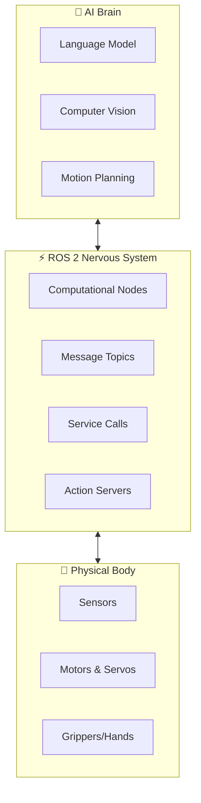
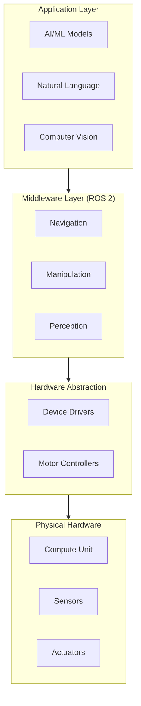

# Module 01: The Robotic Nervous System (ROS 2)

Welcome to the foundational module of your Physical AI journey. Just as the human nervous system coordinates all bodily functions through electrical signals, **ROS 2 (Robot Operating System 2)** serves as the communication backbone that orchestrates every component of a humanoid robot.



## 🎯 Learning Objectives

By the end of this module, you will be able to:

1. **Understand ROS 2 Architecture** — Master the core concepts of Nodes, Topics, Services, and Actions
2. **Bridge Python to Hardware** — Use `rclpy` to connect AI agents with physical robot components
3. **Describe Robot Anatomy** — Create and understand URDF files for humanoid robot description
4. **Build Your First Robot Node** — Complete a functional "Hello Robot" implementation

## 📋 Prerequisites

Before starting this module, ensure you have:

- **Ubuntu 22.04 LTS** (recommended) or Windows with WSL2
- **Python 3.10+** installed
- **ROS 2 Humble** or later installed ([Installation Guide](https://docs.ros.org/en/humble/Installation.html))
- Basic understanding of Python programming
- Familiarity with command-line interfaces

:::tip Quick ROS 2 Installation Check
Run this command to verify your ROS 2 installation:
```bash
ros2 --version
```
You should see output like: `ros2 0.10.x` or similar.
:::

## 🗺️ Module Roadmap

| Chapter | Topic | Duration |
|---------|-------|----------|
| 1.1 | ROS 2 Architecture | 45 min |
| 1.2 | Python Bridging with rclpy | 60 min |
| 1.3 | Anatomy of a Humanoid (URDF) | 75 min |
| 1.4 | Hello Robot Deliverable | 90 min |

## 🔑 Key Concepts Preview

### Why ROS 2?

ROS 2 is not an operating system in the traditional sense—it's a **middleware framework** that provides:

- **Hardware Abstraction** — Write code once, deploy on any robot
- **Inter-Process Communication** — Seamless data flow between components
- **Real-Time Capabilities** — Deterministic behavior for safety-critical applications
- **Multi-Robot Support** — Built-in tools for fleet management
- **Cross-Platform** — Runs on Linux, Windows, and macOS

### The Humanoid Robot Stack



## 🚀 Let's Begin!

Ready to build the nervous system of your humanoid robot? 

**Start with ROS 2 Architecture** (Coming Soon)

---

:::info Module Deliverable
At the end of this module, you will have created:
1. A functional **"Hello Robot"** ROS 2 node in Python
2. A basic **bipedal URDF model** describing a humanoid robot
3. A **launch file** to visualize your robot in RViz2
:::
