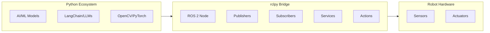

# Python Bridging: Connecting AI Agents with rclpy

The `rclpy` library is ROS 2's official Python client library, enabling you to write robot software in Python. This is particularly powerful for Physical AI applications where you want to integrate machine learning models, LLMs, and other Python-based AI tools with robot hardware.



## 🛠️ Setting Up Your Environment

### Workspace Setup

```bash
# Create a ROS 2 workspace
mkdir -p ~/ros2_ws/src
cd ~/ros2_ws/src

# Create a Python package
ros2 pkg create --build-type ament_python my_humanoid_brain

# Build the workspace
cd ~/ros2_ws
colcon build
source install/setup.bash
```

### Package Structure

```
my_humanoid_brain/
├── my_humanoid_brain/
│   ├── __init__.py
│   ├── simple_node.py
│   ├── sensor_subscriber.py
│   ├── motor_publisher.py
│   └── ai_action_server.py
├── resource/
├── test/
├── package.xml
└── setup.py
```

---

## 📝 Creating Your First Node

### Minimal Node Structure

```python
#!/usr/bin/env python3
"""A minimal ROS 2 node in Python."""

import rclpy
from rclpy.node import Node


class MinimalNode(Node):
    """A simple ROS 2 node that logs a message."""
    
    def __init__(self):
        super().__init__('minimal_node')
        self.get_logger().info('Hello from the minimal node!')
        
        # Create a timer that fires every second
        self.timer = self.create_timer(1.0, self.timer_callback)
        self.counter = 0
    
    def timer_callback(self):
        """Called every second by the timer."""
        self.counter += 1
        self.get_logger().info(f'Timer fired {self.counter} times')


def main(args=None):
    """Entry point for the node."""
    rclpy.init(args=args)
    
    node = MinimalNode()
    
    try:
        rclpy.spin(node)
    except KeyboardInterrupt:
        pass
    finally:
        node.destroy_node()
        rclpy.shutdown()


if __name__ == '__main__':
    main()
```

:::tip Node Lifecycle
1. `rclpy.init()` — Initialize the ROS 2 runtime
2. Create node instance — Set up publishers, subscribers, etc.
3. `rclpy.spin()` — Process callbacks until shutdown
4. `node.destroy_node()` — Clean up resources
5. `rclpy.shutdown()` — Shutdown ROS 2 runtime
:::

---

## 📡 Publishers: Sending Data

Publishers allow your node to broadcast data to topics.

### Publishing Velocity Commands

```python
#!/usr/bin/env python3
"""Publisher node that sends velocity commands."""

import rclpy
from rclpy.node import Node
from geometry_msgs.msg import Twist


class VelocityPublisher(Node):
    """Publishes velocity commands for robot movement."""
    
    def __init__(self):
        super().__init__('velocity_publisher')
        
        # Create publisher for velocity commands
        self.publisher = self.create_publisher(
            Twist,           # Message type
            '/cmd_vel',      # Topic name
            10               # Queue size
        )
        
        # Publish at 10 Hz
        self.timer = self.create_timer(0.1, self.publish_velocity)
        self.get_logger().info('Velocity publisher started')
    
    def publish_velocity(self):
        """Publish a velocity command."""
        msg = Twist()
        msg.linear.x = 0.5   # Forward velocity (m/s)
        msg.linear.y = 0.0
        msg.linear.z = 0.0
        msg.angular.x = 0.0
        msg.angular.y = 0.0
        msg.angular.z = 0.1  # Rotational velocity (rad/s)
        
        self.publisher.publish(msg)
        self.get_logger().debug(f'Published: linear={msg.linear.x}, angular={msg.angular.z}')


def main(args=None):
    rclpy.init(args=args)
    node = VelocityPublisher()
    
    try:
        rclpy.spin(node)
    except KeyboardInterrupt:
        pass
    finally:
        node.destroy_node()
        rclpy.shutdown()


if __name__ == '__main__':
    main()
```

---

## 📥 Subscribers: Receiving Data

Subscribers listen to topics and process incoming messages.

### Subscribing to Sensor Data

```python
#!/usr/bin/env python3
"""Subscriber node that processes LiDAR data."""

import rclpy
from rclpy.node import Node
from sensor_msgs.msg import LaserScan
import numpy as np


class LidarSubscriber(Node):
    """Processes LiDAR scan data for obstacle detection."""
    
    def __init__(self):
        super().__init__('lidar_subscriber')
        
        # Create subscription to LiDAR topic
        self.subscription = self.create_subscription(
            LaserScan,                    # Message type
            '/scan',                      # Topic name
            self.scan_callback,           # Callback function
            10                            # Queue size
        )
        
        self.get_logger().info('LiDAR subscriber started')
    
    def scan_callback(self, msg: LaserScan):
        """Process incoming LiDAR scan."""
        # Convert to numpy array for processing
        ranges = np.array(msg.ranges)
        
        # Filter out invalid readings
        valid_ranges = ranges[np.isfinite(ranges)]
        
        if len(valid_ranges) > 0:
            min_distance = np.min(valid_ranges)
            avg_distance = np.mean(valid_ranges)
            
            self.get_logger().info(
                f'Min distance: {min_distance:.2f}m, '
                f'Avg distance: {avg_distance:.2f}m'
            )
            
            # Obstacle warning
            if min_distance < 0.5:
                self.get_logger().warn('⚠️ Obstacle detected within 0.5m!')


def main(args=None):
    rclpy.init(args=args)
    node = LidarSubscriber()
    
    try:
        rclpy.spin(node)
    except KeyboardInterrupt:
        pass
    finally:
        node.destroy_node()
        rclpy.shutdown()


if __name__ == '__main__':
    main()
```

---

## 🔄 Services: Request/Response Pattern

### Creating a Service Server

```python
#!/usr/bin/env python3
"""Service server for inverse kinematics calculation."""

import rclpy
from rclpy.node import Node
from example_interfaces.srv import AddTwoInts  # Using built-in service type
import math


class IKService(Node):
    """Provides inverse kinematics as a service."""
    
    def __init__(self):
        super().__init__('ik_service')
        
        # Create service server
        self.srv = self.create_service(
            AddTwoInts,              # Service type
            'calculate_ik',          # Service name
            self.calculate_callback  # Handler function
        )
        
        self.get_logger().info('IK Service ready')
    
    def calculate_callback(self, request, response):
        """Handle IK calculation request."""
        # Simplified example - in reality, this would be complex IK math
        response.sum = request.a + request.b
        self.get_logger().info(f'Request: {request.a} + {request.b} = {response.sum}')
        return response


def main(args=None):
    rclpy.init(args=args)
    node = IKService()
    
    try:
        rclpy.spin(node)
    except KeyboardInterrupt:
        pass
    finally:
        node.destroy_node()
        rclpy.shutdown()


if __name__ == '__main__':
    main()
```

### Creating a Service Client

```python
#!/usr/bin/env python3
"""Service client that requests IK calculations."""

import rclpy
from rclpy.node import Node
from example_interfaces.srv import AddTwoInts


class IKClient(Node):
    """Client for inverse kinematics service."""
    
    def __init__(self):
        super().__init__('ik_client')
        
        # Create service client
        self.client = self.create_client(AddTwoInts, 'calculate_ik')
        
        # Wait for service to be available
        while not self.client.wait_for_service(timeout_sec=1.0):
            self.get_logger().info('Waiting for IK service...')
        
        self.get_logger().info('IK Service available!')
    
    def send_request(self, a: int, b: int):
        """Send an IK calculation request."""
        request = AddTwoInts.Request()
        request.a = a
        request.b = b
        
        # Async call
        future = self.client.call_async(request)
        return future


def main(args=None):
    rclpy.init(args=args)
    client = IKClient()
    
    # Send a request
    future = client.send_request(10, 5)
    
    # Wait for response
    rclpy.spin_until_future_complete(client, future)
    
    result = future.result()
    client.get_logger().info(f'IK Result: {result.sum}')
    
    client.destroy_node()
    rclpy.shutdown()


if __name__ == '__main__':
    main()
```

---

## 🎯 Actions: Long-Running Tasks

### Action Server for Navigation

```python
#!/usr/bin/env python3
"""Action server for robot navigation."""

import rclpy
from rclpy.node import Node
from rclpy.action import ActionServer
from example_interfaces.action import Fibonacci  # Using built-in for demo
import time


class NavigationServer(Node):
    """Action server that handles navigation goals."""
    
    def __init__(self):
        super().__init__('navigation_server')
        
        self._action_server = ActionServer(
            self,
            Fibonacci,               # Action type
            'navigate',              # Action name
            self.execute_callback    # Execution handler
        )
        
        self.get_logger().info('Navigation action server ready')
    
    def execute_callback(self, goal_handle):
        """Execute the navigation goal."""
        self.get_logger().info('Executing navigation goal...')
        
        # Get goal parameters
        order = goal_handle.request.order
        
        # Initialize feedback
        feedback_msg = Fibonacci.Feedback()
        feedback_msg.partial_sequence = [0, 1]
        
        # Simulate navigation with progress updates
        for i in range(2, order):
            # Check if goal was canceled
            if goal_handle.is_cancel_requested:
                goal_handle.canceled()
                self.get_logger().info('Navigation canceled')
                return Fibonacci.Result()
            
            # Simulate movement
            time.sleep(0.5)
            
            # Calculate next Fibonacci number (simulating progress)
            feedback_msg.partial_sequence.append(
                feedback_msg.partial_sequence[i - 1] + 
                feedback_msg.partial_sequence[i - 2]
            )
            
            # Publish feedback
            goal_handle.publish_feedback(feedback_msg)
            self.get_logger().info(f'Progress: {i}/{order}')
        
        # Mark goal as succeeded
        goal_handle.succeed()
        
        # Return result
        result = Fibonacci.Result()
        result.sequence = feedback_msg.partial_sequence
        self.get_logger().info('Navigation complete!')
        
        return result


def main(args=None):
    rclpy.init(args=args)
    node = NavigationServer()
    
    try:
        rclpy.spin(node)
    except KeyboardInterrupt:
        pass
    finally:
        node.destroy_node()
        rclpy.shutdown()


if __name__ == '__main__':
    main()
```

---

## 🤖 Integrating AI Models

Here's a pattern for integrating AI models with ROS 2:

```python
#!/usr/bin/env python3
"""AI-powered perception node."""

import rclpy
from rclpy.node import Node
from sensor_msgs.msg import Image
from std_msgs.msg import String
from cv_bridge import CvBridge
import numpy as np


class AIPerceptionNode(Node):
    """Uses AI models for object detection."""
    
    def __init__(self):
        super().__init__('ai_perception')
        
        # Image subscriber
        self.image_sub = self.create_subscription(
            Image, '/camera/image_raw', self.image_callback, 10
        )
        
        # Detection publisher
        self.detection_pub = self.create_publisher(
            String, '/detected_objects', 10
        )
        
        # OpenCV bridge for image conversion
        self.bridge = CvBridge()
        
        # Load your AI model here
        # self.model = load_yolo_model()
        
        self.get_logger().info('AI Perception node started')
    
    def image_callback(self, msg: Image):
        """Process incoming images with AI model."""
        # Convert ROS Image to OpenCV format
        cv_image = self.bridge.imgmsg_to_cv2(msg, 'bgr8')
        
        # Run inference (placeholder)
        # detections = self.model.detect(cv_image)
        detections = ["person", "chair", "table"]  # Placeholder
        
        # Publish detections
        detection_msg = String()
        detection_msg.data = str(detections)
        self.detection_pub.publish(detection_msg)


def main(args=None):
    rclpy.init(args=args)
    node = AIPerceptionNode()
    
    try:
        rclpy.spin(node)
    except KeyboardInterrupt:
        pass
    finally:
        node.destroy_node()
        rclpy.shutdown()


if __name__ == '__main__':
    main()
```

---

## 📦 Package Configuration

### setup.py

```python
from setuptools import setup

package_name = 'my_humanoid_brain'

setup(
    name=package_name,
    version='0.0.1',
    packages=[package_name],
    data_files=[
        ('share/ament_index/resource_index/packages',
            ['resource/' + package_name]),
        ('share/' + package_name, ['package.xml']),
    ],
    install_requires=['setuptools'],
    zip_safe=True,
    maintainer='Your Name',
    maintainer_email='your@email.com',
    description='Physical AI humanoid brain package',
    license='Apache License 2.0',
    tests_require=['pytest'],
    entry_points={
        'console_scripts': [
            'minimal_node = my_humanoid_brain.simple_node:main',
            'velocity_pub = my_humanoid_brain.motor_publisher:main',
            'lidar_sub = my_humanoid_brain.sensor_subscriber:main',
        ],
    },
)
```

---

## 📚 Summary

| Pattern | Use Case | Key Method |
|---------|----------|------------|
| **Publisher** | Stream data out | `create_publisher()` |
| **Subscriber** | Receive data | `create_subscription()` |
| **Service Server** | Handle requests | `create_service()` |
| **Service Client** | Make requests | `create_client()` |
| **Action Server** | Long-running tasks | `ActionServer()` |

:::info Next Chapter
Now that you can communicate with ROS 2 from Python, let's learn how to describe your robot's physical structure!

**[Continue to Humanoid Anatomy (URDF) →](./humanoid-anatomy)**
:::
