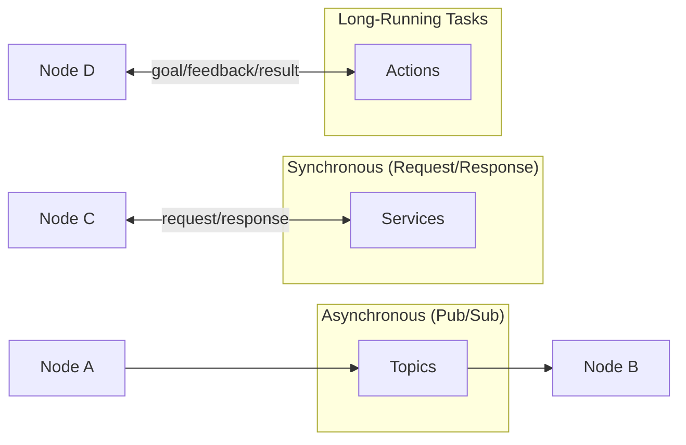
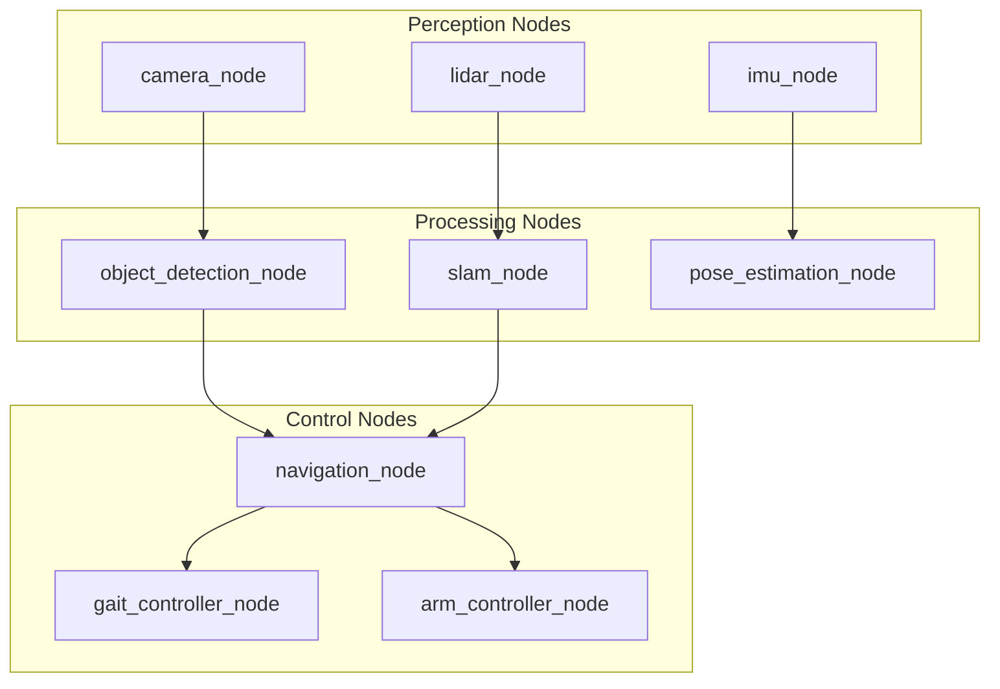
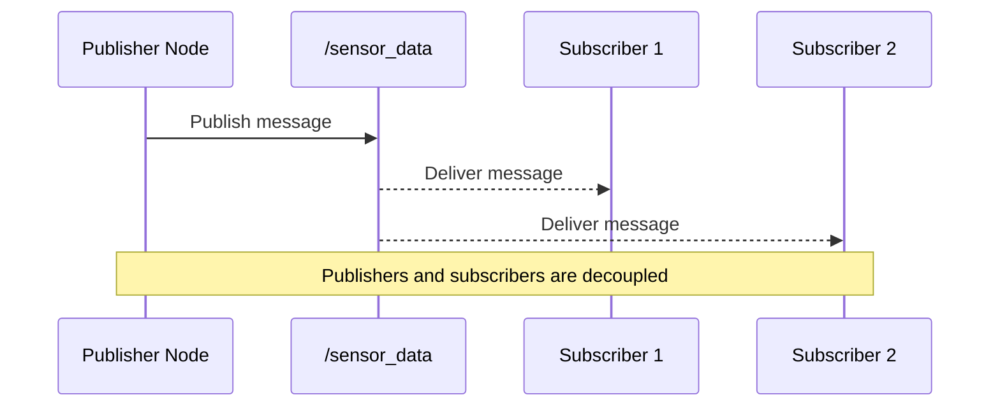
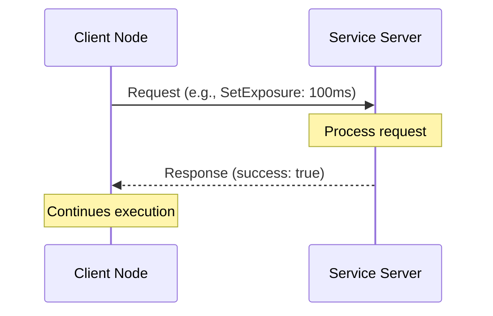
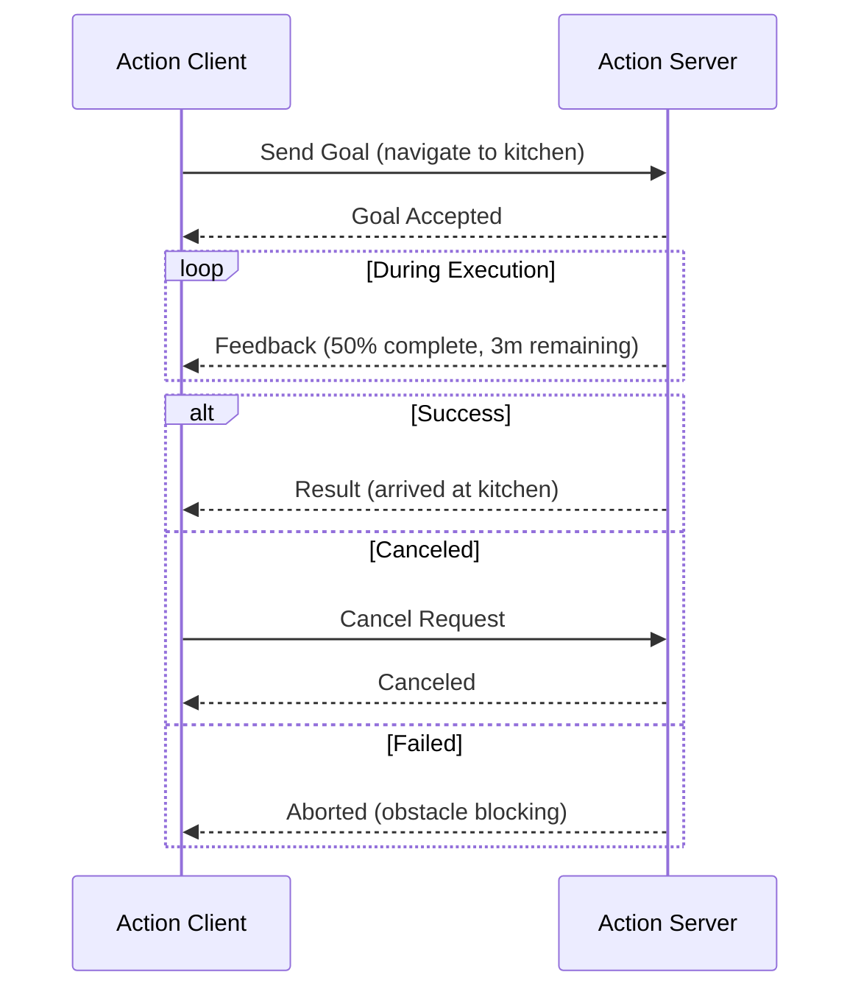
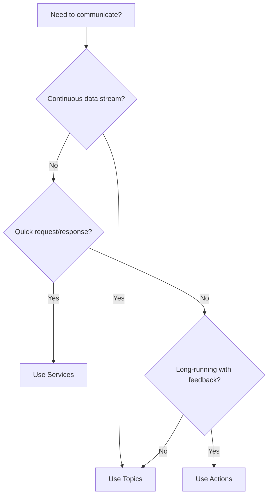

# ROS 2 Architecture: Nodes, Topics, Services, and Actions

The ROS 2 architecture is built on four fundamental communication primitives that enable modular, scalable robot software. Understanding these building blocks is essential for developing Physical AI systems.



## 🧩 Nodes: The Computational Units

A **Node** is the fundamental building block of any ROS 2 system. Each node is a single-purpose process that performs a specific computation.

### Characteristics of Nodes

| Property | Description |
|----------|-------------|
| **Single Responsibility** | Each node should do one thing well |
| **Reusable** | Nodes can be reused across different robots |
| **Replaceable** | Swap implementations without affecting other nodes |
| **Discoverable** | Nodes automatically find each other on the network |

### Example: Humanoid Robot Nodes



### Basic Node Commands

```bash
# List all running nodes
ros2 node list

# Get information about a specific node
ros2 node info /camera_node

# View the computation graph
rqt_graph
```

---

## 📡 Topics: Asynchronous Pub/Sub Communication

**Topics** enable one-to-many asynchronous communication using a publish-subscribe pattern. Nodes publish messages to topics without knowing who will receive them.

### How Topics Work



### Topic Characteristics

- **Anonymous** — Publishers don't know about subscribers (and vice versa)
- **Typed** — Each topic has a specific message type
- **QoS Configurable** — Quality of Service policies for reliability, durability, etc.
- **Many-to-Many** — Multiple publishers and subscribers per topic

### Common Topic Examples

| Topic Name | Message Type | Purpose |
|------------|--------------|---------|
| `/camera/image_raw` | `sensor_msgs/Image` | Raw camera frames |
| `/scan` | `sensor_msgs/LaserScan` | LiDAR distance data |
| `/cmd_vel` | `geometry_msgs/Twist` | Velocity commands |
| `/joint_states` | `sensor_msgs/JointState` | Current joint positions |
| `/tf` | `tf2_msgs/TFMessage` | Coordinate transforms |

### Topic Commands

```bash
# List all active topics
ros2 topic list

# Show topic message type
ros2 topic type /camera/image_raw

# Echo messages from a topic
ros2 topic echo /cmd_vel

# Publish a test message
ros2 topic pub /cmd_vel geometry_msgs/Twist "{linear: {x: 0.5}, angular: {z: 0.1}}"

# Check publishing frequency
ros2 topic hz /camera/image_raw
```

:::tip Quality of Service (QoS)
ROS 2 introduced QoS profiles to handle real-world networking challenges:
- **Reliable** — Guarantees delivery (like TCP)
- **Best Effort** — No guarantees, lower latency (like UDP)
- **Durability** — Late-joining subscribers receive last message
:::

---

## 🔄 Services: Synchronous Request/Response

**Services** provide synchronous, blocking communication for operations that need immediate responses.

### When to Use Services

- Configuration changes (e.g., "set camera exposure")
- One-time queries (e.g., "get robot serial number")
- Short computations (e.g., "calculate inverse kinematics")



### Service Definition Example

```
# SetExposure.srv
---
# Request
int32 exposure_ms
---
# Response
bool success
string message
```

### Service Commands

```bash
# List all available services
ros2 service list

# Get service type
ros2 service type /set_exposure

# Call a service
ros2 service call /set_exposure camera_interfaces/srv/SetExposure "{exposure_ms: 100}"
```

:::danger Service Anti-Patterns
**Never use services for:**
- Continuous data streams (use Topics instead)
- Long-running operations (use Actions instead)
- High-frequency calls (services have overhead)
:::

---

## 🎯 Actions: Long-Running Tasks with Feedback

**Actions** are designed for long-running tasks that need progress feedback and the ability to be canceled.

### Action Components

| Component | Direction | Purpose |
|-----------|-----------|---------|
| **Goal** | Client → Server | What to achieve |
| **Feedback** | Server → Client | Progress updates |
| **Result** | Server → Client | Final outcome |

### Action Flow



### Common Action Examples

| Action | Use Case |
|--------|----------|
| `NavigateToPose` | Move robot to a location |
| `FollowJointTrajectory` | Execute arm movement |
| `Spin` | Rotate robot in place |
| `GripperCommand` | Open/close gripper |

### Action Commands

```bash
# List all action servers
ros2 action list

# Get action type
ros2 action type /navigate_to_pose

# Send an action goal
ros2 action send_goal /navigate_to_pose nav2_msgs/action/NavigateToPose "{pose: {header: {frame_id: 'map'}, pose: {position: {x: 1.0, y: 2.0}}}}"
```

---

## 🔀 Choosing the Right Communication Pattern



### Decision Matrix

| Criteria | Topics | Services | Actions |
|----------|--------|----------|---------|
| **Latency** | Lowest | Low | Higher |
| **Feedback** | ❌ | ❌ | ✅ |
| **Cancelable** | N/A | ❌ | ✅ |
| **Blocking** | ❌ | ✅ | Optional |
| **Many Receivers** | ✅ | ❌ | ❌ |

---

## 🧪 Hands-On Exercise

Let's verify your ROS 2 installation by exploring the demo nodes:

```bash
# Terminal 1: Start the talker node
ros2 run demo_nodes_cpp talker

# Terminal 2: Start the listener node
ros2 run demo_nodes_cpp listener

# Terminal 3: Observe the system
ros2 node list
ros2 topic list
ros2 topic echo /chatter
```

You should see messages flowing from the talker to the listener through the `/chatter` topic.

---

## 📚 Summary

| Concept | Purpose | Pattern |
|---------|---------|---------|
| **Nodes** | Modular computation units | Building blocks |
| **Topics** | Streaming data | Pub/Sub |
| **Services** | Quick requests | Request/Response |
| **Actions** | Long tasks with feedback | Goal/Feedback/Result |

:::info Next Chapter
Now that you understand ROS 2's communication architecture, let's implement these concepts in Python!

**[Continue to Python Bridging →](./python-bridging)**
:::
