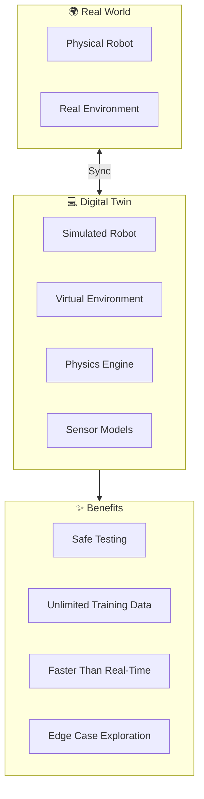
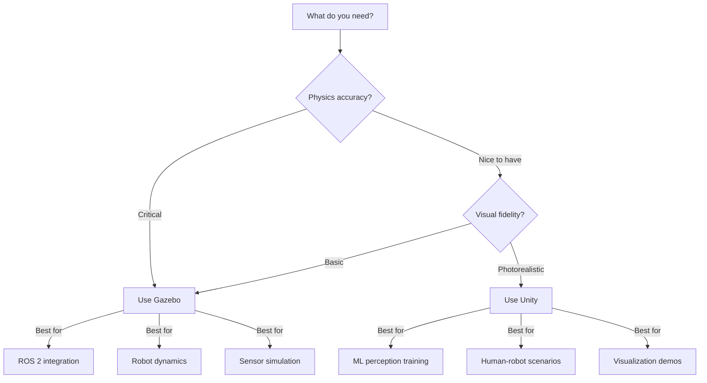
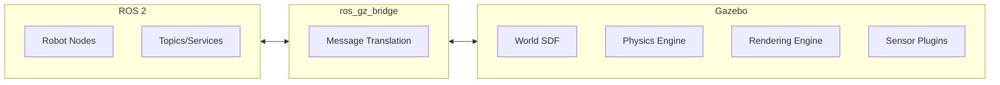

# Module 02: The Digital Twin (Gazebo & Unity)

Welcome to the simulation module! A **Digital Twin** is a virtual replica of your physical robot that allows you to test, train, and validate AI systems in a safe, controlled environment. This module teaches you to build high-fidelity simulations using industry-standard tools.

## 🎯 Learning Objectives

By the end of this module, you will be able to:

1. **Configure Physics Engines** — Set up gravity, friction, and collision in Gazebo
2. **Build Virtual Environments** — Create realistic indoor/outdoor worlds
3. **Simulate Sensors** — Generate synthetic LiDAR, camera, and IMU data
4. **Bridge Sim to Real** — Understand the sim-to-real transfer gap

## 📋 Prerequisites

Before starting this module, ensure you have completed:

- ✅ **Module 01**: ROS 2 fundamentals and URDF creation
- **Gazebo Harmonic** installed ([Installation Guide](https://gazebosim.org/docs/harmonic/install))
- **Unity 2022 LTS** (optional, for high-fidelity rendering)
- At least **16GB RAM** and a **dedicated GPU** recommended

:::tip Hardware Requirements
Simulation is GPU-intensive! For best performance:
- **Minimum**: NVIDIA GTX 1060 / AMD RX 580
- **Recommended**: NVIDIA RTX 3070+ / AMD RX 6800+
- For Unity: DirectX 12 / Vulkan support
:::

## 🗺️ Module Roadmap

| Chapter | Topic | Duration |
|---------|-------|----------|
| 2.1 | [Physics Engines (Gazebo)](./physics-engines) | 60 min |
| 2.2 | [High-Fidelity Rendering (Unity)](./rendering) | 75 min |
| 2.3 | [Sensor Simulation](./sensor-simulation) | 60 min |
| 2.4 | [Simulation Environment Deliverable](./simulation-environment) | 90 min |

## 🔑 Key Concepts Preview

### Why Simulation Matters for Physical AI

| Challenge | Real-World Training | Simulation |
|-----------|-------------------|------------|
| **Cost** | $100k+ robot | Free copies |
| **Time** | Real-time only | 100x faster |
| **Safety** | Risk of damage | No consequences |
| **Data** | Manual labeling | Auto-generated |
| **Scenarios** | Limited | Infinite variations |

### Gazebo vs Unity: When to Use Each

### The Sim-to-Real Gap

:::warning Understanding the Gap
Models trained purely in simulation often fail in the real world due to:
- **Physics differences** — Idealized vs. real-world dynamics
- **Visual differences** — Synthetic vs. natural lighting/textures
- **Sensor noise** — Perfect vs. noisy measurements
- **Timing** — Synchronous vs. asynchronous systems

This module teaches techniques to **minimize this gap**.
:::

## 🏗️ Simulation Architecture

## 🚀 Let's Begin!

Ready to create your robot's virtual world?

**[Start with Physics Engines →](./physics-engines)**

---

:::info Module Deliverable
At the end of this module, you will have created:
1. A **Gazebo world** with realistic physics
2. **Simulated sensors** (LiDAR, camera, IMU)
3. A robot that can **sense walls and obstacles**
4. Integration with your **Module 01 URDF**
:::
