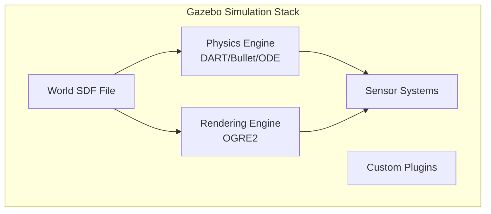

# Physics Engines: Configuring Gazebo for Realistic Simulation

Gazebo is the industry-standard robotics simulator that provides accurate physics, sensor simulation, and seamless ROS 2 integration. In this chapter, you'll learn to configure physics parameters that make your simulation behave like the real world.



## 🛠️ Installing Gazebo Harmonic

### Ubuntu Installation

```bash
# Add Gazebo repository
sudo wget https://packages.osrfoundation.org/gazebo.gpg -O /usr/share/keyrings/pkgs-osrf-archive-keyring.gpg
echo "deb [arch=$(dpkg --print-architecture) signed-by=/usr/share/keyrings/pkgs-osrf-archive-keyring.gpg] http://packages.osrfoundation.org/gazebo/ubuntu-stable $(lsb_release -cs) main" | sudo tee /etc/apt/sources.list.d/gazebo-stable.list > /dev/null

# Install Gazebo Harmonic
sudo apt update
sudo apt install gz-harmonic

# Install ROS 2 - Gazebo bridge
sudo apt install ros-humble-ros-gz
```

### Verify Installation

```bash
# Launch empty world
gz sim empty.sdf

# Check version
gz sim --version
```

---

## 📄 World Files: SDF Format

Gazebo uses **SDF (Simulation Description Format)** files to define worlds. SDF is more feature-rich than URDF and designed specifically for simulation.

### Basic World Structure

```xml
<?xml version="1.0" ?>
<sdf version="1.8">
  <world name="humanoid_world">
    
    <!-- ============ PHYSICS ============ -->
    <physics name="default_physics" type="dart">
      <max_step_size>0.001</max_step_size>
      <real_time_factor>1.0</real_time_factor>
      <real_time_update_rate>1000</real_time_update_rate>
    </physics>
    
    <!-- ============ SCENE ============ -->
    <scene>
      <ambient>0.4 0.4 0.4 1</ambient>
      <background>0.7 0.85 1.0 1</background>
      <shadows>true</shadows>
    </scene>
    
    <!-- ============ LIGHTING ============ -->
    <light type="directional" name="sun">
      <cast_shadows>true</cast_shadows>
      <pose>0 0 10 0 0 0</pose>
      <diffuse>0.8 0.8 0.8 1</diffuse>
      <specular>0.2 0.2 0.2 1</specular>
      <direction>-0.5 0.5 -1</direction>
    </light>
    
    <!-- ============ GROUND PLANE ============ -->
    <model name="ground_plane">
      <static>true</static>
      <link name="link">
        <collision name="collision">
          <geometry>
            <plane>
              <normal>0 0 1</normal>
              <size>100 100</size>
            </plane>
          </geometry>
          <surface>
            <friction>
              <ode>
                <mu>0.8</mu>
                <mu2>0.8</mu2>
              </ode>
            </friction>
          </surface>
        </collision>
        <visual name="visual">
          <geometry>
            <plane>
              <normal>0 0 1</normal>
              <size>100 100</size>
            </plane>
          </geometry>
          <material>
            <ambient>0.3 0.3 0.3 1</ambient>
            <diffuse>0.5 0.5 0.5 1</diffuse>
          </material>
        </visual>
      </link>
    </model>
    
  </world>
</sdf>
```

---

## ⚙️ Physics Configuration

### Physics Engine Selection

Gazebo supports multiple physics engines:

| Engine | Strengths | Best For |
|--------|-----------|----------|
| **DART** | Accuracy, stability | Humanoids, manipulation |
| **Bullet** | Speed, soft bodies | Games, deformables |
| **ODE** | Compatibility | Legacy projects |

### Key Physics Parameters

```xml
<physics name="accurate_physics" type="dart">
  <!-- Simulation step size (seconds) -->
  <!-- Smaller = more accurate, slower -->
  <max_step_size>0.001</max_step_size>
  
  <!-- Real-time factor: 1.0 = real-time, 2.0 = 2x speed -->
  <real_time_factor>1.0</real_time_factor>
  
  <!-- Update rate in Hz -->
  <real_time_update_rate>1000</real_time_update_rate>
  
  <!-- DART-specific settings -->
  <dart>
    <solver>
      <solver_type>dantzig</solver_type>
    </solver>
  </dart>
</physics>
```

:::danger Critical: Step Size for Humanoids
Bipedal robots require **small step sizes** (0.001s or less) for stable foot contacts. Larger steps cause:
- Foot penetration into ground
- Unstable balance
- Unrealistic joint behavior
:::

---

## 🌍 Gravity Configuration

```xml
<!-- Standard Earth gravity -->
<gravity>0 0 -9.81</gravity>

<!-- Moon gravity (for testing) -->
<gravity>0 0 -1.62</gravity>

<!-- Zero-G (space simulation) -->
<gravity>0 0 0</gravity>
```

---

## 🧱 Surface Properties: Friction & Contact

### Friction Parameters

```xml
<surface>
  <friction>
    <ode>
      <!-- Primary friction coefficient (along contact direction) -->
      <mu>1.0</mu>
      
      <!-- Secondary friction coefficient (perpendicular) -->
      <mu2>1.0</mu2>
      
      <!-- Friction direction (optional) -->
      <fdir1>1 0 0</fdir1>
    </ode>
    
    <bullet>
      <friction>1.0</friction>
      <friction2>1.0</friction2>
    </bullet>
  </friction>
  
  <contact>
    <ode>
      <!-- Contact stiffness -->
      <kp>1000000.0</kp>
      
      <!-- Contact damping -->
      <kd>100.0</kd>
      
      <!-- Maximum correcting velocity -->
      <max_vel>100.0</max_vel>
      
      <!-- Penetration allowance -->
      <min_depth>0.001</min_depth>
    </ode>
  </contact>
</surface>
```

### Friction Reference Values

| Material Pair | Friction (μ) |
|---------------|--------------|
| Rubber on Concrete | 0.8 - 1.0 |
| Rubber on Wood | 0.6 - 0.8 |
| Metal on Metal | 0.3 - 0.5 |
| Plastic on Plastic | 0.2 - 0.4 |
| Ice on Ice | 0.03 - 0.05 |

---

## 🏠 Building Indoor Environments

### Example: Office Room

```xml
<!-- Office room with walls and furniture -->
<model name="office_room">
  <static>true</static>
  <pose>0 0 0 0 0 0</pose>
  
  <!-- Floor -->
  <link name="floor">
    <collision name="floor_collision">
      <geometry>
        <box><size>10 10 0.1</size></box>
      </geometry>
      <surface>
        <friction>
          <ode><mu>0.8</mu><mu2>0.8</mu2></ode>
        </friction>
      </surface>
    </collision>
    <visual name="floor_visual">
      <geometry>
        <box><size>10 10 0.1</size></box>
      </geometry>
      <material>
        <ambient>0.4 0.3 0.2 1</ambient>
        <diffuse>0.6 0.5 0.4 1</diffuse>
      </material>
    </visual>
  </link>
  
  <!-- Wall 1 (North) -->
  <link name="wall_north">
    <pose>0 5 1.5 0 0 0</pose>
    <collision name="collision">
      <geometry>
        <box><size>10 0.2 3</size></box>
      </geometry>
    </collision>
    <visual name="visual">
      <geometry>
        <box><size>10 0.2 3</size></box>
      </geometry>
      <material>
        <ambient>0.9 0.9 0.9 1</ambient>
      </material>
    </visual>
  </link>
  
  <!-- Wall 2 (South) -->
  <link name="wall_south">
    <pose>0 -5 1.5 0 0 0</pose>
    <collision name="collision">
      <geometry>
        <box><size>10 0.2 3</size></box>
      </geometry>
    </collision>
    <visual name="visual">
      <geometry>
        <box><size>10 0.2 3</size></box>
      </geometry>
      <material>
        <ambient>0.9 0.9 0.9 1</ambient>
      </material>
    </visual>
  </link>
  
  <!-- Wall 3 (East) -->
  <link name="wall_east">
    <pose>5 0 1.5 0 0 1.5708</pose>
    <collision name="collision">
      <geometry>
        <box><size>10 0.2 3</size></box>
      </geometry>
    </collision>
    <visual name="visual">
      <geometry>
        <box><size>10 0.2 3</size></box>
      </geometry>
      <material>
        <ambient>0.9 0.9 0.9 1</ambient>
      </material>
    </visual>
  </link>
  
  <!-- Wall 4 (West) -->
  <link name="wall_west">
    <pose>-5 0 1.5 0 0 1.5708</pose>
    <collision name="collision">
      <geometry>
        <box><size>10 0.2 3</size></box>
      </geometry>
    </collision>
    <visual name="visual">
      <geometry>
        <box><size>10 0.2 3</size></box>
      </geometry>
      <material>
        <ambient>0.9 0.9 0.9 1</ambient>
      </material>
    </visual>
  </link>
</model>

<!-- Add obstacles -->
<model name="table">
  <static>true</static>
  <pose>2 2 0.4 0 0 0</pose>
  <link name="link">
    <collision name="collision">
      <geometry>
        <box><size>1.2 0.8 0.8</size></box>
      </geometry>
    </collision>
    <visual name="visual">
      <geometry>
        <box><size>1.2 0.8 0.8</size></box>
      </geometry>
      <material>
        <ambient>0.4 0.2 0.1 1</ambient>
        <diffuse>0.6 0.3 0.15 1</diffuse>
      </material>
    </visual>
  </link>
</model>

<model name="chair">
  <static>true</static>
  <pose>2.5 0 0.45 0 0 0</pose>
  <link name="link">
    <collision name="collision">
      <geometry>
        <box><size>0.5 0.5 0.9</size></box>
      </geometry>
    </collision>
    <visual name="visual">
      <geometry>
        <box><size>0.5 0.5 0.9</size></box>
      </geometry>
      <material>
        <ambient>0.1 0.1 0.3 1</ambient>
      </material>
    </visual>
  </link>
</model>
```

---

## 🤖 Spawning Your Robot

### Converting URDF to SDF

```bash
# Gazebo can load URDF directly, but SDF is preferred
gz sdf -p robot.urdf > robot.sdf
```

### Spawning via ROS 2

```bash
# Spawn robot from URDF
ros2 run ros_gz_sim create -file /path/to/robot.urdf -name my_robot -x 0 -y 0 -z 1

# Spawn from topic
ros2 run ros_gz_sim create -topic robot_description -name my_robot
```

### Spawn in SDF World File

```xml
<include>
  <uri>file:///path/to/robot.sdf</uri>
  <name>humanoid</name>
  <pose>0 0 1.0 0 0 0</pose>
</include>
```

---

## 🔌 ROS 2 - Gazebo Bridge

The `ros_gz_bridge` translates messages between ROS 2 and Gazebo.

### Bridge Configuration

```bash
# Bridge specific topics
ros2 run ros_gz_bridge parameter_bridge \
  /cmd_vel@geometry_msgs/msg/Twist@gz.msgs.Twist \
  /scan@sensor_msgs/msg/LaserScan@gz.msgs.LaserScan \
  /imu@sensor_msgs/msg/Imu@gz.msgs.IMU
```

### Common Topic Bridges

| ROS 2 Topic | ROS 2 Type | Gazebo Type |
|-------------|------------|-------------|
| `/cmd_vel` | `geometry_msgs/Twist` | `gz.msgs.Twist` |
| `/scan` | `sensor_msgs/LaserScan` | `gz.msgs.LaserScan` |
| `/camera/image` | `sensor_msgs/Image` | `gz.msgs.Image` |
| `/imu` | `sensor_msgs/Imu` | `gz.msgs.IMU` |
| `/joint_states` | `sensor_msgs/JointState` | `gz.msgs.Model` |

---

## 🚀 Launch File Integration

```python
#!/usr/bin/env python3
"""Launch Gazebo with ROS 2 bridge."""

from launch import LaunchDescription
from launch.actions import IncludeLaunchDescription
from launch.launch_description_sources import PythonLaunchDescriptionSource
from launch_ros.actions import Node
from ament_index_python.packages import get_package_share_directory
import os


def generate_launch_description():
    
    pkg_ros_gz_sim = get_package_share_directory('ros_gz_sim')
    
    # Launch Gazebo
    gazebo = IncludeLaunchDescription(
        PythonLaunchDescriptionSource(
            os.path.join(pkg_ros_gz_sim, 'launch', 'gz_sim.launch.py')
        ),
        launch_arguments={
            'gz_args': '-r office_world.sdf'
        }.items()
    )
    
    # Bridge
    bridge = Node(
        package='ros_gz_bridge',
        executable='parameter_bridge',
        arguments=[
            '/cmd_vel@geometry_msgs/msg/Twist@gz.msgs.Twist',
            '/scan@sensor_msgs/msg/LaserScan@gz.msgs.LaserScan',
        ],
        output='screen'
    )
    
    return LaunchDescription([
        gazebo,
        bridge,
    ])
```

---

## 📚 Summary

| Concept | Key Takeaway |
|---------|--------------|
| **Physics Engine** | Use DART for humanoids |
| **Step Size** | 0.001s or smaller for stability |
| **Friction** | 0.8+ for foot contacts |
| **SDF Format** | More features than URDF |
| **ros_gz_bridge** | Connects ROS 2 ↔ Gazebo |

:::info Next Chapter
Now let's add high-fidelity rendering with Unity for perception training!

**[Continue to Rendering (Unity) →](./rendering)**
:::
