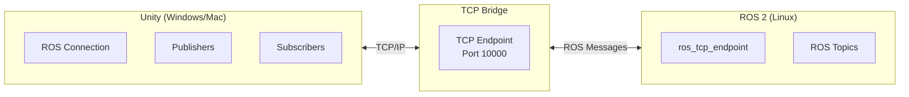
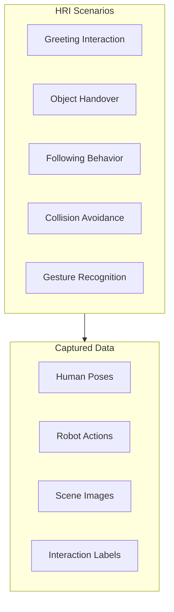

# High-Fidelity Rendering with Unity

While Gazebo excels at physics simulation, **Unity** provides photorealistic rendering essential for training perception models. This chapter covers setting up Unity for human-robot interaction scenarios and generating synthetic training data.

```mermaid
flowchart LR
    subgraph Unity["Unity Rendering Pipeline"]
        HDRP[HD Render Pipeline]
        Lighting[Dynamic Lighting]
        Materials[PBR Materials]
        PostFX[Post-Processing]
    end
    
    subgraph Output["Synthetic Data"]
        RGB[RGB Images]
        Depth[Depth Maps]
        Seg[Segmentation]
        Labels[Auto Labels]
    end
    
    Unity --> Output
    
    subgraph Training["AI Training"]
        Perception[Perception Models]
        Detection[Object Detection]
        Pose[Pose Estimation]
    end
    
    Output --> Training
```



## 🎯 Why Unity for Robotics?

| Feature | Gazebo | Unity |
|---------|--------|-------|
| **Physics Accuracy** | ⭐⭐⭐⭐⭐ | ⭐⭐⭐ |
| **Visual Fidelity** | ⭐⭐⭐ | ⭐⭐⭐⭐⭐ |
| **Perception Training** | ⭐⭐ | ⭐⭐⭐⭐⭐ |
| **ROS Integration** | Native | Via Bridge |
| **Human Models** | Limited | Extensive |
| **Asset Store** | Minimal | Massive |

:::tip When to Use Unity
- Training **computer vision** models
- **Human-robot interaction** studies
- Creating **demo videos** and presentations
- Scenarios requiring **realistic humans**
:::

---

## 🛠️ Setting Up Unity for Robotics

### Installation

1. Download [Unity Hub](https://unity.com/download)
2. Install **Unity 2022.3 LTS** (Long Term Support)
3. Create a new **3D (URP)** or **3D (HDRP)** project

### Required Packages

Open **Window → Package Manager** and install:

```
Unity Robotics Hub
├── ROS TCP Connector
├── URDF Importer
└── Perception Package (for ML training)
```

### Install via Package Manager

```json
// Packages/manifest.json
{
  "dependencies": {
    "com.unity.robotics.ros-tcp-connector": "0.7.0-preview",
    "com.unity.robotics.urdf-importer": "0.5.2-preview",
    "com.unity.perception": "1.0.0-preview.1"
  }
}
```

---

## 🔌 ROS-TCP-Connector Setup

The ROS-TCP-Connector enables bidirectional communication between Unity and ROS 2.

### Architecture



### ROS 2 Side Setup

```bash
# Install the TCP endpoint package
sudo apt install ros-humble-ros-tcp-endpoint

# Or build from source
cd ~/ros2_ws/src
git clone https://github.com/Unity-Technologies/ROS-TCP-Endpoint.git
cd ..
colcon build

# Run the endpoint
ros2 run ros_tcp_endpoint default_server_endpoint --ros-args -p ROS_IP:=0.0.0.0
```

### Unity Side Setup

1. Go to **Robotics → ROS Settings**
2. Set **ROS IP Address**: Your ROS machine's IP
3. Set **ROS Port**: 10000 (default)
4. Select **Protocol**: ROS2

---

## 🤖 Importing URDF into Unity

### Using the URDF Importer

1. Copy your URDF and mesh files to `Assets/URDF/`
2. Right-click → **Import Robot from URDF**
3. Configure import settings:

```
Import Settings:
├── Axis Type: Z Up (ROS standard)
├── Mesh Decomposer: VHACD (for collision)
├── Apply Convex Decomposition: ✓
└── Controller Type: Position Control
```

### URDF Import Script

```csharp
using Unity.Robotics.UrdfImporter;

public class RobotImporter : MonoBehaviour
{
    public string urdfPath = "Assets/URDF/humanoid.urdf";
    
    void Start()
    {
        // Import settings
        ImportSettings settings = new ImportSettings
        {
            chosenAxis = ImportSettings.axisType.zAxis,
            convexMethod = ImportSettings.convexDecomposer.vHACD
        };
        
        // Import robot
        UrdfRobotExtensions.Create(urdfPath, settings);
    }
}
```

---

## 🏠 Creating Realistic Indoor Environments

### Standard Assets to Use

| Asset Type | Recommended Sources |
|------------|---------------------|
| **Furniture** | Unity Asset Store (ArchVizPRO) |
| **Materials** | Quixel Megascans (free with Unity) |
| **Humans** | Mixamo, Unity Digital Humans |
| **Lighting** | HDRI Haven (skyboxes) |

### Room Setup Script

```csharp
using UnityEngine;

public class RoomGenerator : MonoBehaviour
{
    [Header("Room Dimensions")]
    public float width = 10f;
    public float length = 10f;
    public float height = 3f;
    
    [Header("Materials")]
    public Material floorMaterial;
    public Material wallMaterial;
    
    void Start()
    {
        GenerateRoom();
    }
    
    void GenerateRoom()
    {
        // Floor
        GameObject floor = GameObject.CreatePrimitive(PrimitiveType.Cube);
        floor.name = "Floor";
        floor.transform.localScale = new Vector3(width, 0.1f, length);
        floor.transform.position = new Vector3(0, 0, 0);
        floor.GetComponent<Renderer>().material = floorMaterial;
        
        // Walls
        CreateWall("North", new Vector3(0, height/2, length/2), 
                   new Vector3(width, height, 0.2f));
        CreateWall("South", new Vector3(0, height/2, -length/2), 
                   new Vector3(width, height, 0.2f));
        CreateWall("East", new Vector3(width/2, height/2, 0), 
                   new Vector3(0.2f, height, length));
        CreateWall("West", new Vector3(-width/2, height/2, 0), 
                   new Vector3(0.2f, height, length));
    }
    
    void CreateWall(string name, Vector3 position, Vector3 scale)
    {
        GameObject wall = GameObject.CreatePrimitive(PrimitiveType.Cube);
        wall.name = $"Wall_{name}";
        wall.transform.position = position;
        wall.transform.localScale = scale;
        wall.GetComponent<Renderer>().material = wallMaterial;
    }
}
```

---

## 👥 Human-Robot Interaction Scenarios

### Setting Up Digital Humans

```csharp
using UnityEngine;
using Unity.Robotics.ROSTCPConnector;

public class HumanBehavior : MonoBehaviour
{
    private ROSConnection ros;
    private Animator animator;
    
    [Header("ROS Topics")]
    public string humanPoseTopic = "/human/pose";
    public string humanDetectionTopic = "/human/detected";
    
    void Start()
    {
        ros = ROSConnection.GetOrCreateInstance();
        animator = GetComponent<Animator>();
        
        // Publish human pose to ROS
        ros.RegisterPublisher<PoseStampedMsg>(humanPoseTopic);
    }
    
    void Update()
    {
        // Publish current pose
        PoseStampedMsg poseMsg = new PoseStampedMsg
        {
            header = new HeaderMsg
            {
                frame_id = "world",
                stamp = new TimeMsg()
            },
            pose = new PoseMsg
            {
                position = new PointMsg(
                    transform.position.z,  // ROS x = Unity z
                    -transform.position.x, // ROS y = -Unity x
                    transform.position.y   // ROS z = Unity y
                ),
                orientation = new QuaternionMsg(
                    transform.rotation.z,
                    -transform.rotation.x,
                    transform.rotation.y,
                    -transform.rotation.w
                )
            }
        };
        
        ros.Publish(humanPoseTopic, poseMsg);
    }
    
    // Trigger animations
    public void Wave() => animator.SetTrigger("Wave");
    public void Walk() => animator.SetBool("Walking", true);
    public void Stop() => animator.SetBool("Walking", false);
}
```

### Interaction Scenarios



---

## 📷 Synthetic Data Generation

### Unity Perception Package Setup

```csharp
using UnityEngine;
using UnityEngine.Perception.Randomization.Parameters;
using UnityEngine.Perception.Randomization.Scenarios;

public class DataGenerationScenario : FixedLengthScenario
{
    public ColorRgbParameter lightingColor;
    public FloatParameter lightIntensity;
    public Vector3Parameter objectPosition;
    
    protected override void OnIterationStart()
    {
        // Randomize lighting
        var sun = FindObjectOfType<Light>();
        sun.color = lightingColor.Sample();
        sun.intensity = lightIntensity.Sample();
        
        // Randomize object positions
        foreach (var obj in FindObjectsOfType<RandomizableObject>())
        {
            obj.transform.position = objectPosition.Sample();
        }
    }
}
```

### Camera Labeler Configuration

```csharp
using UnityEngine;
using UnityEngine.Perception.GroundTruth;

public class PerceptionCameraSetup : MonoBehaviour
{
    void Start()
    {
        var perceptionCamera = GetComponent<PerceptionCamera>();
        
        // Add labelers
        perceptionCamera.AddLabeler(new BoundingBox2DLabeler());
        perceptionCamera.AddLabeler(new SemanticSegmentationLabeler());
        perceptionCamera.AddLabeler(new InstanceSegmentationLabeler());
        perceptionCamera.AddLabeler(new KeypointLabeler());
    }
}
```

### Output Data Types

| Labeler | Output | Use Case |
|---------|--------|----------|
| **Bounding Box 2D** | COCO format JSON | Object detection |
| **Semantic Segmentation** | PNG masks | Scene understanding |
| **Instance Segmentation** | Individual masks | Instance counting |
| **Keypoint** | Joint positions | Pose estimation |
| **Depth** | 16-bit depth maps | 3D reconstruction |

---

## 🎨 Photorealistic Rendering Settings

### HDRP Configuration

```yaml
Quality Settings:
  Render Pipeline: HDRP
  Anti-Aliasing: TAA
  Shadow Quality: Ultra
  Reflection Probes: Real-time
  
Post Processing:
  - Bloom
  - Ambient Occlusion (SSAO)
  - Screen Space Reflections
  - Motion Blur (for video)
  
Lighting:
  - Global Illumination: Enabled
  - Light Probe Groups: Throughout scene
  - Reflection Probes: Per room
```

---

## 🔄 Coordinate System Conversion

:::warning Unity vs ROS Coordinates
Unity and ROS use different coordinate systems!

| Axis | Unity | ROS |
|------|-------|-----|
| Forward | +Z | +X |
| Left | -X | +Y |
| Up | +Y | +Z |

Always convert coordinates when bridging!
:::

### Conversion Script

```csharp
public static class CoordinateConverter
{
    // Unity to ROS
    public static Vector3 UnityToROS(Vector3 unity)
    {
        return new Vector3(unity.z, -unity.x, unity.y);
    }
    
    // ROS to Unity
    public static Vector3 ROSToUnity(Vector3 ros)
    {
        return new Vector3(-ros.y, ros.z, ros.x);
    }
    
    // Quaternion conversion
    public static Quaternion UnityToROS(Quaternion unity)
    {
        return new Quaternion(unity.z, -unity.x, unity.y, -unity.w);
    }
}
```

---

## 📚 Summary

| Feature | Implementation |
|---------|----------------|
| **ROS Bridge** | ROS-TCP-Connector on port 10000 |
| **URDF Import** | Unity URDF Importer package |
| **Realism** | HDRP + Post-processing |
| **Synthetic Data** | Perception package + labelers |
| **Coordinates** | Always convert Unity ↔ ROS |

:::info Next Chapter
Now let's add sensors to your simulated robot!

**[Continue to Sensor Simulation →](./sensor-simulation)**
:::
