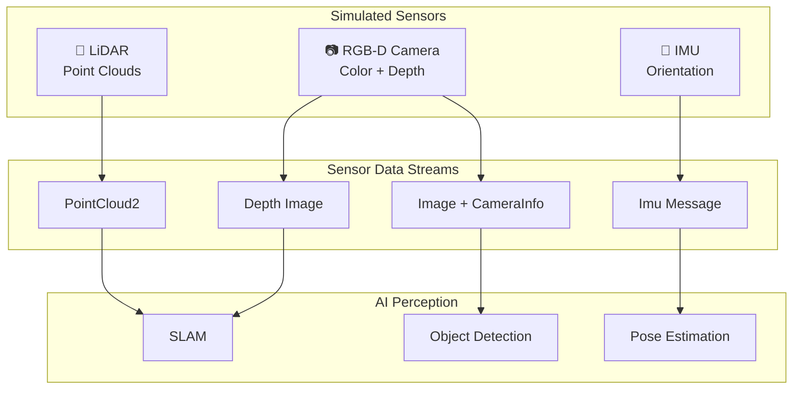
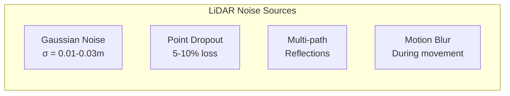
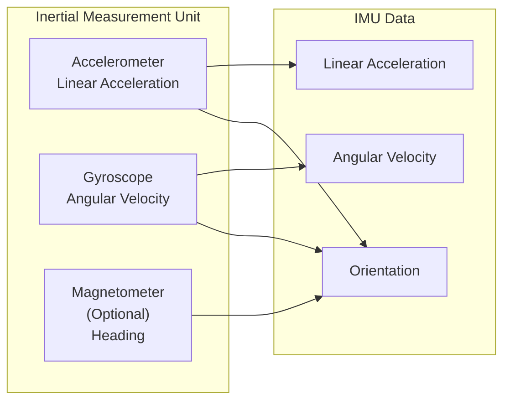

# Sensor Simulation: LiDAR, Cameras, and IMU

Realistic sensor simulation is crucial for developing perception algorithms that transfer to real hardware. This chapter covers implementing the three most common robot sensors in simulation.



## 🔴 LiDAR Simulation

### LiDAR Basics

LiDAR (Light Detection and Ranging) measures distances by emitting laser pulses and measuring return time.

| Parameter | Typical Values | Purpose |
|-----------|---------------|---------|
| **Horizontal FOV** | 360° | Coverage area |
| **Vertical FOV** | 30-40° | Height coverage |
| **Channels** | 16, 32, 64, 128 | Vertical resolution |
| **Points/sec** | 300k - 2M | Density |
| **Range** | 100-300m | Maximum distance |
| **Update Rate** | 10-20 Hz | Temporal resolution |

### Gazebo LiDAR Configuration

```xml
<sensor name="lidar" type="gpu_lidar">
  <topic>/scan</topic>
  <update_rate>10</update_rate>
  <always_on>true</always_on>
  <visualize>true</visualize>
  
  <lidar>
    <scan>
      <horizontal>
        <samples>1800</samples>
        <resolution>1</resolution>
        <min_angle>-3.14159</min_angle>
        <max_angle>3.14159</max_angle>
      </horizontal>
      <vertical>
        <samples>16</samples>
        <resolution>1</resolution>
        <min_angle>-0.261799</min_angle>
        <max_angle>0.261799</max_angle>
      </vertical>
    </scan>
    <range>
      <min>0.1</min>
      <max>100.0</max>
      <resolution>0.01</resolution>
    </range>
    <noise>
      <type>gaussian</type>
      <mean>0.0</mean>
      <stddev>0.01</stddev>
    </noise>
  </lidar>
</sensor>
```

### 2D LiDAR for Navigation

For basic navigation, a 2D LiDAR (single-plane scan) is sufficient:

```xml
<sensor name="lidar_2d" type="gpu_lidar">
  <pose>0 0 0.5 0 0 0</pose>
  <topic>/scan</topic>
  <update_rate>20</update_rate>
  
  <lidar>
    <scan>
      <horizontal>
        <samples>720</samples>
        <resolution>1</resolution>
        <min_angle>-3.14159</min_angle>
        <max_angle>3.14159</max_angle>
      </horizontal>
      <vertical>
        <samples>1</samples>
        <resolution>1</resolution>
        <min_angle>0</min_angle>
        <max_angle>0</max_angle>
      </vertical>
    </scan>
    <range>
      <min>0.1</min>
      <max>30.0</max>
      <resolution>0.01</resolution>
    </range>
  </lidar>
</sensor>
```

### Adding Realistic Noise



```xml
<noise>
  <type>gaussian</type>
  <mean>0.0</mean>
  <stddev>0.02</stddev>
</noise>
```

---

## 📷 RGB-D Camera Simulation

### Depth Camera Types

| Camera | Depth Method | Range | Best For |
|--------|-------------|-------|----------|
| **Intel RealSense** | Stereo + IR | 0.2-10m | Indoor |
| **Microsoft Azure Kinect** | ToF | 0.5-5m | Body tracking |
| **ZED 2** | Stereo | 0.3-20m | Outdoor |
| **Orbbec** | Structured Light | 0.4-8m | Close range |

### Gazebo RGB-D Camera

```xml
<sensor name="rgbd_camera" type="rgbd_camera">
  <pose>0 0 0.8 0 0 0</pose>
  <topic>/camera</topic>
  <update_rate>30</update_rate>
  <always_on>true</always_on>
  
  <camera>
    <horizontal_fov>1.047</horizontal_fov>
    <image>
      <width>640</width>
      <height>480</height>
      <format>R8G8B8</format>
    </image>
    <clip>
      <near>0.1</near>
      <far>10.0</far>
    </clip>
    <depth_camera>
      <clip>
        <near>0.1</near>
        <far>10.0</far>
      </clip>
    </depth_camera>
    <noise>
      <type>gaussian</type>
      <mean>0.0</mean>
      <stddev>0.007</stddev>
    </noise>
  </camera>
</sensor>
```

### Camera Topics Published

```bash
# RGB Image
/camera/image_raw          # sensor_msgs/Image
/camera/camera_info        # sensor_msgs/CameraInfo

# Depth Data
/camera/depth/image_raw    # sensor_msgs/Image (32FC1 or 16UC1)
/camera/depth/camera_info  # sensor_msgs/CameraInfo

# Point Cloud (computed from depth)
/camera/points             # sensor_msgs/PointCloud2
```

### Camera Intrinsics

```python
# Camera intrinsic parameters
"""
K = [fx,  0, cx]
    [ 0, fy, cy]
    [ 0,  0,  1]

Where:
- fx, fy: Focal lengths in pixels
- cx, cy: Principal point (image center)
"""

# Example for 640x480 with 60° FOV
import numpy as np

width, height = 640, 480
fov = 1.047  # 60 degrees in radians

fx = width / (2 * np.tan(fov / 2))
fy = fx  # Square pixels
cx = width / 2
cy = height / 2

K = np.array([
    [fx,  0, cx],
    [ 0, fy, cy],
    [ 0,  0,  1]
])
print(f"Camera Matrix:\n{K}")
```

---

## 📐 IMU Simulation

### IMU Components



### Gazebo IMU Configuration

```xml
<sensor name="imu" type="imu">
  <pose>0 0 0.5 0 0 0</pose>
  <topic>/imu</topic>
  <update_rate>100</update_rate>
  <always_on>true</always_on>
  
  <imu>
    <angular_velocity>
      <x>
        <noise type="gaussian">
          <mean>0.0</mean>
          <stddev>0.0002</stddev>
        </noise>
      </x>
      <y>
        <noise type="gaussian">
          <mean>0.0</mean>
          <stddev>0.0002</stddev>
        </noise>
      </y>
      <z>
        <noise type="gaussian">
          <mean>0.0</mean>
          <stddev>0.0002</stddev>
        </noise>
      </z>
    </angular_velocity>
    
    <linear_acceleration>
      <x>
        <noise type="gaussian">
          <mean>0.0</mean>
          <stddev>0.017</stddev>
        </noise>
      </x>
      <y>
        <noise type="gaussian">
          <mean>0.0</mean>
          <stddev>0.017</stddev>
        </noise>
      </y>
      <z>
        <noise type="gaussian">
          <mean>0.0</mean>
          <stddev>0.017</stddev>
        </noise>
      </z>
    </linear_acceleration>
  </imu>
</sensor>
```

### IMU Noise Parameters

| Parameter | Typical Value | Unit |
|-----------|---------------|------|
| **Gyro Noise Density** | 0.0002 | rad/s/√Hz |
| **Gyro Bias Instability** | 0.0001 | rad/s |
| **Accel Noise Density** | 0.017 | m/s²/√Hz |
| **Accel Bias Instability** | 0.0001 | m/s² |

### ROS 2 IMU Subscriber

```python
#!/usr/bin/env python3
"""IMU data processor node."""

import rclpy
from rclpy.node import Node
from sensor_msgs.msg import Imu
import numpy as np
from scipy.spatial.transform import Rotation


class IMUProcessor(Node):
    """Process IMU data for orientation estimation."""
    
    def __init__(self):
        super().__init__('imu_processor')
        
        self.subscription = self.create_subscription(
            Imu,
            '/imu',
            self.imu_callback,
            10
        )
        
        self.get_logger().info('IMU Processor started')
    
    def imu_callback(self, msg: Imu):
        """Process incoming IMU data."""
        # Extract orientation as quaternion
        q = msg.orientation
        quat = [q.x, q.y, q.z, q.w]
        
        # Convert to Euler angles
        rot = Rotation.from_quat(quat)
        roll, pitch, yaw = rot.as_euler('xyz', degrees=True)
        
        # Extract angular velocity
        angular = msg.angular_velocity
        omega = np.array([angular.x, angular.y, angular.z])
        
        # Extract linear acceleration
        linear = msg.linear_acceleration
        accel = np.array([linear.x, linear.y, linear.z])
        
        self.get_logger().info(
            f'Orientation: R={roll:.1f}° P={pitch:.1f}° Y={yaw:.1f}° | '
            f'Accel: {np.linalg.norm(accel):.2f} m/s²'
        )


def main(args=None):
    rclpy.init(args=args)
    node = IMUProcessor()
    rclpy.spin(node)
    node.destroy_node()
    rclpy.shutdown()


if __name__ == '__main__':
    main()
```

---

## 🎯 Adding Sensors to Your URDF

### Complete Sensor Integration

```xml
<?xml version="1.0"?>
<robot name="humanoid_with_sensors">
  
  <!-- Include base robot -->
  <!-- ... (your existing URDF links/joints) ... -->
  
  <!-- ============ HEAD CAMERA ============ -->
  <link name="camera_link">
    <visual>
      <geometry>
        <box size="0.05 0.1 0.05"/>
      </geometry>
      <material name="black">
        <color rgba="0.1 0.1 0.1 1"/>
      </material>
    </visual>
  </link>
  
  <joint name="camera_joint" type="fixed">
    <parent link="head_link"/>
    <child link="camera_link"/>
    <origin xyz="0.1 0 0" rpy="0 0 0"/>
  </joint>
  
  <!-- Camera optical frame (Z forward) -->
  <link name="camera_optical_frame"/>
  
  <joint name="camera_optical_joint" type="fixed">
    <parent link="camera_link"/>
    <child link="camera_optical_frame"/>
    <origin xyz="0 0 0" rpy="-1.5708 0 -1.5708"/>
  </joint>
  
  <!-- ============ LIDAR ============ -->
  <link name="lidar_link">
    <visual>
      <geometry>
        <cylinder radius="0.05" length="0.05"/>
      </geometry>
      <material name="gray">
        <color rgba="0.5 0.5 0.5 1"/>
      </material>
    </visual>
  </link>
  
  <joint name="lidar_joint" type="fixed">
    <parent link="torso_link"/>
    <child link="lidar_link"/>
    <origin xyz="0 0 0.3" rpy="0 0 0"/>
  </joint>
  
  <!-- ============ IMU ============ -->
  <link name="imu_link">
    <visual>
      <geometry>
        <box size="0.02 0.02 0.01"/>
      </geometry>
      <material name="green">
        <color rgba="0 0.8 0 1"/>
      </material>
    </visual>
  </link>
  
  <joint name="imu_joint" type="fixed">
    <parent link="torso_link"/>
    <child link="imu_link"/>
    <origin xyz="0 0 0" rpy="0 0 0"/>
  </joint>
  
  <!-- ============ GAZEBO PLUGINS ============ -->
  <gazebo reference="camera_link">
    <sensor type="rgbd_camera" name="head_camera">
      <update_rate>30</update_rate>
      <camera>
        <horizontal_fov>1.047</horizontal_fov>
        <image>
          <width>640</width>
          <height>480</height>
        </image>
        <clip>
          <near>0.1</near>
          <far>10</far>
        </clip>
      </camera>
      <plugin name="camera_plugin" filename="libgazebo_ros_camera.so">
        <ros>
          <remapping>image_raw:=/camera/image_raw</remapping>
          <remapping>camera_info:=/camera/camera_info</remapping>
          <remapping>depth/image_raw:=/camera/depth/image_raw</remapping>
        </ros>
        <camera_name>head_camera</camera_name>
        <frame_name>camera_optical_frame</frame_name>
      </plugin>
    </sensor>
  </gazebo>
  
  <gazebo reference="lidar_link">
    <sensor type="gpu_lidar" name="lidar">
      <update_rate>10</update_rate>
      <lidar>
        <scan>
          <horizontal>
            <samples>720</samples>
            <min_angle>-3.14159</min_angle>
            <max_angle>3.14159</max_angle>
          </horizontal>
        </scan>
        <range>
          <min>0.1</min>
          <max>30.0</max>
        </range>
      </lidar>
      <plugin name="lidar_plugin" filename="libgazebo_ros_ray_sensor.so">
        <ros>
          <remapping>~/out:=/scan</remapping>
        </ros>
        <output_type>sensor_msgs/LaserScan</output_type>
        <frame_name>lidar_link</frame_name>
      </plugin>
    </sensor>
  </gazebo>
  
  <gazebo reference="imu_link">
    <sensor type="imu" name="imu">
      <update_rate>100</update_rate>
      <plugin name="imu_plugin" filename="libgazebo_ros_imu_sensor.so">
        <ros>
          <remapping>~/out:=/imu</remapping>
        </ros>
        <frame_name>imu_link</frame_name>
      </plugin>
    </sensor>
  </gazebo>
  
</robot>
```

---

## 📊 Visualizing Sensor Data

### RViz Configuration

```yaml
# Save as sensor_viz.rviz
Visualization Manager:
  Displays:
    - Class: rviz_default_plugins/RobotModel
      Name: RobotModel
      Topic: /robot_description
      
    - Class: rviz_default_plugins/LaserScan
      Name: LiDAR
      Topic: /scan
      Size (m): 0.05
      Color Transformer: Intensity
      
    - Class: rviz_default_plugins/Image
      Name: Camera
      Topic: /camera/image_raw
      
    - Class: rviz_default_plugins/PointCloud2
      Name: DepthCloud
      Topic: /camera/points
      Size (m): 0.01
      
    - Class: rviz_default_plugins/Imu
      Name: IMU
      Topic: /imu
```

### Launch File with Visualization

```python
from launch import LaunchDescription
from launch_ros.actions import Node


def generate_launch_description():
    return LaunchDescription([
        # RViz for visualization
        Node(
            package='rviz2',
            executable='rviz2',
            arguments=['-d', '/path/to/sensor_viz.rviz'],
        ),
        
        # Optional: rqt_image_view for camera
        Node(
            package='rqt_image_view',
            executable='rqt_image_view',
            arguments=['/camera/image_raw'],
        ),
    ])
```

---

## 📚 Summary

| Sensor | Message Type | Typical Rate | Key Config |
|--------|-------------|--------------|------------|
| **LiDAR** | `LaserScan` / `PointCloud2` | 10-20 Hz | Samples, range, noise |
| **RGB Camera** | `Image` | 30 Hz | Resolution, FOV |
| **Depth Camera** | `Image` (32FC1) | 30 Hz | Min/max depth |
| **IMU** | `Imu` | 100-400 Hz | Noise density |

:::info Next Chapter
Now let's put it all together and build a complete simulation environment!

**[Continue to Simulation Environment Deliverable →](./simulation-environment)**
:::
