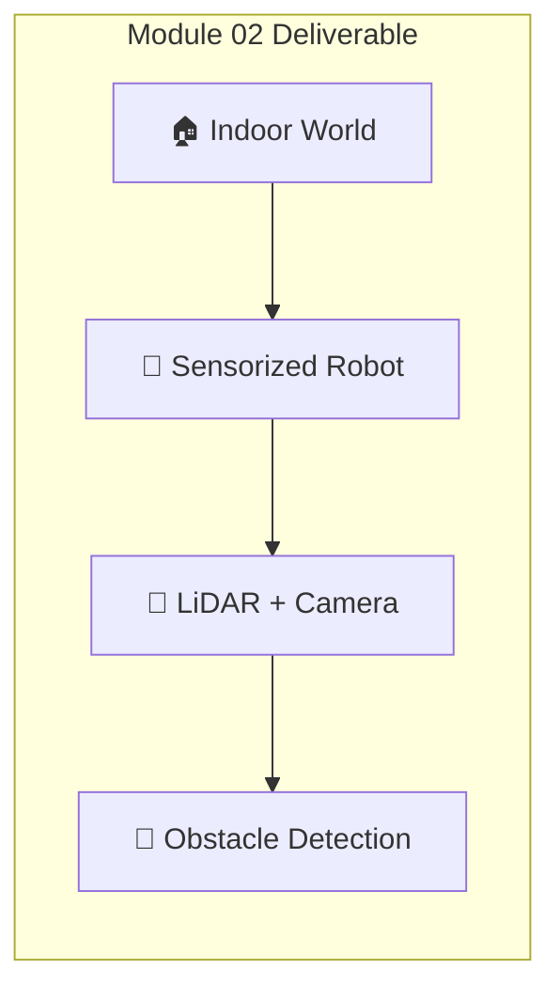
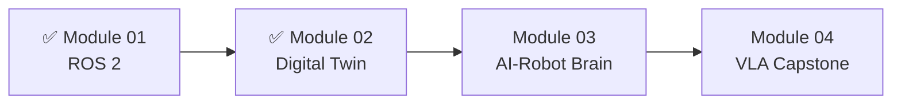

# Module 02 Deliverable: Simulation Environment

In this capstone exercise, you'll create a complete simulation environment where your humanoid robot can sense walls and obstacles. This integrates everything from Module 02: physics, sensors, and the ROS 2 bridge.



---

## 🎯 Deliverable Requirements

By the end of this chapter, you will have:

| Requirement | Description |
|-------------|-------------|
| ✅ **Gazebo World** | Indoor room with walls, floor, and obstacles |
| ✅ **Robot with Sensors** | URDF with LiDAR, camera, and IMU |
| ✅ **ROS 2 Bridge** | All sensor topics available in ROS 2 |
| ✅ **Obstacle Detection** | Node that warns when obstacles are near |
| ✅ **Visualization** | RViz showing robot, sensors, and environment |

---

## 📁 Project Structure

```
simulation_environment/
├── simulation_environment/
│   ├── __init__.py
│   └── obstacle_detector.py
├── urdf/
│   └── humanoid_sensors.urdf
├── worlds/
│   └── indoor_office.sdf
├── launch/
│   └── simulation.launch.py
├── rviz/
│   └── sim_config.rviz
├── resource/
├── package.xml
└── setup.py
```

---

## 🌍 Part 1: The Indoor World (SDF)

### worlds/indoor_office.sdf

```xml
<?xml version="1.0" ?>
<sdf version="1.8">
  <world name="indoor_office">
    
    <!-- ============ PHYSICS ============ -->
    <physics name="humanoid_physics" type="dart">
      <max_step_size>0.001</max_step_size>
      <real_time_factor>1.0</real_time_factor>
      <real_time_update_rate>1000</real_time_update_rate>
      <dart>
        <collision_detector>bullet</collision_detector>
      </dart>
    </physics>
    
    <!-- ============ GRAVITY ============ -->
    <gravity>0 0 -9.81</gravity>
    
    <!-- ============ SCENE ============ -->
    <scene>
      <ambient>0.5 0.5 0.5 1</ambient>
      <background>0.7 0.8 0.95 1</background>
      <shadows>true</shadows>
    </scene>
    
    <!-- ============ LIGHTING ============ -->
    <light type="directional" name="sun">
      <cast_shadows>true</cast_shadows>
      <pose>0 0 10 0 0 0</pose>
      <diffuse>0.9 0.9 0.9 1</diffuse>
      <specular>0.3 0.3 0.3 1</specular>
      <direction>-0.5 0.5 -1</direction>
    </light>
    
    <light type="point" name="ceiling_light_1">
      <pose>0 0 2.8 0 0 0</pose>
      <diffuse>0.8 0.8 0.7 1</diffuse>
      <specular>0.2 0.2 0.2 1</specular>
      <attenuation>
        <range>10</range>
        <constant>0.5</constant>
        <linear>0.01</linear>
        <quadratic>0.001</quadratic>
      </attenuation>
    </light>
    
    <!-- ============ GROUND PLANE ============ -->
    <model name="ground_plane">
      <static>true</static>
      <link name="link">
        <collision name="collision">
          <geometry>
            <plane>
              <normal>0 0 1</normal>
              <size>100 100</size>
            </plane>
          </geometry>
          <surface>
            <friction>
              <ode>
                <mu>0.9</mu>
                <mu2>0.9</mu2>
              </ode>
            </friction>
            <contact>
              <ode>
                <kp>1000000</kp>
                <kd>100</kd>
              </ode>
            </contact>
          </surface>
        </collision>
        <visual name="visual">
          <geometry>
            <plane>
              <normal>0 0 1</normal>
              <size>100 100</size>
            </plane>
          </geometry>
          <material>
            <ambient>0.3 0.25 0.2 1</ambient>
            <diffuse>0.5 0.4 0.35 1</diffuse>
          </material>
        </visual>
      </link>
    </model>
    
    <!-- ============ ROOM STRUCTURE ============ -->
    <model name="office_room">
      <static>true</static>
      <pose>0 0 0 0 0 0</pose>
      
      <!-- Floor (different material than ground) -->
      <link name="floor">
        <pose>0 0 0.01 0 0 0</pose>
        <collision name="collision">
          <geometry>
            <box><size>8 8 0.02</size></box>
          </geometry>
        </collision>
        <visual name="visual">
          <geometry>
            <box><size>8 8 0.02</size></box>
          </geometry>
          <material>
            <ambient>0.6 0.5 0.4 1</ambient>
            <diffuse>0.8 0.7 0.6 1</diffuse>
          </material>
        </visual>
      </link>
      
      <!-- Wall North -->
      <link name="wall_north">
        <pose>0 4 1.5 0 0 0</pose>
        <collision name="collision">
          <geometry><box><size>8 0.15 3</size></box></geometry>
        </collision>
        <visual name="visual">
          <geometry><box><size>8 0.15 3</size></box></geometry>
          <material>
            <ambient>0.9 0.9 0.85 1</ambient>
            <diffuse>0.95 0.95 0.9 1</diffuse>
          </material>
        </visual>
      </link>
      
      <!-- Wall South -->
      <link name="wall_south">
        <pose>0 -4 1.5 0 0 0</pose>
        <collision name="collision">
          <geometry><box><size>8 0.15 3</size></box></geometry>
        </collision>
        <visual name="visual">
          <geometry><box><size>8 0.15 3</size></box></geometry>
          <material>
            <ambient>0.9 0.9 0.85 1</ambient>
          </material>
        </visual>
      </link>
      
      <!-- Wall East -->
      <link name="wall_east">
        <pose>4 0 1.5 0 0 0</pose>
        <collision name="collision">
          <geometry><box><size>0.15 8 3</size></box></geometry>
        </collision>
        <visual name="visual">
          <geometry><box><size>0.15 8 3</size></box></geometry>
          <material>
            <ambient>0.85 0.85 0.9 1</ambient>
          </material>
        </visual>
      </link>
      
      <!-- Wall West -->
      <link name="wall_west">
        <pose>-4 0 1.5 0 0 0</pose>
        <collision name="collision">
          <geometry><box><size>0.15 8 3</size></box></geometry>
        </collision>
        <visual name="visual">
          <geometry><box><size>0.15 8 3</size></box></geometry>
          <material>
            <ambient>0.85 0.85 0.9 1</ambient>
          </material>
        </visual>
      </link>
    </model>
    
    <!-- ============ OBSTACLES ============ -->
    <!-- Table -->
    <model name="table">
      <static>true</static>
      <pose>2 2 0 0 0 0</pose>
      <link name="tabletop">
        <pose>0 0 0.75 0 0 0</pose>
        <collision name="collision">
          <geometry><box><size>1.2 0.8 0.05</size></box></geometry>
        </collision>
        <visual name="visual">
          <geometry><box><size>1.2 0.8 0.05</size></box></geometry>
          <material>
            <ambient>0.4 0.25 0.15 1</ambient>
            <diffuse>0.6 0.4 0.25 1</diffuse>
          </material>
        </visual>
      </link>
      <link name="leg1">
        <pose>0.5 0.3 0.375 0 0 0</pose>
        <collision name="collision">
          <geometry><cylinder><radius>0.03</radius><length>0.75</length></cylinder></geometry>
        </collision>
        <visual name="visual">
          <geometry><cylinder><radius>0.03</radius><length>0.75</length></cylinder></geometry>
          <material><ambient>0.3 0.3 0.3 1</ambient></material>
        </visual>
      </link>
      <link name="leg2">
        <pose>-0.5 0.3 0.375 0 0 0</pose>
        <collision name="collision">
          <geometry><cylinder><radius>0.03</radius><length>0.75</length></cylinder></geometry>
        </collision>
        <visual name="visual">
          <geometry><cylinder><radius>0.03</radius><length>0.75</length></cylinder></geometry>
          <material><ambient>0.3 0.3 0.3 1</ambient></material>
        </visual>
      </link>
      <link name="leg3">
        <pose>0.5 -0.3 0.375 0 0 0</pose>
        <collision name="collision">
          <geometry><cylinder><radius>0.03</radius><length>0.75</length></cylinder></geometry>
        </collision>
        <visual name="visual">
          <geometry><cylinder><radius>0.03</radius><length>0.75</length></cylinder></geometry>
          <material><ambient>0.3 0.3 0.3 1</ambient></material>
        </visual>
      </link>
      <link name="leg4">
        <pose>-0.5 -0.3 0.375 0 0 0</pose>
        <collision name="collision">
          <geometry><cylinder><radius>0.03</radius><length>0.75</length></cylinder></geometry>
        </collision>
        <visual name="visual">
          <geometry><cylinder><radius>0.03</radius><length>0.75</length></cylinder></geometry>
          <material><ambient>0.3 0.3 0.3 1</ambient></material>
        </visual>
      </link>
    </model>
    
    <!-- Chair -->
    <model name="chair">
      <static>true</static>
      <pose>1 1 0 0 0 0.785</pose>
      <link name="seat">
        <pose>0 0 0.45 0 0 0</pose>
        <collision name="collision">
          <geometry><box><size>0.45 0.45 0.05</size></box></geometry>
        </collision>
        <visual name="visual">
          <geometry><box><size>0.45 0.45 0.05</size></box></geometry>
          <material>
            <ambient>0.2 0.2 0.5 1</ambient>
            <diffuse>0.3 0.3 0.6 1</diffuse>
          </material>
        </visual>
      </link>
      <link name="back">
        <pose>-0.2 0 0.7 0 0 0</pose>
        <collision name="collision">
          <geometry><box><size>0.05 0.45 0.5</size></box></geometry>
        </collision>
        <visual name="visual">
          <geometry><box><size>0.05 0.45 0.5</size></box></geometry>
          <material>
            <ambient>0.2 0.2 0.5 1</ambient>
          </material>
        </visual>
      </link>
    </model>
    
    <!-- Cylindrical Plant Pot -->
    <model name="plant">
      <static>true</static>
      <pose>-2 -2 0 0 0 0</pose>
      <link name="pot">
        <pose>0 0 0.25 0 0 0</pose>
        <collision name="collision">
          <geometry><cylinder><radius>0.2</radius><length>0.5</length></cylinder></geometry>
        </collision>
        <visual name="visual">
          <geometry><cylinder><radius>0.2</radius><length>0.5</length></cylinder></geometry>
          <material>
            <ambient>0.5 0.3 0.2 1</ambient>
            <diffuse>0.6 0.4 0.3 1</diffuse>
          </material>
        </visual>
      </link>
      <link name="plant_sphere">
        <pose>0 0 0.7 0 0 0</pose>
        <collision name="collision">
          <geometry><sphere><radius>0.3</radius></sphere></geometry>
        </collision>
        <visual name="visual">
          <geometry><sphere><radius>0.3</radius></sphere></geometry>
          <material>
            <ambient>0.1 0.4 0.1 1</ambient>
            <diffuse>0.2 0.6 0.2 1</diffuse>
          </material>
        </visual>
      </link>
    </model>
    
    <!-- Box Stack (irregular obstacle) -->
    <model name="boxes">
      <static>true</static>
      <pose>-2 2 0 0 0 0</pose>
      <link name="box1">
        <pose>0 0 0.25 0 0 0</pose>
        <collision name="collision">
          <geometry><box><size>0.5 0.4 0.5</size></box></geometry>
        </collision>
        <visual name="visual">
          <geometry><box><size>0.5 0.4 0.5</size></box></geometry>
          <material>
            <ambient>0.6 0.5 0.3 1</ambient>
          </material>
        </visual>
      </link>
      <link name="box2">
        <pose>0.1 0.05 0.65 0 0 0.3</pose>
        <collision name="collision">
          <geometry><box><size>0.4 0.3 0.3</size></box></geometry>
        </collision>
        <visual name="visual">
          <geometry><box><size>0.4 0.3 0.3</size></box></geometry>
          <material>
            <ambient>0.5 0.4 0.25 1</ambient>
          </material>
        </visual>
      </link>
    </model>
    
  </world>
</sdf>
```

---

## 🤖 Part 2: Robot with Sensors (URDF)

Use the URDF from the Sensor Simulation chapter, or create a simplified version:

### urdf/humanoid_sensors.urdf

```xml
<?xml version="1.0"?>
<robot name="humanoid_sensors" xmlns:xacro="http://www.ros.org/wiki/xacro">

  <!-- Base Link -->
  <link name="base_link"/>
  
  <!-- Base Footprint (for navigation) -->
  <link name="base_footprint"/>
  
  <joint name="base_footprint_joint" type="fixed">
    <parent link="base_footprint"/>
    <child link="base_link"/>
    <origin xyz="0 0 0.9" rpy="0 0 0"/>
  </joint>
  
  <!-- Torso -->
  <link name="torso_link">
    <visual>
      <geometry><box size="0.3 0.4 0.5"/></geometry>
      <material name="blue"><color rgba="0.2 0.4 0.8 1"/></material>
    </visual>
    <collision>
      <geometry><box size="0.3 0.4 0.5"/></geometry>
    </collision>
    <inertial>
      <mass value="15"/>
      <inertia ixx="0.5" ixy="0" ixz="0" iyy="0.5" iyz="0" izz="0.3"/>
    </inertial>
  </link>
  
  <joint name="base_torso_joint" type="fixed">
    <parent link="base_link"/>
    <child link="torso_link"/>
    <origin xyz="0 0 0" rpy="0 0 0"/>
  </joint>
  
  <!-- Head -->
  <link name="head_link">
    <visual>
      <geometry><sphere radius="0.12"/></geometry>
      <material name="gray"><color rgba="0.7 0.7 0.7 1"/></material>
    </visual>
    <collision>
      <geometry><sphere radius="0.12"/></geometry>
    </collision>
    <inertial>
      <mass value="3"/>
      <inertia ixx="0.02" ixy="0" ixz="0" iyy="0.02" iyz="0" izz="0.02"/>
    </inertial>
  </link>
  
  <joint name="neck_joint" type="fixed">
    <parent link="torso_link"/>
    <child link="head_link"/>
    <origin xyz="0 0 0.35" rpy="0 0 0"/>
  </joint>
  
  <!-- ============ SENSOR LINKS ============ -->
  
  <!-- LiDAR -->
  <link name="lidar_link">
    <visual>
      <geometry><cylinder radius="0.05" length="0.04"/></geometry>
      <material name="black"><color rgba="0.1 0.1 0.1 1"/></material>
    </visual>
  </link>
  
  <joint name="lidar_joint" type="fixed">
    <parent link="torso_link"/>
    <child link="lidar_link"/>
    <origin xyz="0.15 0 0.2" rpy="0 0 0"/>
  </joint>
  
  <!-- Camera -->
  <link name="camera_link">
    <visual>
      <geometry><box size="0.03 0.08 0.03"/></geometry>
      <material name="black"/>
    </visual>
  </link>
  
  <joint name="camera_joint" type="fixed">
    <parent link="head_link"/>
    <child link="camera_link"/>
    <origin xyz="0.12 0 0" rpy="0 0 0"/>
  </joint>
  
  <link name="camera_optical_frame"/>
  
  <joint name="camera_optical_joint" type="fixed">
    <parent link="camera_link"/>
    <child link="camera_optical_frame"/>
    <origin xyz="0 0 0" rpy="-1.5708 0 -1.5708"/>
  </joint>
  
  <!-- IMU -->
  <link name="imu_link"/>
  
  <joint name="imu_joint" type="fixed">
    <parent link="torso_link"/>
    <child link="imu_link"/>
    <origin xyz="0 0 0" rpy="0 0 0"/>
  </joint>
  
  <!-- ============ GAZEBO SENSOR PLUGINS ============ -->
  
  <!-- LiDAR Plugin -->
  <gazebo reference="lidar_link">
    <sensor type="gpu_lidar" name="lidar_sensor">
      <pose>0 0 0 0 0 0</pose>
      <topic>/scan</topic>
      <update_rate>10</update_rate>
      <lidar>
        <scan>
          <horizontal>
            <samples>720</samples>
            <resolution>1</resolution>
            <min_angle>-3.14159</min_angle>
            <max_angle>3.14159</max_angle>
          </horizontal>
        </scan>
        <range>
          <min>0.1</min>
          <max>30.0</max>
          <resolution>0.01</resolution>
        </range>
        <noise>
          <type>gaussian</type>
          <mean>0</mean>
          <stddev>0.01</stddev>
        </noise>
      </lidar>
      <always_on>true</always_on>
      <visualize>true</visualize>
    </sensor>
  </gazebo>
  
  <!-- Camera Plugin -->
  <gazebo reference="camera_link">
    <sensor type="rgbd_camera" name="camera_sensor">
      <topic>/camera</topic>
      <update_rate>30</update_rate>
      <camera>
        <horizontal_fov>1.047</horizontal_fov>
        <image>
          <width>640</width>
          <height>480</height>
        </image>
        <clip>
          <near>0.1</near>
          <far>10</far>
        </clip>
      </camera>
      <always_on>true</always_on>
    </sensor>
  </gazebo>
  
  <!-- IMU Plugin -->
  <gazebo reference="imu_link">
    <sensor type="imu" name="imu_sensor">
      <topic>/imu</topic>
      <update_rate>100</update_rate>
      <imu>
        <angular_velocity>
          <x><noise type="gaussian"><mean>0</mean><stddev>0.0002</stddev></noise></x>
          <y><noise type="gaussian"><mean>0</mean><stddev>0.0002</stddev></noise></y>
          <z><noise type="gaussian"><mean>0</mean><stddev>0.0002</stddev></noise></z>
        </angular_velocity>
        <linear_acceleration>
          <x><noise type="gaussian"><mean>0</mean><stddev>0.017</stddev></noise></x>
          <y><noise type="gaussian"><mean>0</mean><stddev>0.017</stddev></noise></y>
          <z><noise type="gaussian"><mean>0</mean><stddev>0.017</stddev></noise></z>
        </linear_acceleration>
      </imu>
      <always_on>true</always_on>
    </sensor>
  </gazebo>
  
</robot>
```

---

## 🚨 Part 3: Obstacle Detector Node

### simulation_environment/obstacle_detector.py

```python
#!/usr/bin/env python3
"""
Obstacle Detector Node

Subscribes to LiDAR data and warns when obstacles are detected
within a configurable danger zone.
"""

import rclpy
from rclpy.node import Node
from sensor_msgs.msg import LaserScan
from std_msgs.msg import String, Bool
from geometry_msgs.msg import Twist
import numpy as np


class ObstacleDetector(Node):
    """Detects obstacles using LiDAR data."""
    
    def __init__(self):
        super().__init__('obstacle_detector')
        
        # Parameters
        self.declare_parameter('danger_distance', 0.5)
        self.declare_parameter('warning_distance', 1.0)
        self.declare_parameter('safety_stop', True)
        
        self.danger_dist = self.get_parameter('danger_distance').value
        self.warning_dist = self.get_parameter('warning_distance').value
        self.safety_stop = self.get_parameter('safety_stop').value
        
        # Subscribers
        self.scan_sub = self.create_subscription(
            LaserScan,
            '/scan',
            self.scan_callback,
            10
        )
        
        # Publishers
        self.status_pub = self.create_publisher(String, '/obstacle_status', 10)
        self.danger_pub = self.create_publisher(Bool, '/obstacle_danger', 10)
        self.cmd_pub = self.create_publisher(Twist, '/cmd_vel', 10)
        
        # State
        self.obstacle_detected = False
        self.min_distance = float('inf')
        
        self.get_logger().info('🚨 Obstacle Detector initialized')
        self.get_logger().info(f'   Danger zone: < {self.danger_dist}m')
        self.get_logger().info(f'   Warning zone: < {self.warning_dist}m')
    
    def scan_callback(self, msg: LaserScan):
        """Process incoming LiDAR scan."""
        
        # Convert to numpy array
        ranges = np.array(msg.ranges)
        
        # Filter invalid readings
        valid_mask = np.isfinite(ranges) & (ranges > msg.range_min) & (ranges < msg.range_max)
        valid_ranges = ranges[valid_mask]
        
        if len(valid_ranges) == 0:
            self.get_logger().warn('No valid LiDAR readings!')
            return
        
        # Find minimum distance
        self.min_distance = np.min(valid_ranges)
        min_angle_idx = np.argmin(ranges)
        min_angle = msg.angle_min + min_angle_idx * msg.angle_increment
        min_angle_deg = np.degrees(min_angle)
        
        # Count points in danger/warning zones
        danger_count = np.sum(valid_ranges < self.danger_dist)
        warning_count = np.sum(valid_ranges < self.warning_dist)
        
        # Determine status
        status_msg = String()
        danger_msg = Bool()
        
        if self.min_distance < self.danger_dist:
            # DANGER - Obstacle very close!
            status_msg.data = f'🔴 DANGER! Obstacle at {self.min_distance:.2f}m ({min_angle_deg:.0f}°)'
            danger_msg.data = True
            self.obstacle_detected = True
            
            self.get_logger().error(status_msg.data)
            
            # Emergency stop if enabled
            if self.safety_stop:
                self.emergency_stop()
                
        elif self.min_distance < self.warning_dist:
            # WARNING - Obstacle approaching
            status_msg.data = f'🟡 WARNING: Obstacle at {self.min_distance:.2f}m ({min_angle_deg:.0f}°)'
            danger_msg.data = False
            self.obstacle_detected = True
            
            self.get_logger().warn(status_msg.data)
            
        else:
            # CLEAR - No obstacles nearby
            status_msg.data = f'🟢 CLEAR: Nearest object at {self.min_distance:.2f}m'
            danger_msg.data = False
            self.obstacle_detected = False
            
            # Log periodically (every ~5 seconds at 10Hz = every 50 callbacks)
            # For demo, we log every time; in production, throttle this
        
        # Publish status
        self.status_pub.publish(status_msg)
        self.danger_pub.publish(danger_msg)
    
    def emergency_stop(self):
        """Send zero velocity command to stop the robot."""
        stop_cmd = Twist()
        stop_cmd.linear.x = 0.0
        stop_cmd.linear.y = 0.0
        stop_cmd.linear.z = 0.0
        stop_cmd.angular.x = 0.0
        stop_cmd.angular.y = 0.0
        stop_cmd.angular.z = 0.0
        
        self.cmd_pub.publish(stop_cmd)
        self.get_logger().warn('⛔ EMERGENCY STOP triggered!')


def main(args=None):
    rclpy.init(args=args)
    
    node = ObstacleDetector()
    
    try:
        rclpy.spin(node)
    except KeyboardInterrupt:
        node.get_logger().info('Shutting down obstacle detector...')
    finally:
        node.destroy_node()
        rclpy.shutdown()


if __name__ == '__main__':
    main()
```

---

## 🚀 Part 4: Launch File

### launch/simulation.launch.py

```python
#!/usr/bin/env python3
"""Launch simulation environment with robot and sensors."""

import os
from ament_index_python.packages import get_package_share_directory
from launch import LaunchDescription
from launch.actions import IncludeLaunchDescription, DeclareLaunchArgument
from launch.launch_description_sources import PythonLaunchDescriptionSource
from launch.substitutions import LaunchConfiguration
from launch_ros.actions import Node


def generate_launch_description():
    """Generate launch description."""
    
    # Get package directory
    pkg_dir = get_package_share_directory('simulation_environment')
    pkg_ros_gz = get_package_share_directory('ros_gz_sim')
    
    # Paths
    world_file = os.path.join(pkg_dir, 'worlds', 'indoor_office.sdf')
    urdf_file = os.path.join(pkg_dir, 'urdf', 'humanoid_sensors.urdf')
    rviz_config = os.path.join(pkg_dir, 'rviz', 'sim_config.rviz')
    
    # Read URDF
    with open(urdf_file, 'r') as f:
        robot_description = f.read()
    
    # Launch arguments
    use_sim_time = DeclareLaunchArgument(
        'use_sim_time',
        default_value='true',
        description='Use simulation time'
    )
    
    # Gazebo simulation
    gazebo = IncludeLaunchDescription(
        PythonLaunchDescriptionSource(
            os.path.join(pkg_ros_gz, 'launch', 'gz_sim.launch.py')
        ),
        launch_arguments={
            'gz_args': f'-r {world_file}'
        }.items()
    )
    
    # Spawn robot
    spawn_robot = Node(
        package='ros_gz_sim',
        executable='create',
        arguments=[
            '-file', urdf_file,
            '-name', 'humanoid',
            '-x', '0',
            '-y', '0',
            '-z', '0.1'
        ],
        output='screen'
    )
    
    # Robot state publisher
    robot_state_publisher = Node(
        package='robot_state_publisher',
        executable='robot_state_publisher',
        parameters=[{
            'robot_description': robot_description,
            'use_sim_time': True
        }],
        output='screen'
    )
    
    # ROS-Gazebo bridge
    bridge = Node(
        package='ros_gz_bridge',
        executable='parameter_bridge',
        arguments=[
            '/scan@sensor_msgs/msg/LaserScan@gz.msgs.LaserScan',
            '/camera/image_raw@sensor_msgs/msg/Image@gz.msgs.Image',
            '/camera/depth/image_raw@sensor_msgs/msg/Image@gz.msgs.Image',
            '/camera/camera_info@sensor_msgs/msg/CameraInfo@gz.msgs.CameraInfo',
            '/imu@sensor_msgs/msg/Imu@gz.msgs.IMU',
            '/cmd_vel@geometry_msgs/msg/Twist@gz.msgs.Twist',
        ],
        output='screen'
    )
    
    # Obstacle detector node
    obstacle_detector = Node(
        package='simulation_environment',
        executable='obstacle_detector',
        name='obstacle_detector',
        parameters=[{
            'danger_distance': 0.5,
            'warning_distance': 1.5,
            'safety_stop': True,
            'use_sim_time': True
        }],
        output='screen'
    )
    
    # RViz
    rviz = Node(
        package='rviz2',
        executable='rviz2',
        name='rviz2',
        arguments=['-d', rviz_config] if os.path.exists(rviz_config) else [],
        parameters=[{'use_sim_time': True}],
        output='screen'
    )
    
    return LaunchDescription([
        use_sim_time,
        gazebo,
        spawn_robot,
        robot_state_publisher,
        bridge,
        obstacle_detector,
        rviz,
    ])
```

---

## ✅ Verification Checklist

| Test | Command | Expected Result |
|------|---------|-----------------|
| World loads | `gz sim indoor_office.sdf` | See room with obstacles |
| Robot spawns | Launch file | Robot appears in world |
| LiDAR works | `ros2 topic echo /scan` | LaserScan messages |
| Camera works | `ros2 topic echo /camera/image_raw` | Image messages |
| IMU works | `ros2 topic echo /imu` | Imu messages |
| Detector runs | Check logs | Status messages |
| RViz shows data | RViz window | LiDAR scan visible |

### Quick Test Commands

```bash
# Check all topics
ros2 topic list

# Monitor obstacle status
ros2 topic echo /obstacle_status

# View LiDAR in terminal
ros2 topic echo /scan --field ranges | head -20

# Trigger obstacle (move robot close to wall)
ros2 topic pub --once /cmd_vel geometry_msgs/Twist "{linear: {x: 0.5}}"
```

---

## 🎉 Module 02 Complete!

You now have a complete simulation environment with:

- ✅ **Physics-accurate world** with walls and furniture
- ✅ **Sensorized robot** with LiDAR, camera, and IMU
- ✅ **Obstacle detection** with safety stop
- ✅ **ROS 2 integration** via bridge



:::info Next Module
Ready to add AI perception with NVIDIA Isaac?

**[Continue to Module 03: The AI-Robot Brain →](../ai-robot-brain/)**
:::
