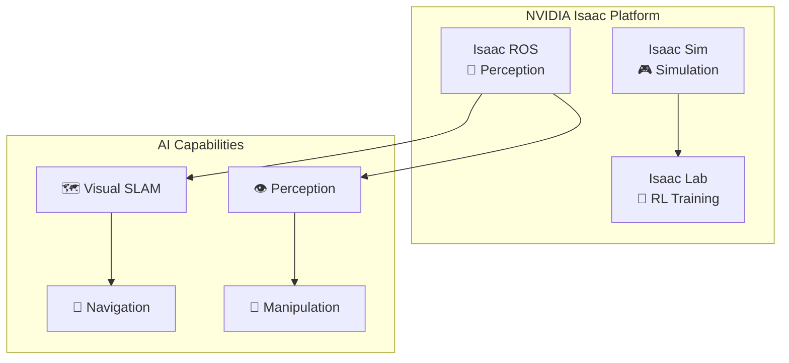
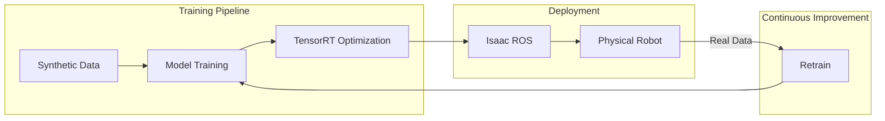
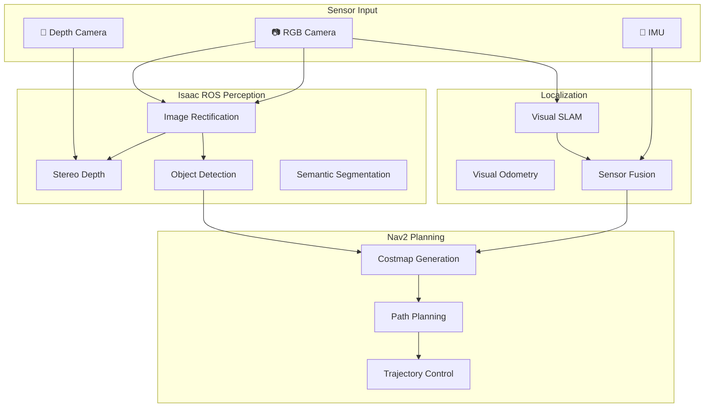

# Module 03: The AI-Robot Brain (NVIDIA Isaac™)

Welcome to the perception and intelligence module! NVIDIA Isaac is a comprehensive platform that brings GPU-accelerated AI capabilities to robotics. In this module, you'll learn to implement advanced perception, visual SLAM, and autonomous navigation.



## 🎯 Learning Objectives

By the end of this module, you will be able to:

1. **Generate Synthetic Data** — Use Isaac Sim for domain-randomized training data
2. **Implement Visual SLAM** — Map environments using camera and depth sensors
3. **Configure Navigation** — Set up Nav2 for autonomous bipedal path planning
4. **Integrate Perception** — Run GPU-accelerated AI models on robot sensor data

## 📋 Prerequisites

### Hardware Requirements

:::danger GPU Required
NVIDIA Isaac requires significant GPU resources:

| Component | Minimum | Recommended |
|-----------|---------|-------------|
| **GPU** | RTX 2070 | RTX 3080+ |
| **VRAM** | 8 GB | 12+ GB |
| **RAM** | 32 GB | 64 GB |
| **Storage** | 50 GB SSD | 100+ GB NVMe |
| **Driver** | 525.60+ | Latest |
:::

### Software Requirements

- **Ubuntu 22.04 LTS** (required)
- **ROS 2 Humble** installed
- **NVIDIA Container Toolkit** for Docker-based deployment
- Completed **Modules 01 and 02**

## 🗺️ Module Roadmap

| Chapter | Topic | Duration |
|---------|-------|----------|
| 3.1 | [Isaac Sim for Synthetic Data](./isaac-sim) | 75 min |
| 3.2 | [Visual SLAM with Isaac ROS](./visual-slam) | 90 min |
| 3.3 | [Navigation with Nav2](./navigation) | 90 min |
| 3.4 | [Mapping & Navigation Deliverable](./mapping-navigation) | 120 min |

## 🔑 The NVIDIA Isaac Ecosystem

### Isaac Sim

A photorealistic simulator built on NVIDIA Omniverse for:
- Generating **synthetic training data** with perfect labels
- **Domain randomization** for robust model training
- Testing robot behaviors before real-world deployment

### Isaac ROS

GPU-accelerated ROS 2 packages including:
- **Visual SLAM** (cuVSLAM) — Real-time mapping
- **Stereo Depth** — GPU depth estimation
- **DNN Inference** — TensorRT-optimized neural networks
- **AprilTag Detection** — Fiducial marker tracking

### Isaac Lab

A framework for **reinforcement learning** in robotics:
- Train locomotion policies for bipedal robots
- Sim-to-real transfer with domain adaptation
- Parallel environment training on GPU



## ⚙️ Installation

### Quick Start with Docker

```bash
# Pull Isaac ROS base image
docker pull nvcr.io/nvidia/isaac/ros:humble-2024.1.0

# Run with GPU support
docker run --runtime nvidia -it --rm \
    --network host \
    -v /tmp/.X11-unix:/tmp/.X11-unix \
    -e DISPLAY=$DISPLAY \
    nvcr.io/nvidia/isaac/ros:humble-2024.1.0
```

### Native Installation

```bash
# Add Isaac ROS apt repository
wget -qO - https://isaac.download.nvidia.com/isaac-ros/repos.key | sudo apt-key add -
sudo sh -c 'echo "deb https://isaac.download.nvidia.com/isaac-ros/packages/ubuntu jammy main" > /etc/apt/sources.list.d/isaac-ros.list'

# Install Isaac ROS packages
sudo apt update
sudo apt install ros-humble-isaac-ros-visual-slam \
                 ros-humble-isaac-ros-stereo-image-proc \
                 ros-humble-isaac-ros-apriltag
```

## 🧠 AI Pipeline Architecture



## 🚀 Let's Begin!

Ready to add AI perception to your humanoid?

**[Start with Isaac Sim →](./isaac-sim)**

---

:::info Module Deliverable
At the end of this module, you will have created:
1. A **synthetic dataset** with labeled images from Isaac Sim
2. A robot running **Visual SLAM** for real-time mapping
3. Full **Nav2 integration** for autonomous point-to-point navigation
4. A complete **mapping and navigation demo**
:::
