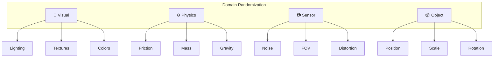

# Isaac Sim: Generating Synthetic Training Data

NVIDIA Isaac Sim is a photorealistic simulator built on Omniverse that enables the generation of perfectly-labeled synthetic data for training perception models. This chapter covers setting up Isaac Sim and creating datasets with domain randomization.

```mermaid
flowchart LR
    subgraph IsaacSim["Isaac Sim"]
        Scene[Virtual Scene]
        DR[Domain Randomization]
        Sensors[Sensor Simulation]
    end
    
    subgraph Output["Synthetic Data"]
        RGB[RGB Images]
        Depth[Depth Maps]
        Seg[Segmentation Masks]
        BBox[Bounding Boxes]
        Pose[6-DOF Poses]
    end
    
    subgraph Training["Model Training"]
        Detection[Object Detection]
        Segmentation[Semantic Seg]
        PoseEst[Pose Estimation]
    end
    
    IsaacSim --> Output --> Training
```



## 🛠️ Installing Isaac Sim

### System Requirements

| Component | Requirement |
|-----------|-------------|
| **OS** | Ubuntu 22.04 |
| **GPU** | NVIDIA RTX 2070+ |
| **VRAM** | 8 GB minimum |
| **RAM** | 32 GB minimum |
| **Storage** | 50 GB+ SSD |
| **Driver** | 525.60+ |

### Installation via Omniverse Launcher

1. Download [NVIDIA Omniverse Launcher](https://www.nvidia.com/en-us/omniverse/)
2. Install the Launcher and sign in
3. Go to **Exchange** → Search for **Isaac Sim**
4. Click **Install** (downloads ~15GB)
5. Launch from **Library** → **Isaac Sim**

### Verify Installation

```bash
# Navigate to Isaac Sim installation
cd ~/.local/share/ov/pkg/isaac_sim-2023.1.1

# Run with ROS 2 support
./isaac-sim.sh --enable extension:omni.isaac.ros2_bridge
```

---

## 🎬 Creating Your First Scene

### Python Scripting Interface

Isaac Sim provides a powerful Python API for programmatic scene creation:

```python
#!/usr/bin/env python3
"""Create a basic scene in Isaac Sim."""

from omni.isaac.kit import SimulationApp

# Launch simulation
config = {
    "width": 1280,
    "height": 720,
    "headless": False,  # Set True for data generation
}
simulation_app = SimulationApp(config)

# Now import Omni modules
from omni.isaac.core import World
from omni.isaac.core.objects import DynamicCuboid, GroundPlane
from omni.isaac.core.utils.nucleus import get_assets_root_path
import numpy as np

# Create world
world = World(stage_units_in_meters=1.0)

# Add ground plane
world.scene.add_default_ground_plane()

# Add objects
cube = world.scene.add(
    DynamicCuboid(
        prim_path="/World/Cube",
        name="target_cube",
        position=np.array([0.5, 0.0, 0.1]),
        scale=np.array([0.1, 0.1, 0.1]),
        color=np.array([1.0, 0.0, 0.0]),  # Red
    )
)

# Reset world
world.reset()

# Run simulation loop
while simulation_app.is_running():
    world.step(render=True)
    
    # Your logic here
    cube_position = cube.get_world_pose()[0]
    print(f"Cube position: {cube_position}")

simulation_app.close()
```

---

## 🤖 Loading Robot Assets

### Importing URDF

```python
from omni.isaac.core.utils.extensions import enable_extension
enable_extension("omni.isaac.urdf")

from omni.importer.urdf import _urdf
from omni.isaac.core.robots import Robot

# URDF importer settings
urdf_interface = _urdf.acquire_urdf_interface()
import_config = _urdf.ImportConfig()
import_config.merge_fixed_joints = False
import_config.fix_base = False
import_config.import_inertia_tensor = True

# Import URDF
urdf_path = "/path/to/humanoid.urdf"
result = urdf_interface.parse_urdf(urdf_path, import_config)

# Create robot prim
robot_prim_path = "/World/Humanoid"
urdf_interface.import_robot(
    robot_prim_path,
    result,
    import_config,
)

# Wrap as Robot object
from omni.isaac.core.articulations import Articulation
robot = Articulation(prim_path=robot_prim_path)
world.scene.add(robot)
```

### Using Pre-built Assets

```python
from omni.isaac.nucleus import get_assets_root_path

assets_root = get_assets_root_path()
robot_usd = assets_root + "/Isaac/Robots/Humanoid/humanoid.usd"

# Add robot to stage
from omni.isaac.core.utils.stage import add_reference_to_stage
add_reference_to_stage(usd_path=robot_usd, prim_path="/World/Robot")
```

---

## 🎲 Domain Randomization

Domain randomization varies simulation parameters to create robust models that transfer to the real world.

### Randomization Categories



### Implementing Domain Randomization

```python
from omni.isaac.core.utils.prims import create_prim
from omni.replicator import ReplicatorContext
import omni.replicator.core as rep

# Initialize Replicator
with rep.new_layer():
    
    # Create lights to randomize
    light = rep.create.light(
        light_type="distant",
        intensity=rep.distribution.uniform(500, 3000),
        temperature=rep.distribution.uniform(4500, 7500),
    )
    
    # Randomize light position
    with rep.trigger.on_frame(num_frames=100):
        with light:
            rep.modify.pose(
                rotation=rep.distribution.uniform((-45, -180, 0), (45, 180, 0))
            )
    
    # Randomize object materials
    cube = rep.get.prims(path_pattern="/World/Cube")
    with rep.trigger.on_frame():
        with cube:
            rep.randomizer.materials(
                materials=[
                    rep.create.material_omnipbr(
                        diffuse=rep.distribution.uniform((0, 0, 0), (1, 1, 1)),
                        roughness=rep.distribution.uniform(0.1, 0.9),
                    )
                ]
            )
    
    # Randomize positions
    with rep.trigger.on_frame():
        with cube:
            rep.modify.pose(
                position=rep.distribution.uniform(
                    (-1, -1, 0.1),
                    (1, 1, 0.1)
                )
            )
```

---

## 📷 Synthetic Data Generation

### Setting Up Sensors

```python
import omni.replicator.core as rep

# Create camera
camera = rep.create.camera(
    position=(0, -3, 1.5),
    look_at=(0, 0, 0.5),
    focal_length=24,
)

# Create render product
render_product = rep.create.render_product(camera, (640, 480))

# Set up annotators (ground truth generators)
rgb_annot = rep.AnnotatorRegistry.get_annotator("rgb")
depth_annot = rep.AnnotatorRegistry.get_annotator("distance_to_camera")
bbox_annot = rep.AnnotatorRegistry.get_annotator("bounding_box_2d_tight")
semantic_annot = rep.AnnotatorRegistry.get_annotator("semantic_segmentation")
instance_annot = rep.AnnotatorRegistry.get_annotator("instance_segmentation")

# Attach annotators to render product
rgb_annot.attach([render_product])
depth_annot.attach([render_product])
bbox_annot.attach([render_product])
semantic_annot.attach([render_product])
instance_annot.attach([render_product])
```

### Generating Dataset

```python
import omni.replicator.core as rep
import asyncio

async def generate_dataset(num_frames: int, output_dir: str):
    """Generate synthetic dataset with randomization."""
    
    # Setup writer
    writer = rep.WriterRegistry.get("BasicWriter")
    writer.initialize(
        output_dir=output_dir,
        rgb=True,
        bounding_box_2d_tight=True,
        semantic_segmentation=True,
        distance_to_camera=True,
    )
    writer.attach([render_product])
    
    # Generate frames
    for i in range(num_frames):
        # Step simulation (triggers randomizers)
        await rep.orchestrator.step_async()
        
        # Data is automatically written by BasicWriter
        print(f"Generated frame {i+1}/{num_frames}")
    
    print(f"Dataset saved to {output_dir}")

# Run generation
asyncio.ensure_future(generate_dataset(1000, "/data/synthetic_dataset"))
```

### Output Data Format

```
synthetic_dataset/
├── rgb/
│   ├── rgb_0001.png
│   ├── rgb_0002.png
│   └── ...
├── distance_to_camera/
│   ├── depth_0001.npy
│   └── ...
├── bounding_box_2d_tight/
│   ├── bbox_0001.json
│   └── ...
├── semantic_segmentation/
│   ├── semantic_0001.png
│   ├── semantic_labels.json
│   └── ...
└── dataset.json
```

---

## 🏷️ Semantic Labels

### Defining Classes

```python
import omni.replicator.core as rep

# Define semantic classes
rep.modify.semantics([
    ("class", "floor"),
    ("class", "wall"),
    ("class", "table"),
    ("class", "chair"),
    ("class", "human"),
    ("class", "robot"),
])

# Apply to objects
floor_prim = rep.get.prims(path_pattern="/World/Floor")
with floor_prim:
    rep.modify.semantics([("class", "floor")])

table_prim = rep.get.prims(path_pattern="/World/Table")
with table_prim:
    rep.modify.semantics([("class", "table")])
```

### Label Mapping

```json
{
  "semantic_labels": {
    "0": {"class": "BACKGROUND"},
    "1": {"class": "floor"},
    "2": {"class": "wall"},
    "3": {"class": "table"},
    "4": {"class": "chair"},
    "5": {"class": "human"},
    "6": {"class": "robot"}
  }
}
```

---

## 🧠 Training with Synthetic Data

### Converting to COCO Format

```python
import json
import os
from PIL import Image

def convert_to_coco(dataset_dir: str, output_path: str):
    """Convert Isaac Sim output to COCO format."""
    
    coco = {
        "images": [],
        "annotations": [],
        "categories": []
    }
    
    # Load semantic labels
    with open(f"{dataset_dir}/semantic_segmentation/semantic_labels.json") as f:
        labels = json.load(f)
    
    # Add categories
    for idx, (label_id, info) in enumerate(labels["semantic_labels"].items()):
        if info["class"] != "BACKGROUND":
            coco["categories"].append({
                "id": int(label_id),
                "name": info["class"],
            })
    
    # Process each frame
    bbox_dir = f"{dataset_dir}/bounding_box_2d_tight"
    annotation_id = 0
    
    for frame_idx, bbox_file in enumerate(sorted(os.listdir(bbox_dir))):
        # Add image entry
        img_path = f"rgb/rgb_{frame_idx:04d}.png"
        with Image.open(f"{dataset_dir}/{img_path}") as img:
            width, height = img.size
        
        coco["images"].append({
            "id": frame_idx,
            "file_name": img_path,
            "width": width,
            "height": height,
        })
        
        # Add annotations
        with open(f"{bbox_dir}/{bbox_file}") as f:
            bboxes = json.load(f)
        
        for bbox in bboxes["data"]:
            x_min, y_min, x_max, y_max = bbox["bbox"]
            coco["annotations"].append({
                "id": annotation_id,
                "image_id": frame_idx,
                "category_id": bbox["semantic_id"],
                "bbox": [x_min, y_min, x_max - x_min, y_max - y_min],
                "area": (x_max - x_min) * (y_max - y_min),
                "iscrowd": 0,
            })
            annotation_id += 1
    
    with open(output_path, "w") as f:
        json.dump(coco, f)
    
    print(f"COCO dataset saved to {output_path}")

convert_to_coco("/data/synthetic_dataset", "/data/coco_annotations.json")
```

---

## 🔄 ROS 2 Integration

### Publishing Sensor Data to ROS 2

```python
from omni.isaac.ros2_bridge import ROS2Camera, ROS2Clock

# Create ROS 2 camera publisher
ros_camera = ROS2Camera(
    prim_path="/World/Camera",
    camera_info_topic="/camera/camera_info",
    rgb_topic="/camera/image_raw",
    depth_topic="/camera/depth/image_raw",
    frame_id="camera_optical_frame",
)

# Add to world
world.scene.add(ros_camera)

# Publish simulation clock
ros_clock = ROS2Clock()
world.add_physics_callback("ros_clock", ros_clock.publish_clock)
```

---

## 📚 Summary

| Feature | Purpose |
|---------|---------|
| **Domain Randomization** | Create robust, transferable models |
| **Replicator** | Automated data generation pipeline |
| **Perfect Labels** | Ground truth for supervised learning |
| **ROS 2 Bridge** | Real-time sensor streaming |

:::info Next Chapter
Now let's use this synthetic data for Visual SLAM!

**[Continue to Visual SLAM →](./visual-slam)**
:::
