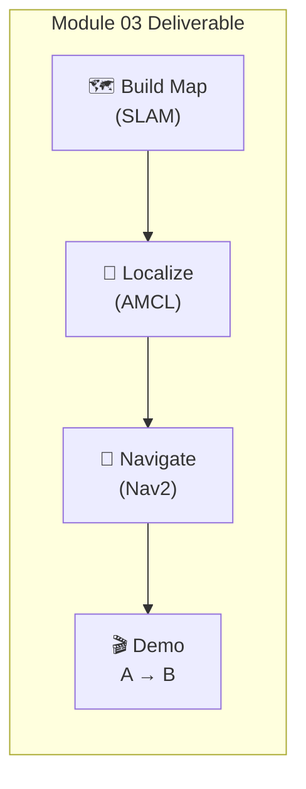
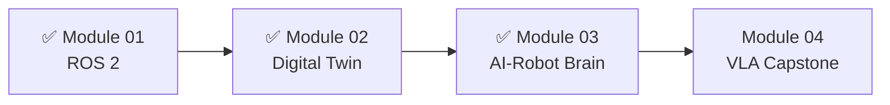

# Module 03 Deliverable: Mapping & Navigation

In this capstone exercise, you'll create a complete SLAM and navigation system where your humanoid robot can map a room and autonomously navigate from point A to point B.



---

## 🎯 Deliverable Requirements

| Requirement | Description |
|-------------|-------------|
| ✅ **SLAM Mapping** | Build a map of the simulation environment |
| ✅ **Map Saving** | Save and load the generated map |
| ✅ **Localization** | Robot localizes itself in the saved map |
| ✅ **Navigation** | Autonomous navigation between waypoints |
| ✅ **Visualization** | RViz showing map, path, and robot |

---

## 📁 Project Structure

```
robot_navigation/
├── robot_navigation/
│   ├── __init__.py
│   ├── waypoint_follower.py
│   └── navigation_demo.py
├── config/
│   ├── nav2_params.yaml
│   ├── slam_params.yaml
│   └── amcl_params.yaml
├── maps/
│   └── (generated maps go here)
├── launch/
│   ├── slam_mapping.launch.py
│   ├── navigation.launch.py
│   └── demo.launch.py
├── rviz/
│   └── navigation.rviz
├── package.xml
└── setup.py
```

---

## 🗺️ Part 1: SLAM Mapping

### config/slam_params.yaml

```yaml
slam_toolbox:
  ros__parameters:
    # Plugin params
    solver_plugin: solver_plugins::CeresSolver
    ceres_linear_solver: SPARSE_NORMAL_CHOLESKY
    ceres_preconditioner: SCHUR_JACOBI
    ceres_trust_strategy: LEVENBERG_MARQUARDT
    ceres_dogleg_type: TRADITIONAL_DOGLEG
    ceres_loss_function: None

    # ROS Parameters
    odom_frame: odom
    map_frame: map
    base_frame: base_footprint
    scan_topic: /scan
    mode: mapping

    # Lifelong params
    debug_logging: false
    throttle_scans: 1
    transform_publish_period: 0.02
    map_update_interval: 2.0
    resolution: 0.05
    max_laser_range: 20.0
    minimum_time_interval: 0.5
    transform_timeout: 0.2
    tf_buffer_duration: 30.0
    stack_size_to_use: 40000000

    # General Parameters
    use_scan_matching: true
    use_scan_barycenter: true
    minimum_travel_distance: 0.3
    minimum_travel_heading: 0.3
    scan_buffer_size: 10
    scan_buffer_maximum_scan_distance: 10.0
    link_match_minimum_response_fine: 0.1
    link_scan_maximum_distance: 1.5
    loop_search_maximum_distance: 3.0
    do_loop_closing: true
    loop_match_minimum_chain_size: 10
    loop_match_maximum_variance_coarse: 3.0
    loop_match_minimum_response_coarse: 0.35
    loop_match_minimum_response_fine: 0.45

    # Correlation Parameters
    correlation_search_space_dimension: 0.5
    correlation_search_space_resolution: 0.01
    correlation_search_space_smear_deviation: 0.1

    # Loop Closure Parameters
    loop_search_space_dimension: 8.0
    loop_search_space_resolution: 0.05
    loop_search_space_smear_deviation: 0.03

    # Scan Matcher Parameters
    distance_variance_penalty: 0.5
    angle_variance_penalty: 1.0

    fine_search_angle_offset: 0.00349
    coarse_search_angle_offset: 0.349
    coarse_angle_resolution: 0.0349
    minimum_angle_penalty: 0.9
    minimum_distance_penalty: 0.5
    use_response_expansion: true
```

### launch/slam_mapping.launch.py

```python
#!/usr/bin/env python3
"""Launch SLAM Toolbox for mapping."""

import os
from ament_index_python.packages import get_package_share_directory
from launch import LaunchDescription
from launch.actions import DeclareLaunchArgument, IncludeLaunchDescription
from launch.launch_description_sources import PythonLaunchDescriptionSource
from launch.substitutions import LaunchConfiguration
from launch_ros.actions import Node


def generate_launch_description():
    
    pkg_dir = get_package_share_directory('robot_navigation')
    slam_params = os.path.join(pkg_dir, 'config', 'slam_params.yaml')
    rviz_config = os.path.join(pkg_dir, 'rviz', 'slam.rviz')
    
    use_sim_time = DeclareLaunchArgument(
        'use_sim_time',
        default_value='true'
    )
    
    # SLAM Toolbox node
    slam_toolbox = Node(
        package='slam_toolbox',
        executable='async_slam_toolbox_node',
        name='slam_toolbox',
        parameters=[
            slam_params,
            {'use_sim_time': LaunchConfiguration('use_sim_time')}
        ],
        output='screen'
    )
    
    # RViz for visualization
    rviz = Node(
        package='rviz2',
        executable='rviz2',
        name='rviz2',
        arguments=['-d', rviz_config],
        parameters=[{'use_sim_time': LaunchConfiguration('use_sim_time')}],
        output='screen'
    )
    
    return LaunchDescription([
        use_sim_time,
        slam_toolbox,
        rviz,
    ])
```

### Mapping Procedure

```bash
# Terminal 1: Launch simulation
ros2 launch simulation_environment simulation.launch.py

# Terminal 2: Launch SLAM
ros2 launch robot_navigation slam_mapping.launch.py

# Terminal 3: Teleoperate to build map
ros2 run teleop_twist_keyboard teleop_twist_keyboard

# When done mapping, save the map:
ros2 run nav2_map_server map_saver_cli -f ~/maps/office_map --ros-args -p use_sim_time:=true
```

---

## 📍 Part 2: Localization Setup

### config/amcl_params.yaml

```yaml
amcl:
  ros__parameters:
    use_sim_time: true
    
    # Filter parameters
    alpha1: 0.2   # Rotation noise from rotation
    alpha2: 0.2   # Rotation noise from translation
    alpha3: 0.2   # Translation noise from translation
    alpha4: 0.2   # Translation noise from rotation
    alpha5: 0.2   # Translation noise from translation (omnidirectional)
    
    # Frame IDs
    base_frame_id: "base_footprint"
    global_frame_id: "map"
    odom_frame_id: "odom"
    
    # Sensor model
    laser_model_type: "likelihood_field"
    laser_max_range: 30.0
    laser_min_range: 0.1
    laser_likelihood_max_dist: 2.0
    max_beams: 60
    
    # Particle filter
    min_particles: 500
    max_particles: 3000
    pf_err: 0.05
    pf_z: 0.99
    
    # Update thresholds
    update_min_d: 0.2    # Minimum distance to trigger update
    update_min_a: 0.2    # Minimum rotation to trigger update
    resample_interval: 1
    
    # Recovery
    recovery_alpha_slow: 0.001
    recovery_alpha_fast: 0.1
    
    # Transform tolerance
    transform_tolerance: 1.0
    tf_broadcast: true
    
    # Initial pose (optional, can be set via RViz)
    set_initial_pose: false
    initial_pose:
      x: 0.0
      y: 0.0
      yaw: 0.0
```

---

## 🧭 Part 3: Full Navigation Launch

### launch/navigation.launch.py

```python
#!/usr/bin/env python3
"""Launch full navigation stack."""

import os
from ament_index_python.packages import get_package_share_directory
from launch import LaunchDescription
from launch.actions import DeclareLaunchArgument, IncludeLaunchDescription, GroupAction
from launch.launch_description_sources import PythonLaunchDescriptionSource
from launch.substitutions import LaunchConfiguration
from launch_ros.actions import Node, SetRemap
from nav2_common.launch import RewrittenYaml


def generate_launch_description():
    
    # Get directories
    pkg_dir = get_package_share_directory('robot_navigation')
    nav2_bringup_dir = get_package_share_directory('nav2_bringup')
    
    # Paths
    nav2_params = os.path.join(pkg_dir, 'config', 'nav2_params.yaml')
    map_file = os.path.join(pkg_dir, 'maps', 'office_map.yaml')
    rviz_config = os.path.join(pkg_dir, 'rviz', 'navigation.rviz')
    
    # Launch arguments
    use_sim_time = DeclareLaunchArgument(
        'use_sim_time',
        default_value='true'
    )
    
    map_arg = DeclareLaunchArgument(
        'map',
        default_value=map_file
    )
    
    autostart = DeclareLaunchArgument(
        'autostart',
        default_value='true'
    )
    
    # Configured parameters
    configured_params = RewrittenYaml(
        source_file=nav2_params,
        param_rewrites={
            'use_sim_time': LaunchConfiguration('use_sim_time'),
            'yaml_filename': LaunchConfiguration('map')
        },
        convert_types=True
    )
    
    # Lifecycle manager for localization
    lifecycle_manager_localization = Node(
        package='nav2_lifecycle_manager',
        executable='lifecycle_manager',
        name='lifecycle_manager_localization',
        output='screen',
        parameters=[{
            'use_sim_time': LaunchConfiguration('use_sim_time'),
            'autostart': LaunchConfiguration('autostart'),
            'node_names': ['map_server', 'amcl']
        }]
    )
    
    # Lifecycle manager for navigation
    lifecycle_manager_navigation = Node(
        package='nav2_lifecycle_manager',
        executable='lifecycle_manager',
        name='lifecycle_manager_navigation',
        output='screen',
        parameters=[{
            'use_sim_time': LaunchConfiguration('use_sim_time'),
            'autostart': LaunchConfiguration('autostart'),
            'node_names': [
                'controller_server',
                'planner_server',
                'recoveries_server',
                'bt_navigator',
                'waypoint_follower'
            ]
        }]
    )
    
    # Map server
    map_server = Node(
        package='nav2_map_server',
        executable='map_server',
        name='map_server',
        output='screen',
        parameters=[configured_params],
    )
    
    # AMCL
    amcl = Node(
        package='nav2_amcl',
        executable='amcl',
        name='amcl',
        output='screen',
        parameters=[configured_params],
    )
    
    # Controller server
    controller_server = Node(
        package='nav2_controller',
        executable='controller_server',
        name='controller_server',
        output='screen',
        parameters=[configured_params],
    )
    
    # Planner server
    planner_server = Node(
        package='nav2_planner',
        executable='planner_server',
        name='planner_server',
        output='screen',
        parameters=[configured_params],
    )
    
    # Recoveries server
    recoveries_server = Node(
        package='nav2_recoveries',
        executable='recoveries_server',
        name='recoveries_server',
        output='screen',
        parameters=[configured_params],
    )
    
    # BT Navigator
    bt_navigator = Node(
        package='nav2_bt_navigator',
        executable='bt_navigator',
        name='bt_navigator',
        output='screen',
        parameters=[configured_params],
    )
    
    # Waypoint follower
    waypoint_follower = Node(
        package='nav2_waypoint_follower',
        executable='waypoint_follower',
        name='waypoint_follower',
        output='screen',
        parameters=[configured_params],
    )
    
    # RViz
    rviz = Node(
        package='rviz2',
        executable='rviz2',
        name='rviz2',
        arguments=['-d', rviz_config],
        parameters=[{'use_sim_time': LaunchConfiguration('use_sim_time')}],
        output='screen'
    )
    
    return LaunchDescription([
        use_sim_time,
        map_arg,
        autostart,
        map_server,
        amcl,
        lifecycle_manager_localization,
        controller_server,
        planner_server,
        recoveries_server,
        bt_navigator,
        waypoint_follower,
        lifecycle_manager_navigation,
        rviz,
    ])
```

---

## 🎬 Part 4: Navigation Demo Node

### robot_navigation/navigation_demo.py

```python
#!/usr/bin/env python3
"""
Navigation Demo - Point A to Point B

Demonstrates autonomous navigation between predefined waypoints.
"""

import rclpy
from rclpy.node import Node
from rclpy.action import ActionClient
from rclpy.duration import Duration
from nav2_msgs.action import NavigateToPose, FollowWaypoints
from geometry_msgs.msg import PoseStamped, PoseWithCovarianceStamped
from nav_msgs.msg import Odometry
from std_msgs.msg import String
import math
from enum import Enum


class DemoState(Enum):
    IDLE = "IDLE"
    SETTING_INITIAL_POSE = "SETTING_INITIAL_POSE"
    WAITING_FOR_LOCALIZATION = "WAITING_FOR_LOCALIZATION"
    NAVIGATING = "NAVIGATING"
    PAUSED = "PAUSED"
    COMPLETE = "COMPLETE"
    ERROR = "ERROR"


class NavigationDemo(Node):
    """Autonomous navigation demonstration."""
    
    def __init__(self):
        super().__init__('navigation_demo')
        
        # Parameters
        self.declare_parameter('waypoints', [
            {'name': 'Start', 'x': 0.0, 'y': 0.0, 'yaw': 0.0},
            {'name': 'Kitchen', 'x': 3.0, 'y': 2.0, 'yaw': 1.57},
            {'name': 'Living Room', 'x': -2.0, 'y': 3.0, 'yaw': 3.14},
            {'name': 'Bedroom', 'x': -3.0, 'y': -2.0, 'yaw': -1.57},
            {'name': 'Start', 'x': 0.0, 'y': 0.0, 'yaw': 0.0},
        ])
        
        self.waypoints = self.get_parameter('waypoints').value
        
        # State
        self.state = DemoState.IDLE
        self.current_waypoint_idx = 0
        self.current_pose = None
        
        # Action clients
        self.nav_client = ActionClient(self, NavigateToPose, 'navigate_to_pose')
        self.waypoint_client = ActionClient(self, FollowWaypoints, 'follow_waypoints')
        
        # Publishers
        self.initial_pose_pub = self.create_publisher(
            PoseWithCovarianceStamped, 
            'initialpose', 
            10
        )
        self.status_pub = self.create_publisher(String, 'demo_status', 10)
        
        # Subscribers
        self.odom_sub = self.create_subscription(
            Odometry,
            'odom',
            self.odom_callback,
            10
        )
        
        # Timer for state machine
        self.timer = self.create_timer(1.0, self.state_machine_tick)
        
        self.get_logger().info('🤖 Navigation Demo initialized')
        self.get_logger().info(f'   {len(self.waypoints)} waypoints loaded')
        
        self.publish_status('Initialized - Ready to start')
    
    def publish_status(self, status: str):
        msg = String()
        msg.data = f'[{self.state.value}] {status}'
        self.status_pub.publish(msg)
        self.get_logger().info(msg.data)
    
    def odom_callback(self, msg: Odometry):
        self.current_pose = msg.pose.pose
    
    def state_machine_tick(self):
        """Main state machine loop."""
        
        if self.state == DemoState.IDLE:
            # Check if ready to start
            if self.current_pose is not None:
                self.start_demo()
        
        elif self.state == DemoState.NAVIGATING:
            # Check navigation progress (handled by action callbacks)
            pass
    
    def start_demo(self):
        """Start the navigation demo."""
        self.get_logger().info('🚀 Starting navigation demo!')
        self.state = DemoState.NAVIGATING
        self.current_waypoint_idx = 0
        self.navigate_to_next_waypoint()
    
    def navigate_to_next_waypoint(self):
        """Navigate to the next waypoint."""
        
        if self.current_waypoint_idx >= len(self.waypoints):
            self.state = DemoState.COMPLETE
            self.publish_status('🎉 Demo complete! All waypoints visited.')
            return
        
        waypoint = self.waypoints[self.current_waypoint_idx]
        self.publish_status(
            f'Navigating to waypoint {self.current_waypoint_idx + 1}/{len(self.waypoints)}: '
            f'{waypoint["name"]} ({waypoint["x"]}, {waypoint["y"]})'
        )
        
        # Create goal
        goal_msg = NavigateToPose.Goal()
        goal_msg.pose = self.create_pose_stamped(
            waypoint['x'],
            waypoint['y'],
            waypoint['yaw']
        )
        
        # Wait for server
        self.nav_client.wait_for_server()
        
        # Send goal
        send_goal_future = self.nav_client.send_goal_async(
            goal_msg,
            feedback_callback=self.navigation_feedback_callback
        )
        send_goal_future.add_done_callback(self.navigation_goal_response_callback)
    
    def create_pose_stamped(self, x: float, y: float, yaw: float) -> PoseStamped:
        """Create a PoseStamped message."""
        pose = PoseStamped()
        pose.header.frame_id = 'map'
        pose.header.stamp = self.get_clock().now().to_msg()
        
        pose.pose.position.x = x
        pose.pose.position.y = y
        pose.pose.position.z = 0.0
        
        # Convert yaw to quaternion
        pose.pose.orientation.x = 0.0
        pose.pose.orientation.y = 0.0
        pose.pose.orientation.z = math.sin(yaw / 2.0)
        pose.pose.orientation.w = math.cos(yaw / 2.0)
        
        return pose
    
    def navigation_goal_response_callback(self, future):
        goal_handle = future.result()
        
        if not goal_handle.accepted:
            self.get_logger().error('Goal rejected!')
            self.state = DemoState.ERROR
            return
        
        self.get_logger().info('Goal accepted!')
        
        result_future = goal_handle.get_result_async()
        result_future.add_done_callback(self.navigation_result_callback)
    
    def navigation_feedback_callback(self, feedback_msg):
        feedback = feedback_msg.feedback
        current = feedback.current_pose.pose.position
        
        # Calculate distance to goal
        waypoint = self.waypoints[self.current_waypoint_idx]
        dist = math.sqrt(
            (waypoint['x'] - current.x)**2 + 
            (waypoint['y'] - current.y)**2
        )
        
        self.get_logger().debug(f'Distance to goal: {dist:.2f}m')
    
    def navigation_result_callback(self, future):
        result = future.result()
        
        waypoint = self.waypoints[self.current_waypoint_idx]
        self.get_logger().info(
            f'✅ Reached waypoint: {waypoint["name"]}'
        )
        
        # Move to next waypoint
        self.current_waypoint_idx += 1
        
        # Brief pause at waypoint
        self.get_logger().info('Pausing for 2 seconds...')
        self.create_timer(2.0, self.navigate_to_next_waypoint, one_shot=True)
    
    def create_timer(self, period, callback, one_shot=False):
        """Create a timer (with one_shot support)."""
        if one_shot:
            def one_shot_callback():
                callback()
                timer.cancel()
            timer = super().create_timer(period, one_shot_callback)
            return timer
        return super().create_timer(period, callback)


def main(args=None):
    rclpy.init(args=args)
    
    demo = NavigationDemo()
    
    try:
        rclpy.spin(demo)
    except KeyboardInterrupt:
        demo.get_logger().info('Demo interrupted')
    finally:
        demo.destroy_node()
        rclpy.shutdown()


if __name__ == '__main__':
    main()
```

---

## 🚀 Running the Demo

### Step 1: Build the Package

```bash
cd ~/ros2_ws
colcon build --packages-select robot_navigation
source install/setup.bash
```

### Step 2: Create a Map (if not done)

```bash
# Launch simulation
ros2 launch simulation_environment simulation.launch.py

# In new terminal - Launch SLAM
ros2 launch robot_navigation slam_mapping.launch.py

# In new terminal - Teleoperate
ros2 run teleop_twist_keyboard teleop_twist_keyboard

# Drive around the environment, then save:
ros2 run nav2_map_server map_saver_cli -f ~/ros2_ws/src/robot_navigation/maps/office_map
```

### Step 3: Run Navigation Demo

```bash
# Terminal 1: Launch simulation
ros2 launch simulation_environment simulation.launch.py

# Terminal 2: Launch navigation
ros2 launch robot_navigation navigation.launch.py

# Terminal 3: Set initial pose in RViz (click "2D Pose Estimate")

# Terminal 4: Run demo
ros2 run robot_navigation navigation_demo
```

---

## ✅ Verification Checklist

| Test | Expected Result |
|------|-----------------|
| SLAM builds map | Map visible in RViz during exploration |
| Map saves | `office_map.yaml` and `.pgm` created |
| AMCL localizes | Particle cloud converges around robot |
| Global path computed | Pink line from robot to goal |
| Robot follows path | Robot moves along planned path |
| Obstacles avoided | Path routes around new obstacles |
| Waypoints visited | All waypoints reached in sequence |

---

## 🎉 Module 03 Complete!

You now have a fully autonomous navigation system:

- ✅ **SLAM mapping** with SLAM Toolbox
- ✅ **Localization** with AMCL
- ✅ **Path planning** with Nav2
- ✅ **Autonomous waypoint following**



:::info Final Module
Ready for the capstone? Let's add voice control and LLM intelligence!

**[Continue to Module 04: Vision-Language-Action →](../vision-language-action/)**
:::
