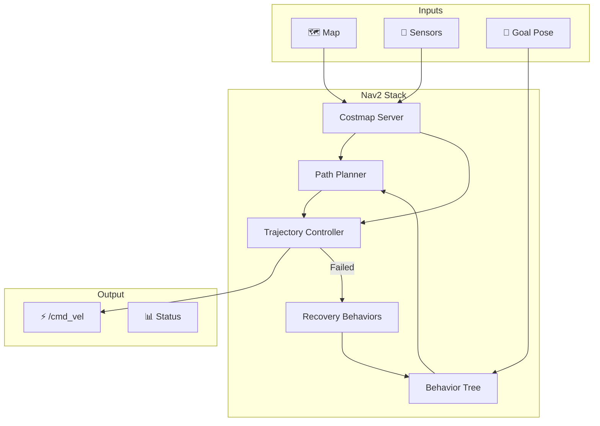
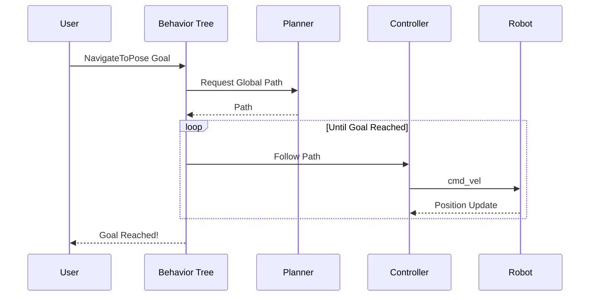

# Autonomous Navigation with Nav2

Nav2 (Navigation 2) is the ROS 2 navigation stack that enables autonomous point-to-point navigation. This chapter covers configuring Nav2 for bipedal robots, including costmap generation, path planning, and trajectory control.



## 🧠 Nav2 Architecture

### Core Components

| Component | Purpose |
|-----------|---------|
| **Behavior Tree (BT)** | Orchestrates navigation tasks |
| **Planner Server** | Computes global paths |
| **Controller Server** | Follows paths locally |
| **Costmap 2D** | Represents obstacles |
| **Recovery Server** | Handles stuck situations |
| **Lifecycle Manager** | Manages node states |

### Navigation Flow



---

## 🛠️ Installation

```bash
# Install Nav2
sudo apt install ros-humble-navigation2 ros-humble-nav2-bringup

# Install additional tools
sudo apt install ros-humble-slam-toolbox ros-humble-robot-localization
```

---

## ⚙️ Configuration Files

### nav2_params.yaml

```yaml
# Nav2 Parameters for Bipedal Robot

amcl:
  ros__parameters:
    use_sim_time: true
    alpha1: 0.2
    alpha2: 0.2
    alpha3: 0.2
    alpha4: 0.2
    base_frame_id: "base_footprint"
    beam_skip_distance: 0.5
    beam_skip_error_threshold: 0.9
    beam_skip_threshold: 0.3
    do_beamskip: false
    global_frame_id: "map"
    lambda_short: 0.1
    laser_likelihood_max_dist: 2.0
    laser_max_range: 30.0
    laser_min_range: 0.1
    laser_model_type: "likelihood_field"
    max_beams: 60
    max_particles: 2000
    min_particles: 500
    odom_frame_id: "odom"
    pf_err: 0.05
    pf_z: 0.99
    recovery_alpha_fast: 0.0
    recovery_alpha_slow: 0.0
    resample_interval: 1
    robot_model_type: "nav2_amcl::DifferentialMotionModel"
    save_pose_rate: 0.5
    sigma_hit: 0.2
    tf_broadcast: true
    transform_tolerance: 1.0
    update_min_a: 0.2
    update_min_d: 0.25
    z_hit: 0.5
    z_max: 0.05
    z_rand: 0.5
    z_short: 0.05

bt_navigator:
  ros__parameters:
    use_sim_time: true
    global_frame: map
    robot_base_frame: base_link
    odom_topic: /odom
    bt_loop_duration: 10
    default_server_timeout: 20
    # Default BehaviorTree XML
    default_nav_to_pose_bt_xml: ""
    # Plugin libraries
    plugin_lib_names:
      - nav2_compute_path_to_pose_action_bt_node
      - nav2_follow_path_action_bt_node
      - nav2_spin_action_bt_node
      - nav2_wait_action_bt_node
      - nav2_back_up_action_bt_node
      - nav2_clear_costmap_service_bt_node
      - nav2_is_stuck_condition_bt_node
      - nav2_goal_reached_condition_bt_node
      - nav2_goal_updated_condition_bt_node
      - nav2_rate_controller_bt_node
      - nav2_distance_controller_bt_node
      - nav2_recovery_node_bt_node
      - nav2_pipeline_sequence_bt_node
      - nav2_round_robin_node_bt_node
      - nav2_transform_available_condition_bt_node

controller_server:
  ros__parameters:
    use_sim_time: true
    controller_frequency: 20.0
    min_x_velocity_threshold: 0.001
    min_y_velocity_threshold: 0.001
    min_theta_velocity_threshold: 0.001
    progress_checker_plugin: "progress_checker"
    goal_checker_plugins: ["goal_checker"]
    controller_plugins: ["FollowPath"]
    
    progress_checker:
      plugin: "nav2_controller::SimpleProgressChecker"
      required_movement_radius: 0.5
      movement_time_allowance: 10.0
      
    goal_checker:
      plugin: "nav2_controller::SimpleGoalChecker"
      xy_goal_tolerance: 0.15
      yaw_goal_tolerance: 0.25
      stateful: True
      
    # DWB Controller (good for bipeds)
    FollowPath:
      plugin: "dwb_core::DWBLocalPlanner"
      debug_trajectory_details: True
      min_vel_x: 0.0
      min_vel_y: 0.0
      max_vel_x: 0.5      # Slower for bipedal
      max_vel_y: 0.0      # No lateral movement
      max_vel_theta: 0.5
      min_speed_xy: 0.0
      max_speed_xy: 0.5
      min_speed_theta: 0.0
      acc_lim_x: 1.0
      acc_lim_y: 0.0
      acc_lim_theta: 1.5
      decel_lim_x: -1.0
      decel_lim_y: 0.0
      decel_lim_theta: -1.5
      vx_samples: 20
      vy_samples: 1
      vtheta_samples: 20
      sim_time: 1.5
      linear_granularity: 0.05
      angular_granularity: 0.025
      transform_tolerance: 0.2
      xy_goal_tolerance: 0.15
      trans_stopped_velocity: 0.25
      short_circuit_trajectory_evaluation: True
      stateful: True
      critics:
        - RotateToGoal
        - Oscillation
        - BaseObstacle
        - GoalAlign
        - PathAlign
        - PathDist
        - GoalDist
      BaseObstacle.scale: 0.02
      PathAlign.scale: 32.0
      PathAlign.forward_point_distance: 0.1
      GoalAlign.scale: 24.0
      GoalAlign.forward_point_distance: 0.1
      PathDist.scale: 32.0
      GoalDist.scale: 24.0
      RotateToGoal.scale: 32.0
      RotateToGoal.slowing_factor: 5.0
      RotateToGoal.lookahead_time: -1.0

planner_server:
  ros__parameters:
    use_sim_time: true
    expected_planner_frequency: 20.0
    planner_plugins: ["GridBased"]
    
    GridBased:
      plugin: "nav2_navfn_planner/NavfnPlanner"
      tolerance: 0.5
      use_astar: false
      allow_unknown: true

local_costmap:
  local_costmap:
    ros__parameters:
      use_sim_time: true
      update_frequency: 5.0
      publish_frequency: 2.0
      global_frame: odom
      robot_base_frame: base_link
      rolling_window: true
      width: 3
      height: 3
      resolution: 0.05
      robot_radius: 0.22
      plugins: ["voxel_layer", "inflation_layer"]
      
      voxel_layer:
        plugin: "nav2_costmap_2d::VoxelLayer"
        enabled: True
        publish_voxel_map: True
        origin_z: 0.0
        z_resolution: 0.05
        z_voxels: 16
        max_obstacle_height: 2.0
        mark_threshold: 0
        observation_sources: scan
        scan:
          topic: /scan
          max_obstacle_height: 2.0
          clearing: True
          marking: True
          data_type: "LaserScan"
          raytrace_max_range: 3.0
          raytrace_min_range: 0.0
          obstacle_max_range: 2.5
          obstacle_min_range: 0.0
          
      inflation_layer:
        plugin: "nav2_costmap_2d::InflationLayer"
        cost_scaling_factor: 3.0
        inflation_radius: 0.55
        
      always_send_full_costmap: True

global_costmap:
  global_costmap:
    ros__parameters:
      use_sim_time: true
      update_frequency: 1.0
      publish_frequency: 1.0
      global_frame: map
      robot_base_frame: base_link
      robot_radius: 0.22
      resolution: 0.05
      track_unknown_space: true
      plugins: ["static_layer", "obstacle_layer", "inflation_layer"]
      
      static_layer:
        plugin: "nav2_costmap_2d::StaticLayer"
        map_subscribe_transient_local: True
        
      obstacle_layer:
        plugin: "nav2_costmap_2d::ObstacleLayer"
        enabled: True
        observation_sources: scan
        scan:
          topic: /scan
          max_obstacle_height: 2.0
          clearing: True
          marking: True
          data_type: "LaserScan"
          raytrace_max_range: 3.0
          raytrace_min_range: 0.0
          obstacle_max_range: 2.5
          obstacle_min_range: 0.0
          
      inflation_layer:
        plugin: "nav2_costmap_2d::InflationLayer"
        cost_scaling_factor: 3.0
        inflation_radius: 0.55
        
      always_send_full_costmap: True

recoveries_server:
  ros__parameters:
    use_sim_time: true
    costmap_topic: local_costmap/costmap_raw
    footprint_topic: local_costmap/published_footprint
    cycle_frequency: 10.0
    recovery_plugins: ["spin", "backup", "wait"]
    
    spin:
      plugin: "nav2_recoveries/Spin"
    backup:
      plugin: "nav2_recoveries/BackUp"
    wait:
      plugin: "nav2_recoveries/Wait"

lifecycle_manager:
  ros__parameters:
    use_sim_time: true
    autostart: true
    node_names:
      - controller_server
      - planner_server
      - recoveries_server
      - bt_navigator
```

---

## 🚀 Launch File

### navigation.launch.py

```python
#!/usr/bin/env python3
"""Launch Nav2 navigation stack."""

import os
from ament_index_python.packages import get_package_share_directory
from launch import LaunchDescription
from launch.actions import DeclareLaunchArgument, IncludeLaunchDescription
from launch.launch_description_sources import PythonLaunchDescriptionSource
from launch.substitutions import LaunchConfiguration
from launch_ros.actions import Node


def generate_launch_description():
    
    # Get directories
    pkg_dir = get_package_share_directory('my_robot_navigation')
    nav2_dir = get_package_share_directory('nav2_bringup')
    
    # Paths
    nav2_params = os.path.join(pkg_dir, 'config', 'nav2_params.yaml')
    map_file = os.path.join(pkg_dir, 'maps', 'office_map.yaml')
    
    # Launch arguments
    use_sim_time = DeclareLaunchArgument(
        'use_sim_time',
        default_value='true'
    )
    
    map_arg = DeclareLaunchArgument(
        'map',
        default_value=map_file
    )
    
    # Map server
    map_server = Node(
        package='nav2_map_server',
        executable='map_server',
        name='map_server',
        parameters=[{
            'yaml_filename': LaunchConfiguration('map'),
            'use_sim_time': LaunchConfiguration('use_sim_time')
        }],
        output='screen'
    )
    
    # AMCL localization
    amcl = Node(
        package='nav2_amcl',
        executable='amcl',
        name='amcl',
        parameters=[nav2_params],
        output='screen'
    )
    
    # Nav2 bringup
    nav2_bringup = IncludeLaunchDescription(
        PythonLaunchDescriptionSource(
            os.path.join(nav2_dir, 'launch', 'navigation_launch.py')
        ),
        launch_arguments={
            'use_sim_time': LaunchConfiguration('use_sim_time'),
            'params_file': nav2_params,
        }.items()
    )
    
    # Lifecycle manager for map server
    lifecycle_manager = Node(
        package='nav2_lifecycle_manager',
        executable='lifecycle_manager',
        name='lifecycle_manager_localization',
        output='screen',
        parameters=[{
            'use_sim_time': LaunchConfiguration('use_sim_time'),
            'autostart': True,
            'node_names': ['map_server', 'amcl']
        }]
    )
    
    return LaunchDescription([
        use_sim_time,
        map_arg,
        map_server,
        amcl,
        lifecycle_manager,
        nav2_bringup,
    ])
```

---

## 🗺️ Creating a Map

### Using SLAM Toolbox

```bash
# Launch SLAM mapping
ros2 launch slam_toolbox online_async_launch.py \
    slam_params_file:=/path/to/slam_params.yaml \
    use_sim_time:=true

# Drive robot around to build map

# Save map when complete
ros2 run nav2_map_server map_saver_cli -f /maps/office_map
```

### Map Format

```
maps/
├── office_map.yaml     # Map metadata
└── office_map.pgm      # Map image (occupied=black, free=white)
```

```yaml
# office_map.yaml
image: office_map.pgm
resolution: 0.05
origin: [-10.0, -10.0, 0.0]
negate: 0
occupied_thresh: 0.65
free_thresh: 0.196
```

---

## 🎯 Sending Navigation Goals

### Programmatic Goal

```python
#!/usr/bin/env python3
"""Send navigation goals programmatically."""

import rclpy
from rclpy.node import Node
from rclpy.action import ActionClient
from nav2_msgs.action import NavigateToPose
from geometry_msgs.msg import PoseStamped


class NavigationClient(Node):
    """Client for sending navigation goals."""
    
    def __init__(self):
        super().__init__('navigation_client')
        
        self._action_client = ActionClient(
            self, 
            NavigateToPose, 
            'navigate_to_pose'
        )
        
        self.get_logger().info('Navigation client initialized')
    
    def send_goal(self, x: float, y: float, yaw: float = 0.0):
        """Send a navigation goal."""
        
        # Wait for action server
        self._action_client.wait_for_server()
        
        # Create goal message
        goal_msg = NavigateToPose.Goal()
        goal_msg.pose.header.frame_id = 'map'
        goal_msg.pose.header.stamp = self.get_clock().now().to_msg()
        
        # Set position
        goal_msg.pose.pose.position.x = x
        goal_msg.pose.pose.position.y = y
        goal_msg.pose.pose.position.z = 0.0
        
        # Set orientation (yaw only)
        from scipy.spatial.transform import Rotation
        import numpy as np
        r = Rotation.from_euler('z', yaw)
        q = r.as_quat()
        goal_msg.pose.pose.orientation.x = q[0]
        goal_msg.pose.pose.orientation.y = q[1]
        goal_msg.pose.pose.orientation.z = q[2]
        goal_msg.pose.pose.orientation.w = q[3]
        
        self.get_logger().info(f'Sending goal: ({x}, {y})')
        
        # Send goal
        send_goal_future = self._action_client.send_goal_async(
            goal_msg, 
            feedback_callback=self.feedback_callback
        )
        send_goal_future.add_done_callback(self.goal_response_callback)
    
    def goal_response_callback(self, future):
        goal_handle = future.result()
        if not goal_handle.accepted:
            self.get_logger().error('Goal rejected!')
            return
        
        self.get_logger().info('Goal accepted!')
        
        result_future = goal_handle.get_result_async()
        result_future.add_done_callback(self.result_callback)
    
    def feedback_callback(self, feedback_msg):
        feedback = feedback_msg.feedback
        current = feedback.current_pose.pose.position
        self.get_logger().info(
            f'Current position: ({current.x:.2f}, {current.y:.2f})'
        )
    
    def result_callback(self, future):
        result = future.result().result
        self.get_logger().info('Navigation complete!')


def main():
    rclpy.init()
    
    client = NavigationClient()
    
    # Send goal to kitchen (example coordinates)
    client.send_goal(x=5.0, y=3.0, yaw=0.0)
    
    rclpy.spin(client)


if __name__ == '__main__':
    main()
```

### Using RViz

1. Click "2D Goal Pose" button in RViz
2. Click and drag on the map to set goal position and orientation
3. Watch the robot navigate!

---

## 🔧 Bipedal-Specific Considerations

### Footprint Configuration

```yaml
# For humanoid robots, use a polygon footprint
robot_radius: 0.22  # Or use footprint:
footprint: "[[0.15, 0.10], [0.15, -0.10], [-0.10, -0.10], [-0.10, 0.10]]"
```

### Velocity Constraints

:::tip Bipedal Velocity Limits
Bipedal robots are inherently less stable than wheeled robots. Use conservative velocity limits:

| Parameter | Wheeled Robot | Bipedal Robot |
|-----------|---------------|---------------|
| `max_vel_x` | 0.5 - 1.0 m/s | 0.2 - 0.5 m/s |
| `max_vel_theta` | 1.0 rad/s | 0.3 - 0.5 rad/s |
| `acc_lim_x` | 2.5 m/s² | 0.5 - 1.0 m/s² |
:::

### Gait-Aware Navigation

For bipedal robots, consider:
- **Longer stopping distances** due to balance constraints
- **Gentler acceleration profiles**
- **Step planning integration** with the locomotion controller

---

## 📊 Monitoring Navigation

### CLI Tools

```bash
# Check navigation state
ros2 topic echo /bt_navigator/transition_event

# View costmaps
ros2 run nav2_costmap_2d nav2_costmap_2d_markers

# Check controller feedback
ros2 topic echo /local_plan
```

### RViz Displays

- **Map** — Static map
- **Local Costmap** — Rolling window with obstacles
- **Global Costmap** — Full map with inflation
- **Path** — Planned global path
- **Local Plan** — Controller trajectory

---

## 📚 Summary

| Component | Configuration | Purpose |
|-----------|--------------|---------|
| **Map Server** | `map.yaml` | Provide static map |
| **AMCL** | Particle filter params | Localization |
| **Planner** | NavFn/Smac | Global path planning |
| **Controller** | DWB params | Path following |
| **Costmaps** | Layers, inflation | Obstacle representation |

:::info Next Chapter
Let's put everything together into a complete navigation demo!

**[Continue to Mapping & Navigation Deliverable →](./mapping-navigation)**
:::
