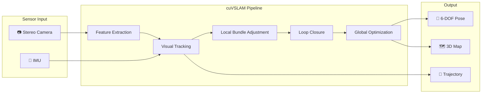
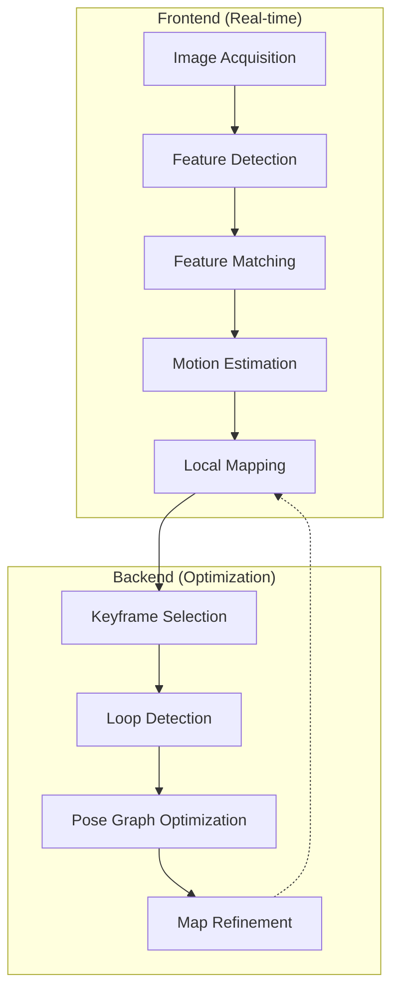
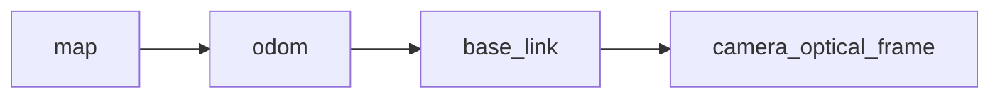

# Visual SLAM with Isaac ROS

Visual SLAM (Simultaneous Localization and Mapping) enables your robot to build a map of its environment while simultaneously tracking its position within that map. NVIDIA Isaac ROS provides GPU-accelerated Visual SLAM through **cuVSLAM**.



## 🧠 How Visual SLAM Works

### Core Concepts

| Concept | Description |
|---------|-------------|
| **Feature Extraction** | Detect distinctive points (corners, edges) in images |
| **Feature Matching** | Match features across frames to estimate motion |
| **Bundle Adjustment** | Optimize camera poses and 3D point positions |
| **Loop Closure** | Recognize previously visited locations to correct drift |
| **Pose Graph** | Graph of robot poses optimized for consistency |

### SLAM Pipeline Stages



---

## 🛠️ Installing Isaac ROS Visual SLAM

### Using Docker (Recommended)

```bash
# Clone Isaac ROS common
mkdir -p ~/workspaces/isaac_ros-dev/src
cd ~/workspaces/isaac_ros-dev/src
git clone https://github.com/NVIDIA-ISAAC-ROS/isaac_ros_common.git

# Clone Visual SLAM package
git clone https://github.com/NVIDIA-ISAAC-ROS/isaac_ros_visual_slam.git

# Build container and enter
cd ~/workspaces/isaac_ros-dev/src/isaac_ros_common
./scripts/run_dev.sh

# Inside container: build packages
cd /workspaces/isaac_ros-dev
colcon build --symlink-install
source install/setup.bash
```

### Native Installation

```bash
# Install dependencies
sudo apt update
sudo apt install ros-humble-isaac-ros-visual-slam

# Install additional packages
sudo apt install ros-humble-image-transport \
                 ros-humble-image-transport-plugins \
                 ros-humble-cv-bridge
```

---

## 📷 Camera Configuration

### Stereo Camera Requirements

cuVSLAM requires rectified stereo images and camera intrinsics.

```yaml
# camera_info.yaml
image_width: 640
image_height: 480
camera_name: "stereo"
camera_matrix:
  rows: 3
  cols: 3
  data: [380.0, 0, 320.0,
         0, 380.0, 240.0,
         0, 0, 1]
distortion_model: "plumb_bob"
distortion_coefficients:
  rows: 1
  cols: 5
  data: [0, 0, 0, 0, 0]  # Rectified images
projection_matrix:
  rows: 3
  cols: 4
  data: [380.0, 0, 320.0, 0,
         0, 380.0, 240.0, 0,
         0, 0, 1, 0]
```

### Topic Requirements

| Topic | Type | Description |
|-------|------|-------------|
| `/camera/left/image_raw` | `sensor_msgs/Image` | Left rectified image |
| `/camera/right/image_raw` | `sensor_msgs/Image` | Right rectified image |
| `/camera/left/camera_info` | `sensor_msgs/CameraInfo` | Left intrinsics |
| `/camera/right/camera_info` | `sensor_msgs/CameraInfo` | Right intrinsics |
| `/imu` | `sensor_msgs/Imu` | IMU data (optional, improves accuracy) |

---

## 🚀 Launching Visual SLAM

### Basic Launch File

```python
#!/usr/bin/env python3
"""Launch Isaac ROS Visual SLAM."""

from launch import LaunchDescription
from launch.actions import DeclareLaunchArgument
from launch.substitutions import LaunchConfiguration
from launch_ros.actions import Node
from launch_ros.descriptions import ComposableNode
from launch_ros.actions import ComposableNodeContainer


def generate_launch_description():
    
    # Launch arguments
    enable_imu = DeclareLaunchArgument(
        'enable_imu',
        default_value='true',
        description='Enable IMU fusion'
    )
    
    enable_slam = DeclareLaunchArgument(
        'enable_slam',
        default_value='true',
        description='Enable SLAM (vs pure odometry)'
    )
    
    # Visual SLAM node
    visual_slam_node = Node(
        package='isaac_ros_visual_slam',
        executable='isaac_ros_visual_slam_node',
        name='visual_slam',
        parameters=[{
            # Input topics
            'image_left_topic': '/camera/left/image_raw',
            'image_right_topic': '/camera/right/image_raw',
            'camera_info_left_topic': '/camera/left/camera_info',
            'camera_info_right_topic': '/camera/right/camera_info',
            'imu_topic': '/imu',
            
            # Frame IDs
            'base_frame': 'base_link',
            'odom_frame': 'odom',
            'map_frame': 'map',
            'camera_optical_frame': 'camera_optical_frame',
            
            # Algorithm settings
            'enable_imu_fusion': LaunchConfiguration('enable_imu'),
            'enable_slam_visualization': True,
            'enable_observations_view': True,
            'enable_landmarks_view': True,
            
            # Performance settings
            'denoise_input_images': False,
            'rectified_images': True,
            'enable_debug_mode': False,
            
            # SLAM settings
            'enable_slam': LaunchConfiguration('enable_slam'),
            'enable_loop_closure': True,
            'loop_closure_threshold': 0.9,
        }],
        remappings=[
            ('visual_slam/image_left', '/camera/left/image_raw'),
            ('visual_slam/image_right', '/camera/right/image_raw'),
            ('visual_slam/camera_info_left', '/camera/left/camera_info'),
            ('visual_slam/camera_info_right', '/camera/right/camera_info'),
            ('visual_slam/imu', '/imu'),
        ],
        output='screen'
    )
    
    return LaunchDescription([
        enable_imu,
        enable_slam,
        visual_slam_node,
    ])
```

### Running Visual SLAM

```bash
# Terminal 1: Launch VSLAM
ros2 launch my_robot_slam visual_slam.launch.py

# Terminal 2: Launch camera driver (example with RealSense)
ros2 launch realsense2_camera rs_launch.py \
    enable_sync:=true \
    enable_infra1:=true \
    enable_infra2:=true

# Terminal 3: View in RViz
ros2 run rviz2 rviz2 -d slam_config.rviz
```

---

## 📊 Understanding VSLAM Output

### Published Topics

| Topic | Type | Description |
|-------|------|-------------|
| `/visual_slam/tracking/odometry` | `nav_msgs/Odometry` | Visual odometry |
| `/visual_slam/vis/observations_cloud` | `sensor_msgs/PointCloud2` | Current features |
| `/visual_slam/vis/landmarks_cloud` | `sensor_msgs/PointCloud2` | Map points |
| `/visual_slam/vis/slam_path` | `nav_msgs/Path` | Robot trajectory |
| `/visual_slam/status` | `isaac_ros_visual_slam_interfaces/VisualSlamStatus` | SLAM status |

### TF Transforms



```bash
# View TF tree
ros2 run tf2_tools view_frames

# Echo transform
ros2 run tf2_ros tf2_echo map base_link
```

---

## 🔧 Tuning Parameters

### Critical Parameters

```python
parameters=[{
    # Feature detection
    'num_ORB_features': 1500,           # More = better accuracy, slower
    'min_num_matches': 50,              # Minimum matches for tracking
    
    # Tracking robustness
    'enable_imu_fusion': True,          # Helps with fast motion
    'gyro_noise_density': 0.0002,       # IMU noise model
    'accelerometer_noise_density': 0.02,
    
    # Loop closure
    'enable_loop_closure': True,
    'loop_closure_threshold': 0.9,      # Similarity threshold
    'loop_closure_search_radius': 5.0,  # meters
    
    # Performance
    'image_preprocessing_threads': 2,
    'enable_debug_mode': False,         # Disable for performance
}]
```

### Troubleshooting

| Issue | Possible Cause | Solution |
|-------|---------------|----------|
| Tracking lost frequently | Fast motion, blur | Enable IMU fusion, reduce speed |
| High drift | Poor features | Increase `num_ORB_features` |
| No loop closures | Threshold too high | Lower `loop_closure_threshold` |
| High CPU usage | Too many features | Reduce `num_ORB_features` |
| Jumpy odometry | Camera calibration | Recalibrate stereo camera |

---

## 🗺️ Saving and Loading Maps

### Saving the Map

```python
#!/usr/bin/env python3
"""Save VSLAM map service call."""

import rclpy
from rclpy.node import Node
from isaac_ros_visual_slam_interfaces.srv import SaveMap


class MapSaver(Node):
    def __init__(self):
        super().__init__('map_saver')
        
        self.client = self.create_client(SaveMap, '/visual_slam/save_map')
        while not self.client.wait_for_service(timeout_sec=1.0):
            self.get_logger().info('Waiting for save_map service...')
        
        self.send_request()
    
    def send_request(self):
        request = SaveMap.Request()
        request.map_url = '/maps/my_environment.pb'
        
        future = self.client.call_async(request)
        rclpy.spin_until_future_complete(self, future)
        
        result = future.result()
        if result.success:
            self.get_logger().info('Map saved successfully!')
        else:
            self.get_logger().error(f'Failed to save map: {result.message}')


def main():
    rclpy.init()
    node = MapSaver()
    node.destroy_node()
    rclpy.shutdown()

if __name__ == '__main__':
    main()
```

### Loading a Saved Map

```python
parameters=[{
    'map_file_path': '/maps/my_environment.pb',
    'enable_localization_mode': True,  # Localize in existing map
}]
```

---

## 📈 Visualizing in RViz

### RViz Configuration

```yaml
# slam_visualization.rviz
Visualization Manager:
  Displays:
    - Class: rviz_default_plugins/RobotModel
      Name: Robot
      
    - Class: rviz_default_plugins/Path
      Name: Trajectory
      Topic: /visual_slam/vis/slam_path
      Color: 0; 255; 0  # Green
      
    - Class: rviz_default_plugins/PointCloud2
      Name: Landmarks
      Topic: /visual_slam/vis/landmarks_cloud
      Size (m): 0.02
      Color: 255; 255; 0  # Yellow
      
    - Class: rviz_default_plugins/PointCloud2
      Name: Observations
      Topic: /visual_slam/vis/observations_cloud
      Size (m): 0.01
      Color: 0; 255; 255  # Cyan
      
    - Class: rviz_default_plugins/Odometry
      Name: Odometry
      Topic: /visual_slam/tracking/odometry
      
    - Class: rviz_default_plugins/TF
      Name: TF
```

---

## 🧪 Testing with Recorded Data

### Record a Bag File

```bash
# Record camera and IMU data
ros2 bag record \
    /camera/left/image_raw \
    /camera/right/image_raw \
    /camera/left/camera_info \
    /camera/right/camera_info \
    /imu \
    -o my_robot_data
```

### Playback for Testing

```bash
# Play bag file
ros2 bag play my_robot_data --clock

# In another terminal, run VSLAM with sim time
ros2 launch my_robot_slam visual_slam.launch.py use_sim_time:=true
```

---

## 📚 Summary

| Component | Purpose |
|-----------|---------|
| **cuVSLAM** | GPU-accelerated SLAM algorithm |
| **Feature Tracking** | Estimate camera motion |
| **Loop Closure** | Correct accumulated drift |
| **IMU Fusion** | Handle fast motions |
| **Map Persistence** | Save/load environments |

:::info Next Chapter
Now let's use the map for autonomous navigation!

**[Continue to Navigation →](./navigation)**
:::
