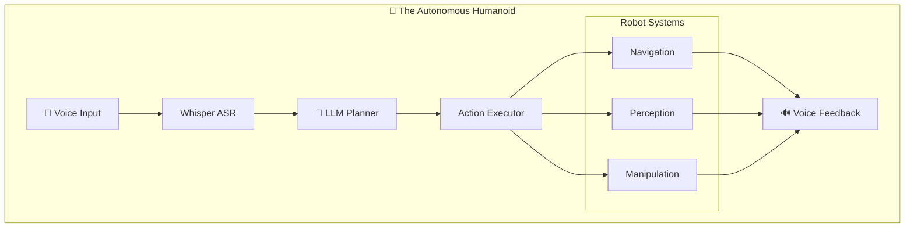
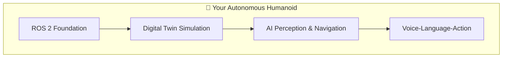

# Capstone: The Autonomous Humanoid

This is the culmination of your Physical AI journey. You'll integrate everything—ROS 2, simulation, navigation, perception, voice control, and LLM reasoning—into a complete autonomous humanoid system.



---

## 🎯 Capstone Requirements

| Component | Description | Status |
|-----------|-------------|--------|
| **Voice Activation** | Wake word + speech recognition | Required |
| **Command Understanding** | LLM-based intent parsing | Required |
| **Multi-Step Planning** | Complex task decomposition | Required |
| **Navigation** | Autonomous room-to-room movement | Required |
| **Object Detection** | Identify objects in scene | Required |
| **Feedback** | Voice status updates | Required |
| **Error Recovery** | Handle failures gracefully | Bonus |

---

## 📁 Project Structure

```
autonomous_humanoid/
├── autonomous_humanoid/
│   ├── __init__.py
│   ├── main_agent.py           # Main orchestrator
│   ├── voice_interface.py      # Whisper + TTS
│   ├── cognitive_engine.py     # LLM integration
│   ├── action_executor.py      # ROS 2 action execution
│   ├── perception_manager.py   # Object detection
│   └── utils/
│       ├── __init__.py
│       ├── prompts.py          # LLM prompts
│       └── config.py           # Configuration
├── config/
│   ├── agent_config.yaml
│   ├── nav2_params.yaml
│   └── perception_config.yaml
├── launch/
│   ├── full_system.launch.py
│   └── demo.launch.py
├── package.xml
└── setup.py
```

---

## 🧠 Part 1: The Main Agent

### autonomous_humanoid/main_agent.py

```python
#!/usr/bin/env python3
"""
The Autonomous Humanoid - Main Agent

This is the central orchestrator that integrates voice control,
LLM reasoning, and robot action execution.
"""

import rclpy
from rclpy.node import Node
from rclpy.action import ActionClient
from rclpy.callback_groups import ReentrantCallbackGroup
from rclpy.executors import MultiThreadedExecutor

from std_msgs.msg import String, Bool
from sensor_msgs.msg import Image
from geometry_msgs.msg import PoseStamped
from nav2_msgs.action import NavigateToPose

import asyncio
import json
from enum import Enum
from dataclasses import dataclass, field
from typing import List, Dict, Any, Optional


class AgentState(Enum):
    """Agent state machine states."""
    IDLE = "idle"
    LISTENING = "listening"
    PROCESSING = "processing"
    EXECUTING = "executing"
    SPEAKING = "speaking"
    ERROR = "error"


@dataclass
class AgentContext:
    """Current context for the agent."""
    current_location: str = "entrance"
    visible_objects: List[str] = field(default_factory=list)
    held_object: Optional[str] = None
    current_task: Optional[str] = None
    task_history: List[str] = field(default_factory=list)


class AutonomousHumanoid(Node):
    """
    The Autonomous Humanoid Agent.
    
    Integrates voice control, LLM reasoning, navigation,
    perception, and manipulation into a unified system.
    """
    
    def __init__(self):
        super().__init__('autonomous_humanoid')
        
        # Callback groups for concurrent execution
        self.cb_group = ReentrantCallbackGroup()
        
        # ============ Parameters ============
        self.declare_parameter('wake_word', 'hey robot')
        self.declare_parameter('llm_model', 'gpt-4o')
        self.declare_parameter('enable_tts', True)
        self.declare_parameter('confidence_threshold', 0.7)
        
        self.wake_word = self.get_parameter('wake_word').value
        self.llm_model = self.get_parameter('llm_model').value
        self.enable_tts = self.get_parameter('enable_tts').value
        
        # ============ State ============
        self.state = AgentState.IDLE
        self.context = AgentContext()
        self.is_listening_for_wake = True
        
        # Location coordinates
        self.locations = {
            "entrance": {"x": 0.0, "y": 0.0, "yaw": 0.0},
            "kitchen": {"x": 3.0, "y": 2.0, "yaw": 1.57},
            "living_room": {"x": -2.0, "y": 1.0, "yaw": 3.14},
            "bedroom": {"x": -3.0, "y": -2.0, "yaw": -1.57},
            "bathroom": {"x": 2.0, "y": -2.0, "yaw": 0.0},
        }
        
        # ============ Publishers ============
        self.state_pub = self.create_publisher(
            String, '/agent/state', 10
        )
        self.speak_pub = self.create_publisher(
            String, '/agent/speak', 10
        )
        self.status_pub = self.create_publisher(
            String, '/agent/status', 10
        )
        
        # ============ Subscribers ============
        self.transcription_sub = self.create_subscription(
            String,
            '/speech/transcription',
            self.transcription_callback,
            10,
            callback_group=self.cb_group
        )
        
        self.objects_sub = self.create_subscription(
            String,
            '/perception/detected_objects',
            self.objects_callback,
            10
        )
        
        # ============ Action Clients ============
        self.nav_client = ActionClient(
            self,
            NavigateToPose,
            'navigate_to_pose',
            callback_group=self.cb_group
        )
        
        # ============ Components ============
        # These would be separate nodes in production
        from .cognitive_engine import CognitiveEngine
        from .voice_interface import VoiceInterface
        
        self.cognitive = CognitiveEngine(model=self.llm_model)
        self.voice = VoiceInterface()
        
        # ============ Startup ============
        self.publish_state()
        self.speak("Hello! I am your autonomous humanoid assistant. Say 'Hey Robot' to wake me up.")
        
        self.get_logger().info('🤖 Autonomous Humanoid initialized!')
        self.get_logger().info(f'   Wake word: "{self.wake_word}"')
        self.get_logger().info(f'   LLM model: {self.llm_model}')
    
    # ============ State Management ============
    
    def set_state(self, state: AgentState):
        """Update agent state."""
        self.state = state
        self.publish_state()
        self.get_logger().info(f'State: {state.value}')
    
    def publish_state(self):
        """Publish current state."""
        msg = String()
        msg.data = self.state.value
        self.state_pub.publish(msg)
    
    def publish_status(self, status: str):
        """Publish status message."""
        msg = String()
        msg.data = status
        self.status_pub.publish(msg)
        self.get_logger().info(f'Status: {status}')
    
    # ============ Voice Interface ============
    
    def speak(self, message: str):
        """Speak a message via TTS."""
        if self.enable_tts:
            msg = String()
            msg.data = message
            self.speak_pub.publish(msg)
            self.get_logger().info(f'Speaking: "{message}"')
    
    def transcription_callback(self, msg: String):
        """Handle incoming transcriptions."""
        text = msg.data.strip().lower()
        
        if not text:
            return
        
        self.get_logger().info(f'Heard: "{text}"')
        
        # Check for wake word
        if self.is_listening_for_wake:
            if self.wake_word.lower() in text:
                self.handle_wake()
            return
        
        # Process command
        self.process_command(text)
    
    def handle_wake(self):
        """Handle wake word detection."""
        self.is_listening_for_wake = False
        self.set_state(AgentState.LISTENING)
        self.speak("Yes? I'm listening.")
        
        # Set timeout to return to idle
        self.create_timer(10.0, self.listening_timeout, one_shot=True)
    
    def listening_timeout(self):
        """Return to idle if no command received."""
        if self.state == AgentState.LISTENING:
            self.speak("I didn't hear a command. Say 'Hey Robot' to wake me up again.")
            self.is_listening_for_wake = True
            self.set_state(AgentState.IDLE)
    
    def create_timer(self, period: float, callback, one_shot: bool = False):
        """Create timer with one-shot support."""
        if one_shot:
            def one_shot_wrapper():
                callback()
                timer.cancel()
            timer = super().create_timer(period, one_shot_wrapper)
        else:
            timer = super().create_timer(period, callback)
        return timer
    
    # ============ Command Processing ============
    
    def process_command(self, command: str):
        """Process a voice command."""
        self.set_state(AgentState.PROCESSING)
        self.context.current_task = command
        
        self.speak("Let me think about that...")
        
        # Get action plan from LLM
        try:
            actions = self.cognitive.plan(
                command=command,
                context={
                    "current_location": self.context.current_location,
                    "visible_objects": self.context.visible_objects,
                    "held_object": self.context.held_object,
                    "available_locations": list(self.locations.keys()),
                }
            )
            
            if actions:
                self.speak(f"I'll {command}. This will take {len(actions)} steps.")
                self.execute_action_sequence(actions)
            else:
                self.speak("I'm not sure how to do that. Can you try rephrasing?")
                self.return_to_idle()
                
        except Exception as e:
            self.get_logger().error(f'Planning failed: {e}')
            self.speak("Sorry, I had trouble understanding. Please try again.")
            self.return_to_idle()
    
    # ============ Action Execution ============
    
    def execute_action_sequence(self, actions: List[Dict]):
        """Execute a sequence of actions."""
        self.set_state(AgentState.EXECUTING)
        
        for i, action in enumerate(actions):
            action_type = action.get("action")
            self.publish_status(f'Executing step {i+1}/{len(actions)}: {action_type}')
            
            try:
                if action_type == "navigate_to":
                    self.execute_navigate(action.get("location"))
                elif action_type == "scan":
                    self.execute_scan()
                elif action_type == "pick_up":
                    self.execute_pick(action.get("object"))
                elif action_type == "place":
                    self.execute_place(action.get("target"))
                elif action_type == "say":
                    self.speak(action.get("message", ""))
                elif action_type == "wait":
                    self.execute_wait(action.get("seconds", 1.0))
                else:
                    self.get_logger().warn(f'Unknown action: {action_type}')
                    
            except Exception as e:
                self.get_logger().error(f'Action failed: {e}')
                self.speak(f"I encountered a problem with step {i+1}.")
                break
        
        # Task complete
        self.context.task_history.append(self.context.current_task)
        self.speak("Task complete!")
        self.return_to_idle()
    
    def execute_navigate(self, location: str):
        """Navigate to a location."""
        if location not in self.locations:
            self.speak(f"I don't know where {location} is.")
            return
        
        coords = self.locations[location]
        self.speak(f"Moving to {location}...")
        
        # Create navigation goal
        goal = NavigateToPose.Goal()
        goal.pose.header.frame_id = 'map'
        goal.pose.header.stamp = self.get_clock().now().to_msg()
        goal.pose.pose.position.x = coords["x"]
        goal.pose.pose.position.y = coords["y"]
        goal.pose.pose.orientation.z = float(coords.get("yaw", 0.0))
        goal.pose.pose.orientation.w = 1.0
        
        # Wait for nav to be ready
        if not self.nav_client.wait_for_server(timeout_sec=5.0):
            self.get_logger().error('Navigation server not available')
            return
        
        # Send goal
        future = self.nav_client.send_goal_async(goal)
        rclpy.spin_until_future_complete(self, future)
        
        goal_handle = future.result()
        if not goal_handle.accepted:
            self.speak("Navigation was rejected.")
            return
        
        # Wait for result
        result_future = goal_handle.get_result_async()
        rclpy.spin_until_future_complete(self, result_future)
        
        self.context.current_location = location
        self.speak(f"I've arrived at {location}.")
    
    def execute_scan(self):
        """Scan for objects."""
        self.speak("Looking around...")
        # In production, this would trigger perception
        # For demo, simulate finding objects
        import time
        time.sleep(2.0)
        self.context.visible_objects = ["cup", "book", "remote", "plant"]
        self.speak(f"I can see: {', '.join(self.context.visible_objects)}")
    
    def execute_pick(self, obj: str):
        """Pick up an object."""
        if obj not in self.context.visible_objects:
            self.speak(f"I don't see a {obj} nearby.")
            return
        
        self.speak(f"Picking up the {obj}...")
        # In production, this would trigger manipulation
        import time
        time.sleep(2.0)
        self.context.held_object = obj
        self.context.visible_objects.remove(obj)
        self.speak(f"I've picked up the {obj}.")
    
    def execute_place(self, target: str):
        """Place held object."""
        if not self.context.held_object:
            self.speak("I'm not holding anything.")
            return
        
        obj = self.context.held_object
        self.speak(f"Placing the {obj} on the {target}...")
        # In production, this would trigger manipulation
        import time
        time.sleep(2.0)
        self.context.held_object = None
        self.speak(f"I've placed the {obj} on the {target}.")
    
    def execute_wait(self, seconds: float):
        """Wait for specified time."""
        import time
        time.sleep(seconds)
    
    def return_to_idle(self):
        """Return to idle state."""
        self.context.current_task = None
        self.is_listening_for_wake = True
        self.set_state(AgentState.IDLE)
    
    # ============ Perception ============
    
    def objects_callback(self, msg: String):
        """Update visible objects from perception."""
        try:
            objects = json.loads(msg.data)
            self.context.visible_objects = objects
        except json.JSONDecodeError:
            pass


def main(args=None):
    rclpy.init(args=args)
    
    agent = AutonomousHumanoid()
    
    # Use multi-threaded executor for concurrent callbacks
    executor = MultiThreadedExecutor()
    executor.add_node(agent)
    
    try:
        executor.spin()
    except KeyboardInterrupt:
        agent.get_logger().info('Shutting down...')
    finally:
        agent.destroy_node()
        rclpy.shutdown()


if __name__ == '__main__':
    main()
```

---

## 🧠 Part 2: Cognitive Engine

### autonomous_humanoid/cognitive_engine.py

```python
#!/usr/bin/env python3
"""Cognitive engine with LLM-based planning."""

import json
from typing import List, Dict, Any, Optional
from openai import OpenAI


PLANNING_PROMPT = """You are the brain of an autonomous humanoid robot.

## Your Capabilities
1. navigate_to(location) - Move to: {locations}
2. scan() - Look around and identify objects
3. pick_up(object) - Pick up an object
4. place(target) - Place held object somewhere
5. say(message) - Speak to the user
6. wait(seconds) - Pause execution

## Current State
- Location: {current_location}
- Visible objects: {visible_objects}
- Holding: {held_object}

## Task
Convert the user's command into a sequence of actions.
Think step by step about what needs to happen.

## Output Format
Return ONLY a JSON array of actions:
[
  {{"action": "say", "message": "I'll help with that"}},
  {{"action": "navigate_to", "location": "kitchen"}},
  {{"action": "scan"}},
  ...
]
"""


class CognitiveEngine:
    """LLM-based cognitive engine."""
    
    def __init__(self, model: str = "gpt-4o"):
        self.client = OpenAI()
        self.model = model
    
    def plan(
        self,
        command: str,
        context: Dict[str, Any]
    ) -> List[Dict]:
        """Generate action plan for a command."""
        
        prompt = PLANNING_PROMPT.format(
            locations=", ".join(context.get("available_locations", [])),
            current_location=context.get("current_location", "unknown"),
            visible_objects=context.get("visible_objects", []),
            held_object=context.get("held_object", "nothing")
        )
        
        try:
            response = self.client.chat.completions.create(
                model=self.model,
                messages=[
                    {"role": "system", "content": prompt},
                    {"role": "user", "content": command}
                ],
                temperature=0.1,
                response_format={"type": "json_object"}
            )
            
            content = response.choices[0].message.content
            data = json.loads(content)
            
            if isinstance(data, list):
                return data
            elif "actions" in data:
                return data["actions"]
            else:
                return [data]
                
        except Exception as e:
            print(f"Planning error: {e}")
            return []
```

---

## 🔊 Part 3: Voice Interface

### autonomous_humanoid/voice_interface.py

```python
#!/usr/bin/env python3
"""Voice interface with Whisper ASR and TTS."""

import whisper
import sounddevice as sd
import numpy as np
from typing import Optional


class VoiceInterface:
    """Voice input/output interface."""
    
    def __init__(
        self,
        model_size: str = "base",
        sample_rate: int = 16000
    ):
        self.model = whisper.load_model(model_size)
        self.sample_rate = sample_rate
    
    def listen(self, duration: float = 5.0) -> str:
        """Listen and transcribe speech."""
        audio = sd.rec(
            int(duration * self.sample_rate),
            samplerate=self.sample_rate,
            channels=1,
            dtype=np.float32
        )
        sd.wait()
        
        result = self.model.transcribe(
            audio.flatten(),
            language="en",
            fp16=False
        )
        
        return result["text"].strip()
    
    def speak(self, message: str):
        """Speak using TTS (placeholder)."""
        # In production, integrate with TTS engine like:
        # - pyttsx3 (offline)
        # - gTTS (Google)
        # - OpenAI TTS
        print(f"🔊 {message}")
```

---

## 🚀 Part 4: Launch File

### launch/full_system.launch.py

```python
#!/usr/bin/env python3
"""Launch the full autonomous humanoid system."""

import os
from ament_index_python.packages import get_package_share_directory
from launch import LaunchDescription
from launch.actions import IncludeLaunchDescription, DeclareLaunchArgument
from launch.launch_description_sources import PythonLaunchDescriptionSource
from launch.substitutions import LaunchConfiguration
from launch_ros.actions import Node


def generate_launch_description():
    
    pkg_dir = get_package_share_directory('autonomous_humanoid')
    
    # Launch arguments
    use_sim_time = DeclareLaunchArgument(
        'use_sim_time', default_value='true'
    )
    
    # Simulation
    simulation = IncludeLaunchDescription(
        PythonLaunchDescriptionSource([
            get_package_share_directory('simulation_environment'),
            '/launch/simulation.launch.py'
        ])
    )
    
    # Navigation
    navigation = IncludeLaunchDescription(
        PythonLaunchDescriptionSource([
            get_package_share_directory('robot_navigation'),
            '/launch/navigation.launch.py'
        ]),
        launch_arguments={
            'use_sim_time': LaunchConfiguration('use_sim_time')
        }.items()
    )
    
    # Whisper ASR
    whisper_asr = Node(
        package='autonomous_humanoid',
        executable='whisper_asr_node',
        name='whisper_asr',
        parameters=[{
            'model_size': 'base',
            'continuous': True,
        }],
        output='screen'
    )
    
    # Main agent
    main_agent = Node(
        package='autonomous_humanoid',
        executable='main_agent',
        name='autonomous_humanoid',
        parameters=[{
            'wake_word': 'hey robot',
            'llm_model': 'gpt-4o',
            'enable_tts': True,
        }],
        output='screen'
    )
    
    return LaunchDescription([
        use_sim_time,
        simulation,
        navigation,
        whisper_asr,
        main_agent,
    ])
```

---

## 🎬 Running the Demo

### Step 1: Build the Package

```bash
cd ~/ros2_ws
colcon build --packages-select autonomous_humanoid
source install/setup.bash
```

### Step 2: Launch the System

```bash
# Set your OpenAI API key
export OPENAI_API_KEY="your-api-key"

# Launch everything
ros2 launch autonomous_humanoid full_system.launch.py
```

### Step 3: Interact with the Robot

1. Say **"Hey Robot"** to wake the robot
2. Wait for "Yes? I'm listening."
3. Give a command:
   - "Go to the kitchen"
   - "Find my cup and bring it here"
   - "Clean up the living room"
   - "What can you see?"

---

## 🧪 Example Interactions

### Simple Navigation

```
Human: "Hey Robot"
Robot: "Yes? I'm listening."
Human: "Go to the kitchen"
Robot: "Let me think about that... I'll go to the kitchen. This will take 2 steps."
Robot: "Moving to kitchen..."
Robot: "I've arrived at kitchen."
Robot: "Task complete!"
```

### Complex Task

```
Human: "Hey Robot"
Robot: "Yes? I'm listening."
Human: "Find my cup and take it to the living room"
Robot: "Let me think about that... I'll find your cup and take it to the living room. This will take 5 steps."
Robot: "Looking around..."
Robot: "I can see: cup, book, remote, plant"
Robot: "Picking up the cup..."
Robot: "I've picked up the cup."
Robot: "Moving to living room..."
Robot: "I've arrived at living room."
Robot: "Placing the cup on the table..."
Robot: "I've placed the cup on the table."
Robot: "Task complete!"
```

---

## ✅ Verification Checklist

| Feature | Test | Expected Result |
|---------|------|-----------------|
| Wake word | Say "Hey Robot" | Robot responds |
| Command parsing | Give navigation command | Robot plans actions |
| Navigation | "Go to kitchen" | Robot moves |
| Object detection | "What do you see?" | Lists objects |
| Multi-step tasks | "Get the cup from kitchen" | Completes sequence |
| Error handling | Invalid command | Graceful response |

---

## 🎉 Congratulations!

You've completed the **Physical AI & Humanoid Robotics** course!

### What You've Built



### Skills Acquired

| Module | Skills |
|--------|--------|
| **01** | ROS 2, URDF, rclpy |
| **02** | Gazebo, Unity, Sensors |
| **03** | Isaac, VSLAM, Nav2 |
| **04** | Whisper, LLMs, VLA |

### Next Steps

- 🔧 **Extend the system** with manipulation (MoveIt2)
- 🎓 **Train custom models** for your environment
- 🌐 **Deploy to real hardware** with sim-to-real techniques
- 🤝 **Join the community** at [ROS Discourse](https://discourse.ros.org)

---

:::tip The Future of Robotics
You now have the skills to build robots that understand and interact with the world through natural language. This is the foundation of next-generation human-robot interaction.

**Go build something amazing! 🚀**
:::
