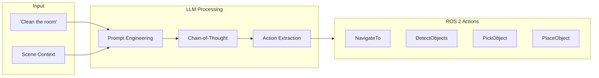

# Cognitive Logic: Using LLMs for Command Parsing

Large Language Models (LLMs) serve as the "cognitive engine" of your robot, translating natural language commands into structured action sequences. This chapter covers integrating LLMs with ROS 2 for intelligent command parsing.



## 🧠 LLM Integration Options

### API-Based Solutions

| Provider | Model | Strengths | Latency |
|----------|-------|-----------|---------|
| **OpenAI** | GPT-4o | Best reasoning | ~1-3s |
| **Anthropic** | Claude 3 | Long context | ~1-2s |
| **Google** | Gemini Pro | Multimodal | ~1-2s |
| **Groq** | Llama 3.1 | Ultra-fast | ~0.2s |

### Local Models

| Model | Parameters | VRAM | Speed |
|-------|------------|------|-------|
| **Llama 3.1 8B** | 8B | ~16GB | Fast |
| **Mistral 7B** | 7B | ~14GB | Fast |
| **Phi-3** | 3.8B | ~8GB | Very Fast |
| **Qwen2 7B** | 7B | ~14GB | Fast |

---

## 🛠️ Setup

### API-Based (OpenAI)

```bash
pip install openai langchain
```

```python
import os
from openai import OpenAI

# Set API key
os.environ["OPENAI_API_KEY"] = "your-api-key"

client = OpenAI()
```

### Local (Ollama)

```bash
# Install Ollama
curl -fsSL https://ollama.com/install.sh | sh

# Pull a model
ollama pull llama3.1

# Or for faster inference
ollama pull phi3
```

```python
import ollama

response = ollama.chat(
    model='llama3.1',
    messages=[{'role': 'user', 'content': 'Hello!'}]
)
print(response['message']['content'])
```

---

## 🎯 Prompt Engineering for Robotics

### The System Prompt

```python
ROBOT_SYSTEM_PROMPT = """You are an AI assistant controlling a humanoid robot. 
Your job is to translate natural language commands into robot action sequences.

## Available Actions

1. `navigate_to(location: str)` - Move to a location
   - Locations: "kitchen", "living_room", "bedroom", "entrance", "bathroom"
   - Example: navigate_to("kitchen")

2. `scan_for_objects()` - Look around and identify visible objects
   - Returns a list of detected objects with positions
   - Example: scan_for_objects()

3. `pick_up(object: str)` - Grasp and pick up an object
   - Object must be within reach
   - Example: pick_up("cup")

4. `place_at(location: str)` - Place held object at location
   - Locations: "table", "shelf", "sink", "trash_bin", "counter"
   - Example: place_at("sink")

5. `say(message: str)` - Speak a message to the user
   - Example: say("Task completed!")

6. `wait(seconds: float)` - Wait for specified time
   - Example: wait(2.0)

## Response Format

Respond ONLY with a JSON array of actions. No explanations.

Example:
```json
[
  {"action": "navigate_to", "params": {"location": "kitchen"}},
  {"action": "scan_for_objects", "params": {}},
  {"action": "pick_up", "params": {"object": "cup"}},
  {"action": "navigate_to", "params": {"location": "living_room"}},
  {"action": "place_at", "params": {"location": "table"}},
  {"action": "say", "params": {"message": "I moved the cup to the living room table."}}
]
```

## Context

Current location: \{current_location\}
Visible objects: \{visible_objects\}
Held object: \{held_object\}
"""
```

### Parsing Commands

```python
#!/usr/bin/env python3
"""LLM-based command parser for robotics."""

import json
from openai import OpenAI
from dataclasses import dataclass
from typing import List, Dict, Any, Optional


@dataclass
class RobotAction:
    """Represents a single robot action."""
    action: str
    params: Dict[str, Any]
    
    def __str__(self):
        params_str = ", ".join(f"{k}={v}" for k, v in self.params.items())
        return f"{self.action}({params_str})"


class CommandParser:
    """Parses natural language commands into robot actions."""
    
    def __init__(self, model: str = "gpt-4o"):
        self.client = OpenAI()
        self.model = model
        self.system_prompt = ROBOT_SYSTEM_PROMPT
    
    def parse(
        self,
        command: str,
        current_location: str = "unknown",
        visible_objects: List[str] = None,
        held_object: Optional[str] = None
    ) -> List[RobotAction]:
        """Parse a natural language command into actions."""
        
        # Format system prompt with context
        system = self.system_prompt.format(
            current_location=current_location,
            visible_objects=visible_objects or \[\],
            held_object=held_object or "nothing"
        )
        
        # Call LLM
        response = self.client.chat.completions.create(
            model=self.model,
            messages=[
                {"role": "system", "content": system},
                {"role": "user", "content": command}
            ],
            temperature=0.1,  # Low temperature for consistency
            response_format={"type": "json_object"}
        )
        
        # Parse response
        content = response.choices[0].message.content
        
        try:
            # Handle both direct array and wrapped responses
            data = json.loads(content)
            if isinstance(data, list):
                actions_data = data
            elif isinstance(data, dict) and "actions" in data:
                actions_data = data["actions"]
            else:
                actions_data = [data]
            
            actions = [
                RobotAction(action=a["action"], params=a.get("params", {}))
                for a in actions_data
            ]
            return actions
            
        except json.JSONDecodeError as e:
            print(f"Failed to parse LLM response: {e}")
            print(f"Response was: {content}")
            return []
    
    def explain(self, command: str) -> str:
        """Get explanation of how command will be executed."""
        
        response = self.client.chat.completions.create(
            model=self.model,
            messages=[
                {"role": "system", "content": "Explain how a robot should execute this command step by step."},
                {"role": "user", "content": command}
            ],
            temperature=0.7
        )
        
        return response.choices[0].message.content


# Example usage
if __name__ == "__main__":
    parser = CommandParser()
    
    # Test commands
    commands = [
        "Go to the kitchen and get me a glass of water",
        "Clean up the living room",
        "Find my keys",
        "Take the trash out",
    ]
    
    for cmd in commands:
        print(f"\n📝 Command: '{cmd}'")
        actions = parser.parse(cmd, current_location="living_room")
        print("🤖 Actions:")
        for i, action in enumerate(actions, 1):
            print(f"   {i}. {action}")
```

---

## 🔧 Tool/Function Calling

Modern LLMs support structured function calling for more reliable action extraction.

### OpenAI Function Calling

```python
#!/usr/bin/env python3
"""LLM with function calling for robotics."""

from openai import OpenAI
import json

client = OpenAI()

# Define available functions (tools)
ROBOT_TOOLS = [
    {
        "type": "function",
        "function": {
            "name": "navigate_to",
            "description": "Move the robot to a specific location in the environment",
            "parameters": {
                "type": "object",
                "properties": {
                    "location": {
                        "type": "string",
                        "enum": ["kitchen", "living_room", "bedroom", "bathroom", "entrance"],
                        "description": "The destination location"
                    },
                    "speed": {
                        "type": "string",
                        "enum": ["slow", "normal", "fast"],
                        "description": "Movement speed",
                        "default": "normal"
                    }
                },
                "required": ["location"]
            }
        }
    },
    {
        "type": "function",
        "function": {
            "name": "pick_up_object",
            "description": "Pick up an object that is within reach",
            "parameters": {
                "type": "object",
                "properties": {
                    "object_name": {
                        "type": "string",
                        "description": "Name of the object to pick up"
                    },
                    "use_both_hands": {
                        "type": "boolean",
                        "description": "Whether to use both hands for heavy objects",
                        "default": False
                    }
                },
                "required": ["object_name"]
            }
        }
    },
    {
        "type": "function",
        "function": {
            "name": "place_object",
            "description": "Place the currently held object at a location",
            "parameters": {
                "type": "object",
                "properties": {
                    "target_location": {
                        "type": "string",
                        "description": "Where to place the object (e.g., 'table', 'shelf', 'sink')"
                    },
                    "carefully": {
                        "type": "boolean",
                        "description": "Whether to place carefully (for fragile items)",
                        "default": False
                    }
                },
                "required": ["target_location"]
            }
        }
    },
    {
        "type": "function",
        "function": {
            "name": "scan_environment",
            "description": "Look around and identify objects in the environment",
            "parameters": {
                "type": "object",
                "properties": {
                    "search_for": {
                        "type": "string",
                        "description": "Specific object to search for, or 'all' for everything"
                    }
                },
                "required": []
            }
        }
    },
    {
        "type": "function",
        "function": {
            "name": "speak",
            "description": "Say something to the user",
            "parameters": {
                "type": "object",
                "properties": {
                    "message": {
                        "type": "string",
                        "description": "The message to speak"
                    }
                },
                "required": ["message"]
            }
        }
    }
]


def parse_command_with_tools(command: str, context: dict = None) -> list:
    """Parse command using function calling."""
    
    messages = [
        {
            "role": "system",
            "content": """You are a robot assistant. Break down user commands into 
            a sequence of function calls. Call functions in the order they should 
            be executed. Think step by step about what actions are needed."""
        },
        {
            "role": "user",
            "content": command
        }
    ]
    
    if context:
        messages[0]["content"] += f"\n\nCurrent context: {json.dumps(context)}"
    
    response = client.chat.completions.create(
        model="gpt-4o",
        messages=messages,
        tools=ROBOT_TOOLS,
        tool_choice="auto"
    )
    
    # Extract function calls
    message = response.choices[0].message
    actions = []
    
    if message.tool_calls:
        for tool_call in message.tool_calls:
            action = {
                "function": tool_call.function.name,
                "arguments": json.loads(tool_call.function.arguments)
            }
            actions.append(action)
    
    return actions


# Example
if __name__ == "__main__":
    context = {
        "current_location": "living_room",
        "visible_objects": ["remote", "magazine", "empty_cup"],
        "holding": None
    }
    
    command = "Please take the empty cup to the kitchen sink"
    
    actions = parse_command_with_tools(command, context)
    
    print(f"Command: {command}")
    print("\nPlanned actions:")
    for i, action in enumerate(actions, 1):
        print(f"  {i}. {action['function']}({action['arguments']})")
```

---

## 🤖 ROS 2 Integration

### Cognitive Logic Node

```python
#!/usr/bin/env python3
"""ROS 2 node for LLM-based command processing."""

import rclpy
from rclpy.node import Node
from rclpy.action import ActionClient
from std_msgs.msg import String
from geometry_msgs.msg import PoseStamped
from nav2_msgs.action import NavigateToPose
import json
from openai import OpenAI


class CognitiveLogicNode(Node):
    """LLM-powered cognitive logic for robot control."""
    
    def __init__(self):
        super().__init__('cognitive_logic')
        
        # Parameters
        self.declare_parameter('model', 'gpt-4o')
        self.declare_parameter('api_key', '')
        
        model = self.get_parameter('model').value
        api_key = self.get_parameter('api_key').value
        
        # Initialize OpenAI client
        self.client = OpenAI(api_key=api_key if api_key else None)
        self.model = model
        
        # Robot state
        self.current_location = "entrance"
        self.visible_objects = []
        self.held_object = None
        
        # Location coordinates (for navigation)
        self.locations = {
            "entrance": (0.0, 0.0),
            "kitchen": (3.0, 2.0),
            "living_room": (-2.0, 1.0),
            "bedroom": (-3.0, -2.0),
            "bathroom": (2.0, -2.0),
        }
        
        # Subscribers
        self.command_sub = self.create_subscription(
            String,
            '/speech/command',
            self.command_callback,
            10
        )
        
        # Publishers
        self.action_pub = self.create_publisher(
            String,
            '/robot/action_sequence',
            10
        )
        
        self.status_pub = self.create_publisher(
            String,
            '/cognitive/status',
            10
        )
        
        # Action clients
        self.nav_client = ActionClient(
            self,
            NavigateToPose,
            'navigate_to_pose'
        )
        
        self.get_logger().info('🧠 Cognitive Logic Node ready!')
    
    def command_callback(self, msg: String):
        """Process incoming voice command."""
        command = msg.data
        self.get_logger().info(f'Processing command: "{command}"')
        
        self.publish_status(f'Processing: {command}')
        
        # Parse command with LLM
        actions = self.parse_command(command)
        
        if actions:
            self.publish_status(f'Planned {len(actions)} actions')
            
            # Publish action sequence
            action_msg = String()
            action_msg.data = json.dumps(actions)
            self.action_pub.publish(action_msg)
            
            # Execute actions
            self.execute_actions(actions)
        else:
            self.publish_status('Failed to parse command')
    
    def parse_command(self, command: str) -> list:
        """Parse command using LLM."""
        
        system_prompt = f"""You are controlling a humanoid robot. 
        Convert commands to JSON action sequences.
        
        Current location: {self.current_location}
        Visible objects: {self.visible_objects}
        Holding: {self.held_object or 'nothing'}
        
        Available locations: {list(self.locations.keys())}
        
        Return JSON array of actions:
        [
          {{"action": "navigate_to", "location": "..."}},
          {{"action": "scan"}},
          {{"action": "pick_up", "object": "..."}},
          {{"action": "place", "target": "..."}},
          {{"action": "say", "message": "..."}}
        ]
        """
        
        try:
            response = self.client.chat.completions.create(
                model=self.model,
                messages=[
                    {"role": "system", "content": system_prompt},
                    {"role": "user", "content": command}
                ],
                temperature=0.1,
                response_format={"type": "json_object"}
            )
            
            content = response.choices[0].message.content
            data = json.loads(content)
            
            # Handle various response formats
            if isinstance(data, list):
                return data
            elif "actions" in data:
                return data["actions"]
            else:
                return [data]
                
        except Exception as e:
            self.get_logger().error(f'LLM parsing failed: {e}')
            return []
    
    def execute_actions(self, actions: list):
        """Execute action sequence."""
        for i, action in enumerate(actions):
            action_type = action.get("action")
            self.get_logger().info(f'Executing [{i+1}/{len(actions)}]: {action}')
            
            if action_type == "navigate_to":
                self.execute_navigation(action["location"])
            elif action_type == "scan":
                self.execute_scan()
            elif action_type == "pick_up":
                self.execute_pick(action["object"])
            elif action_type == "place":
                self.execute_place(action["target"])
            elif action_type == "say":
                self.execute_speak(action["message"])
    
    def execute_navigation(self, location: str):
        """Execute navigation action."""
        if location not in self.locations:
            self.get_logger().warn(f'Unknown location: {location}')
            return
        
        x, y = self.locations[location]
        
        goal = NavigateToPose.Goal()
        goal.pose.header.frame_id = 'map'
        goal.pose.header.stamp = self.get_clock().now().to_msg()
        goal.pose.pose.position.x = x
        goal.pose.pose.position.y = y
        
        self.get_logger().info(f'Navigating to {location} ({x}, {y})')
        
        # Send navigation goal
        self.nav_client.wait_for_server()
        future = self.nav_client.send_goal_async(goal)
        rclpy.spin_until_future_complete(self, future)
        
        self.current_location = location
    
    def execute_scan(self):
        """Execute scan action."""
        self.get_logger().info('Scanning environment...')
        # Integration with perception would go here
        self.visible_objects = ["cup", "book", "remote"]
    
    def execute_pick(self, obj: str):
        """Execute pick action."""
        self.get_logger().info(f'Picking up {obj}')
        # Integration with manipulation would go here
        self.held_object = obj
    
    def execute_place(self, target: str):
        """Execute place action."""
        self.get_logger().info(f'Placing {self.held_object} at {target}')
        # Integration with manipulation would go here
        self.held_object = None
    
    def execute_speak(self, message: str):
        """Execute speak action."""
        self.get_logger().info(f'Speaking: {message}')
        # Integration with TTS would go here
    
    def publish_status(self, status: str):
        """Publish status update."""
        msg = String()
        msg.data = status
        self.status_pub.publish(msg)


def main(args=None):
    rclpy.init(args=args)
    node = CognitiveLogicNode()
    
    try:
        rclpy.spin(node)
    except KeyboardInterrupt:
        pass
    finally:
        node.destroy_node()
        rclpy.shutdown()


if __name__ == '__main__':
    main()
```

---

## 🔄 Chain of Thought Reasoning

For complex commands, use chain-of-thought prompting:

```python
COT_PROMPT = """Think step by step about how to accomplish this command.

Command: "{command}"

Step 1: Understand what the user wants
Step 2: Identify what information I need
Step 3: Plan the sequence of physical actions
Step 4: Output the action sequence as JSON

Think through each step, then provide the final action sequence.
"""
```

---

## 📚 Summary

| Component | Purpose |
|-----------|---------|
| **LLM Provider** | GPT-4o for accuracy, Llama for privacy |
| **Prompt Engineering** | Define actions, context, format |
| **Function Calling** | Structured action extraction |
| **ROS 2 Integration** | Execute actions on robot |

:::info Next Chapter
Let's put everything together in the capstone project!

**[Continue to Capstone: The Autonomous Humanoid →](./capstone-autonomous-humanoid)**
:::
