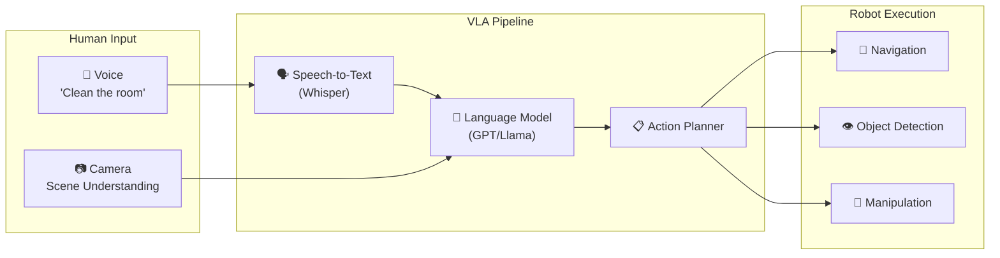
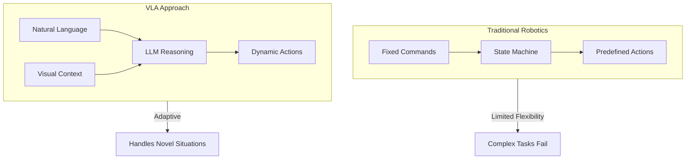
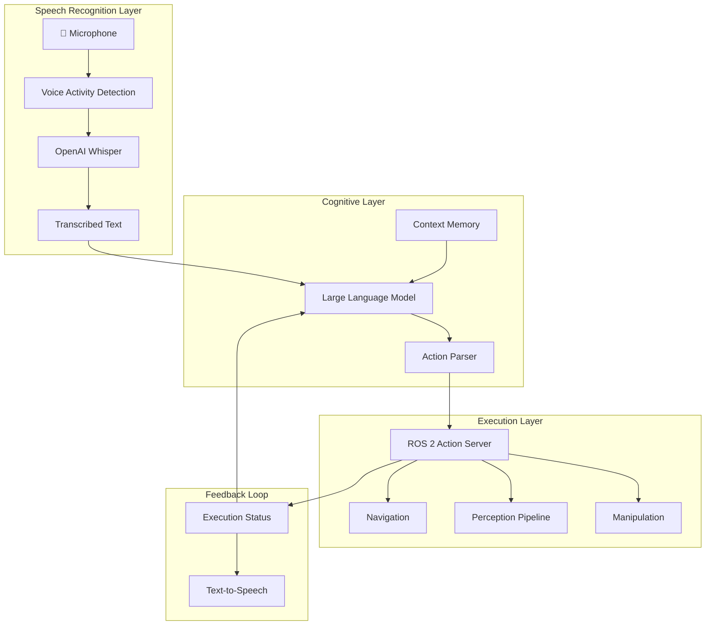
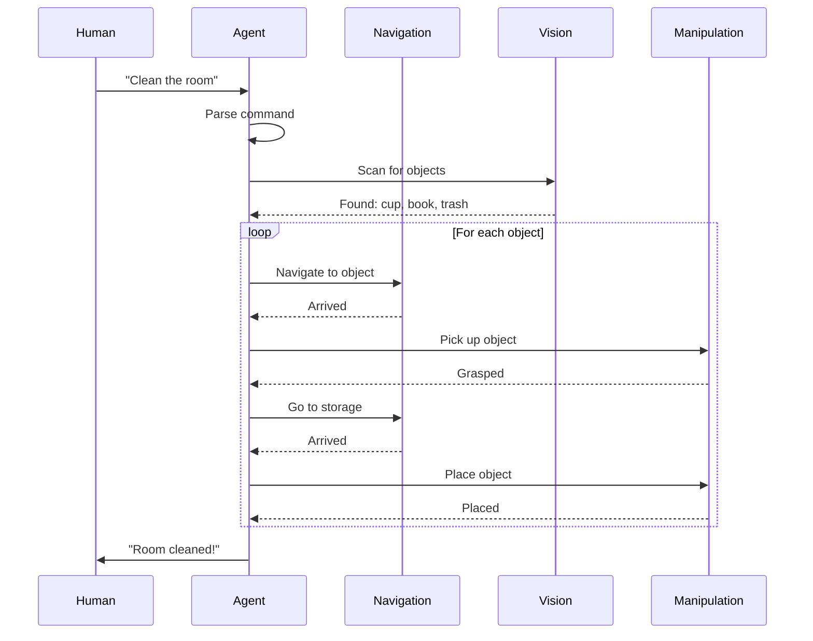

# Module 04: Vision-Language-Action (VLA)

Welcome to the capstone module! This is where everything comes together—combining **vision** (perception), **language** (LLM reasoning), and **action** (robot control) into a unified system that responds to natural language commands.



## 🎯 Learning Objectives

By the end of this module, you will be able to:

1. **Integrate Voice Commands** — Use OpenAI Whisper for speech-to-text
2. **Parse Natural Language** — Convert commands to robot actions using LLMs
3. **Execute Action Sequences** — Orchestrate complex multi-step behaviors
4. **Build an Autonomous Agent** — Create an end-to-end voice-controlled robot

## 📋 Prerequisites

- ✅ Completed **Modules 01, 02, and 03**
- Python 3.10+ with `pip`
- OpenAI API key (or local LLM setup)
- Microphone for voice input (or audio files)
- (Optional) NVIDIA GPU for local inference

## 🗺️ Module Roadmap

| Chapter | Topic | Duration |
|---------|-------|----------|
| 4.1 | [Voice Pipeline (Whisper)](./voice-pipeline) | 60 min |
| 4.2 | [Cognitive Logic (LLMs)](./cognitive-logic) | 90 min |
| 4.3 | [🎓 Capstone: The Autonomous Humanoid](./capstone-autonomous-humanoid) | 180 min |

## 🔑 The VLA Paradigm

### What is Vision-Language-Action?

VLA models represent a new paradigm in robotics where:

- **Vision** provides scene understanding and object recognition
- **Language** enables natural human-robot communication
- **Action** translates understanding into physical robot behaviors



### Why This Matters

| Traditional | VLA-Enabled |
|-------------|-------------|
| "Command 47" | "Please clean up" |
| Predefined routes | Dynamic path finding |
| Fixed object list | Open-world recognition |
| Scripted responses | Contextual understanding |

---

## 🏗️ System Architecture



---

## 🛠️ Technology Stack

### Speech Recognition

| Tool | Purpose | Latency |
|------|---------|---------|
| **OpenAI Whisper** | High-accuracy transcription | ~2-5s |
| **Whisper.cpp** | Fast local inference | ~0.5-2s |
| **Google Speech API** | Cloud streaming | ~0.3s |
| **Vosk** | Offline lightweight | ~0.1s |

### Language Models

| Model | Deployment | Best For |
|-------|------------|----------|
| **GPT-4o** | OpenAI API | Complex reasoning |
| **Claude 3** | Anthropic API | Long context |
| **Llama 3** | Local GPU | Privacy/offline |
| **Phi-3** | Edge devices | Low latency |

### Action Frameworks

- **ROS 2 Actions** — Long-running task management
- **Behavior Trees** — Complex behavior orchestration
- **SMACH** — Hierarchical state machines

---

## 🚀 Quick Start Preview

Here's a taste of what you'll build:

```python
#!/usr/bin/env python3
"""Preview of the VLA pipeline."""

import rclpy
from rclpy.node import Node

class VLAAgent(Node):
    """Voice-controlled robot agent."""
    
    def __init__(self):
        super().__init__('vla_agent')
        
        # Initialize components
        self.speech_recognizer = WhisperASR()
        self.llm = LanguageModel(model="gpt-4")
        self.action_executor = ActionExecutor(self)
        
        self.get_logger().info('🤖 VLA Agent ready!')
        self.get_logger().info('Say a command to begin...')
    
    async def process_command(self, audio):
        """Process a voice command end-to-end."""
        
        # Step 1: Speech to text
        text = await self.speech_recognizer.transcribe(audio)
        self.get_logger().info(f'Heard: "{text}"')
        
        # Step 2: LLM reasoning
        actions = await self.llm.plan(
            command=text,
            scene=self.get_scene_description(),
            available_actions=self.action_executor.get_available_actions()
        )
        self.get_logger().info(f'Planned: {actions}')
        
        # Step 3: Execute actions
        for action in actions:
            result = await self.action_executor.execute(action)
            self.get_logger().info(f'{action}: {result}')
        
        return "Task complete!"
```

---

## 🎓 Capstone Deliverable Preview

The **Autonomous Humanoid** capstone integrates:

1. **Voice Activation** — "Hey Robot, listen..."
2. **Command Understanding** — Natural language parsing
3. **Task Planning** — Breaking commands into steps
4. **Execution** — Navigation, detection, manipulation
5. **Feedback** — Status updates and confirmation



---

## 🚀 Let's Begin!

Ready to give your robot a voice and intelligence?

**[Start with Voice Pipeline →](./voice-pipeline)**

---

:::info Capstone Deliverable
At the end of this module, you will have created:

**"The Autonomous Humanoid"** — A complete voice-controlled robot that:
1. Listens for voice commands
2. Understands natural language instructions
3. Plans and executes complex multi-step actions
4. Provides verbal feedback on completion
:::
