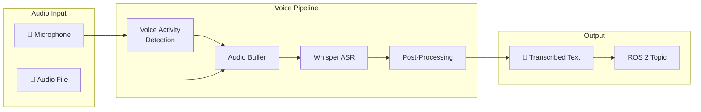

# Voice Pipeline: Integrating OpenAI Whisper

The voice pipeline converts spoken commands into text that can be understood by the robot. This chapter covers implementing OpenAI Whisper for robust speech-to-text conversion in a ROS 2 environment.



## 🧠 Understanding Whisper

### What is Whisper?

OpenAI Whisper is a state-of-the-art automatic speech recognition (ASR) model trained on 680,000 hours of multilingual data. Key features:

| Feature | Description |
|---------|-------------|
| **Multilingual** | Supports 99 languages |
| **Robust** | Handles noise, accents, technical terms |
| **Flexible** | Various model sizes for different needs |
| **Open Source** | Available for local deployment |

### Model Sizes

| Model | Parameters | VRAM | Speed | Accuracy |
|-------|------------|------|-------|----------|
| `tiny` | 39M | ~1GB | 32x | Good |
| `base` | 74M | ~1GB | 16x | Better |
| `small` | 244M | ~2GB | 6x | Great |
| `medium` | 769M | ~5GB | 2x | Excellent |
| `large-v3` | 1550M | ~10GB | 1x | Best |

---

## 🛠️ Installation

### Python Dependencies

```bash
# Create virtual environment
python -m venv venv
source venv/bin/activate  # Linux/Mac
# or: .\venv\Scripts\activate  # Windows

# Install Whisper
pip install openai-whisper

# For faster inference with CUDA
pip install torch torchvision torchaudio --index-url https://download.pytorch.org/whl/cu118

# Audio processing
pip install sounddevice numpy scipy

# ROS 2 Python dependencies
pip install rclpy
```

### System Dependencies

```bash
# Ubuntu: Install FFmpeg for audio processing
sudo apt install ffmpeg portaudio19-dev

# For real-time audio
sudo apt install python3-pyaudio
```

---

## 🎤 Basic Whisper Usage

### Transcribing Audio Files

```python
#!/usr/bin/env python3
"""Basic Whisper transcription example."""

import whisper

# Load model (downloads on first run)
model = whisper.load_model("base")

# Transcribe audio file
result = model.transcribe("command.wav")

print(f"Transcription: {result['text']}")
print(f"Language: {result['language']}")
print(f"Segments: {len(result['segments'])}")

# Access individual segments with timestamps
for segment in result['segments']:
    print(f"[{segment['start']:.2f}s - {segment['end']:.2f}s] {segment['text']}")
```

### Real-Time Microphone Input

```python
#!/usr/bin/env python3
"""Real-time speech recognition with Whisper."""

import whisper
import sounddevice as sd
import numpy as np
from scipy.io.wavfile import write
import tempfile
import os


class RealtimeWhisper:
    """Real-time speech recognition."""
    
    def __init__(self, model_size: str = "base"):
        print(f"Loading Whisper {model_size} model...")
        self.model = whisper.load_model(model_size)
        self.sample_rate = 16000
        print("Model loaded!")
    
    def record_audio(self, duration: float = 5.0) -> np.ndarray:
        """Record audio from microphone."""
        print(f"Recording for {duration} seconds...")
        audio = sd.rec(
            int(duration * self.sample_rate),
            samplerate=self.sample_rate,
            channels=1,
            dtype=np.float32
        )
        sd.wait()
        print("Recording complete!")
        return audio.flatten()
    
    def transcribe_audio(self, audio: np.ndarray) -> str:
        """Transcribe audio array."""
        # Whisper expects float32 audio normalized to [-1, 1]
        audio = audio.astype(np.float32)
        
        # Transcribe
        result = self.model.transcribe(
            audio,
            fp16=False,  # Set True if using GPU
            language="en"
        )
        
        return result['text'].strip()
    
    def listen_and_transcribe(self, duration: float = 5.0) -> str:
        """Record and transcribe in one step."""
        audio = self.record_audio(duration)
        text = self.transcribe_audio(audio)
        return text


def main():
    whisper_asr = RealtimeWhisper(model_size="base")
    
    print("\n🎤 Speak your command...")
    text = whisper_asr.listen_and_transcribe(duration=5.0)
    print(f"\n📝 You said: '{text}'")


if __name__ == "__main__":
    main()
```

---

## 🔊 Voice Activity Detection (VAD)

VAD detects when speech starts and stops, enabling push-to-talk-free operation.

### Simple Energy-Based VAD

```python
#!/usr/bin/env python3
"""Voice Activity Detection using energy threshold."""

import numpy as np
import sounddevice as sd
from collections import deque


class EnergyVAD:
    """Simple energy-based Voice Activity Detection."""
    
    def __init__(
        self,
        sample_rate: int = 16000,
        frame_duration_ms: int = 30,
        energy_threshold: float = 0.01,
        silence_duration_ms: int = 500
    ):
        self.sample_rate = sample_rate
        self.frame_size = int(sample_rate * frame_duration_ms / 1000)
        self.energy_threshold = energy_threshold
        self.silence_frames = int(silence_duration_ms / frame_duration_ms)
        
        self.is_speaking = False
        self.silent_frames = 0
        self.audio_buffer = []
    
    def process_frame(self, frame: np.ndarray) -> tuple[bool, np.ndarray | None]:
        """
        Process an audio frame.
        Returns (speech_ended, audio_segment).
        """
        energy = np.sqrt(np.mean(frame ** 2))
        
        if energy > self.energy_threshold:
            # Speech detected
            self.is_speaking = True
            self.silent_frames = 0
            self.audio_buffer.extend(frame)
            return False, None
        
        elif self.is_speaking:
            # Silence after speech
            self.silent_frames += 1
            self.audio_buffer.extend(frame)
            
            if self.silent_frames >= self.silence_frames:
                # End of utterance
                audio = np.array(self.audio_buffer, dtype=np.float32)
                self.audio_buffer = []
                self.is_speaking = False
                self.silent_frames = 0
                return True, audio
        
        return False, None
    
    def stream_callback(self, indata, frames, time, status):
        """Callback for sounddevice stream."""
        if status:
            print(f"Audio status: {status}")
        
        frame = indata[:, 0].copy()
        speech_ended, audio = self.process_frame(frame)
        
        if speech_ended and audio is not None:
            self.on_speech_complete(audio)
    
    def on_speech_complete(self, audio: np.ndarray):
        """Override this method to handle complete utterances."""
        print(f"Speech segment: {len(audio) / self.sample_rate:.2f}s")


class WhisperVAD(EnergyVAD):
    """VAD with Whisper transcription."""
    
    def __init__(self, model_size: str = "base", **kwargs):
        super().__init__(**kwargs)
        import whisper
        self.model = whisper.load_model(model_size)
    
    def on_speech_complete(self, audio: np.ndarray):
        """Transcribe completed speech segment."""
        result = self.model.transcribe(audio, fp16=False)
        text = result['text'].strip()
        if text:
            print(f"🎤 Heard: '{text}'")


def main():
    vad = WhisperVAD(model_size="base")
    
    print("🎤 Listening... (speak to transcribe, Ctrl+C to exit)")
    
    with sd.InputStream(
        samplerate=vad.sample_rate,
        channels=1,
        blocksize=vad.frame_size,
        callback=vad.stream_callback
    ):
        try:
            while True:
                sd.sleep(100)
        except KeyboardInterrupt:
            print("\nStopped.")


if __name__ == "__main__":
    main()
```

---

## 🤖 ROS 2 Integration

### Whisper ASR Node

```python
#!/usr/bin/env python3
"""ROS 2 node for Whisper speech recognition."""

import rclpy
from rclpy.node import Node
from std_msgs.msg import String
from std_srvs.srv import Trigger
import whisper
import sounddevice as sd
import numpy as np
import threading


class WhisperASRNode(Node):
    """ROS 2 Whisper ASR Node."""
    
    def __init__(self):
        super().__init__('whisper_asr')
        
        # Parameters
        self.declare_parameter('model_size', 'base')
        self.declare_parameter('language', 'en')
        self.declare_parameter('sample_rate', 16000)
        self.declare_parameter('recording_duration', 5.0)
        self.declare_parameter('energy_threshold', 0.01)
        
        model_size = self.get_parameter('model_size').value
        self.language = self.get_parameter('language').value
        self.sample_rate = self.get_parameter('sample_rate').value
        self.duration = self.get_parameter('recording_duration').value
        self.energy_threshold = self.get_parameter('energy_threshold').value
        
        # Load Whisper model
        self.get_logger().info(f'Loading Whisper {model_size} model...')
        self.model = whisper.load_model(model_size)
        self.get_logger().info('Model loaded!')
        
        # Publishers
        self.transcription_pub = self.create_publisher(
            String, 
            '/speech/transcription', 
            10
        )
        
        self.command_pub = self.create_publisher(
            String,
            '/speech/command',
            10
        )
        
        # Services
        self.listen_srv = self.create_service(
            Trigger,
            '/speech/listen',
            self.listen_callback
        )
        
        # State
        self.is_listening = False
        self.continuous_mode = False
        
        # Start continuous listening in background
        self.declare_parameter('continuous', False)
        if self.get_parameter('continuous').value:
            self.start_continuous_listening()
        
        self.get_logger().info('🎤 Whisper ASR Node ready!')
    
    def listen_callback(self, request, response):
        """Handle listen service request."""
        if self.is_listening:
            response.success = False
            response.message = "Already listening"
            return response
        
        # Record and transcribe
        text = self.record_and_transcribe()
        
        response.success = True
        response.message = text
        return response
    
    def record_and_transcribe(self) -> str:
        """Record audio and transcribe."""
        self.is_listening = True
        self.get_logger().info(f'Recording for {self.duration}s...')
        
        # Record audio
        audio = sd.rec(
            int(self.duration * self.sample_rate),
            samplerate=self.sample_rate,
            channels=1,
            dtype=np.float32
        )
        sd.wait()
        audio = audio.flatten()
        
        # Check if audio contains speech
        energy = np.sqrt(np.mean(audio ** 2))
        if energy < self.energy_threshold:
            self.is_listening = False
            self.get_logger().info('No speech detected')
            return ""
        
        # Transcribe
        self.get_logger().info('Transcribing...')
        result = self.model.transcribe(
            audio,
            language=self.language,
            fp16=False
        )
        
        text = result['text'].strip()
        self.is_listening = False
        
        # Publish transcription
        msg = String()
        msg.data = text
        self.transcription_pub.publish(msg)
        self.command_pub.publish(msg)
        
        self.get_logger().info(f'Transcribed: "{text}"')
        return text
    
    def start_continuous_listening(self):
        """Start continuous listening mode."""
        self.continuous_mode = True
        thread = threading.Thread(target=self._continuous_listen_loop, daemon=True)
        thread.start()
        self.get_logger().info('Continuous listening mode started')
    
    def _continuous_listen_loop(self):
        """Continuous listening loop."""
        while self.continuous_mode and rclpy.ok():
            self.record_and_transcribe()


def main(args=None):
    rclpy.init(args=args)
    
    node = WhisperASRNode()
    
    try:
        rclpy.spin(node)
    except KeyboardInterrupt:
        pass
    finally:
        node.destroy_node()
        rclpy.shutdown()


if __name__ == '__main__':
    main()
```

### Launch File

```python
#!/usr/bin/env python3
"""Launch Whisper ASR node."""

from launch import LaunchDescription
from launch.actions import DeclareLaunchArgument
from launch.substitutions import LaunchConfiguration
from launch_ros.actions import Node


def generate_launch_description():
    return LaunchDescription([
        DeclareLaunchArgument('model_size', default_value='base'),
        DeclareLaunchArgument('language', default_value='en'),
        DeclareLaunchArgument('continuous', default_value='true'),
        
        Node(
            package='vla_robot',
            executable='whisper_asr_node',
            name='whisper_asr',
            parameters=[{
                'model_size': LaunchConfiguration('model_size'),
                'language': LaunchConfiguration('language'),
                'continuous': LaunchConfiguration('continuous'),
                'recording_duration': 5.0,
            }],
            output='screen'
        ),
    ])
```

---

## 🔧 Optimization Tips

### Faster Inference with Whisper.cpp

```bash
# Clone whisper.cpp
git clone https://github.com/ggerganov/whisper.cpp.git
cd whisper.cpp

# Build with CUDA support
make GGML_CUDA=1

# Download model
./models/download-ggml-model.sh base.en

# Use from Python
pip install pywhispercpp
```

```python
from pywhispercpp.model import Model

model = Model('base.en', n_threads=4)
result = model.transcribe('audio.wav')
print(result)
```

### Streaming Transcription

```python
"""Streaming transcription for lower latency."""

import whisper
import numpy as np

class StreamingWhisper:
    def __init__(self, model_size: str = "base"):
        self.model = whisper.load_model(model_size)
        self.buffer = np.array([], dtype=np.float32)
        self.sample_rate = 16000
    
    def add_audio(self, chunk: np.ndarray):
        """Add audio chunk to buffer."""
        self.buffer = np.concatenate([self.buffer, chunk])
    
    def transcribe_buffer(self) -> str:
        """Transcribe current buffer."""
        if len(self.buffer) < self.sample_rate:  # Min 1 second
            return ""
        
        result = self.model.transcribe(self.buffer, fp16=False)
        return result['text'].strip()
    
    def clear_buffer(self):
        """Clear the audio buffer."""
        self.buffer = np.array([], dtype=np.float32)
```

---

## 📊 Testing the Pipeline

### Test Commands

```bash
# Launch ASR node
ros2 launch vla_robot whisper_asr.launch.py

# In another terminal, trigger listening
ros2 service call /speech/listen std_srvs/srv/Trigger

# Or monitor continuous output
ros2 topic echo /speech/transcription
```

### Test Audio Files

```python
#!/usr/bin/env python3
"""Test Whisper with sample audio files."""

import whisper

model = whisper.load_model("base")

# Test commands
test_phrases = [
    "go_to_kitchen.wav",
    "pick_up_cup.wav", 
    "clean_the_room.wav",
]

for audio_file in test_phrases:
    result = model.transcribe(audio_file)
    print(f"{audio_file}: '{result['text']}'")
```

---

## 📚 Summary

| Component | Purpose |
|-----------|---------|
| **Whisper Model** | State-of-the-art ASR |
| **VAD** | Detect speech boundaries |
| **ROS 2 Node** | Publish transcriptions |
| **Streaming** | Lower latency |

:::info Next Chapter
Now let's turn transcribed text into robot actions!

**[Continue to Cognitive Logic →](./cognitive-logic)**
:::
