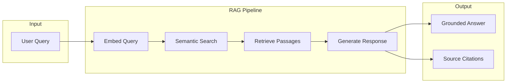
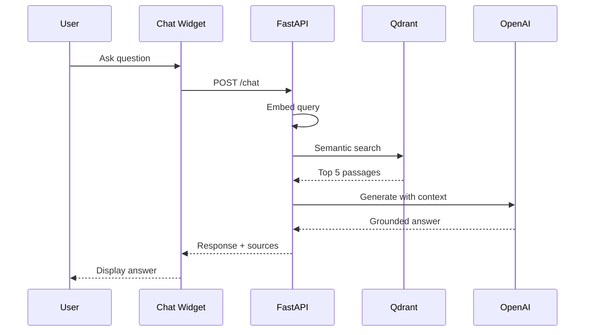

# RAG Chatbot – Retrieval-Augmented Humanoid AI Assistant

Build a knowledge-grounded chatbot that answers questions from this textbook using Retrieval-Augmented Generation (RAG).



## 🎯 Module Goals

By the end of this module, you will:

- **Ingest** book content into a vector database (Qdrant)
- **Retrieve** relevant passages using semantic search
- **Generate** accurate answers via OpenAI models
- **Deploy** a FastAPI-based RAG backend
- **Integrate** the chatbot with the Docusaurus frontend

---

## 🏗️ Architecture Overview

| Component | Technology | Purpose |
|-----------|------------|---------|
| **Embeddings** | `all-MiniLM-L6-v2` | Convert text to vectors (local) |
| **Vector Store** | Qdrant | Store and search embeddings |
| **LLM** | OpenAI GPT-4o-mini | Generate grounded responses |
| **Backend** | FastAPI | REST API for chat |
| **Frontend** | React Widget | User interface |

### Data Flow



---

## 📂 Project Structure

```
rag-backend/
├── .env.example          # Environment template
├── requirements.txt      # Python dependencies
├── config.py             # Configuration
├── ingest.py             # Data ingestion pipeline
├── retrieval.py          # Semantic search
├── generation.py         # Response generation
├── main.py               # FastAPI application
└── tests/
    └── test_pipeline.py  # Unit tests
```

---

## 🚀 Quick Start

```bash
# 1. Install dependencies
cd my-website/rag-backend
pip install -r requirements.txt

# 2. Configure environment
cp .env.example .env
# Edit .env with your OpenAI API key

# 3. Start Qdrant (Docker)
docker run -p 6333:6333 qdrant/qdrant

# 4. Ingest book content
python ingest.py

# 5. Start the API
uvicorn main:app --reload

# 6. Test it!
curl -X POST http://localhost:8000/chat \
  -H "Content-Type: application/json" \
  -d '{"query": "What is ROS 2?"}'
```

---

## 📚 Chapters

| Chapter | Topic |
|---------|-------|
| [Setup Guide](./setup) | Installation and configuration |
| [API Reference](./api-reference) | Endpoint documentation |
| [Integration](./integration) | Frontend integration |

:::tip Try the Chatbot!
Look for the floating chat button in the bottom-right corner of any page. Ask questions about ROS 2, Isaac Sim, SLAM, or any topic from this book!
:::
