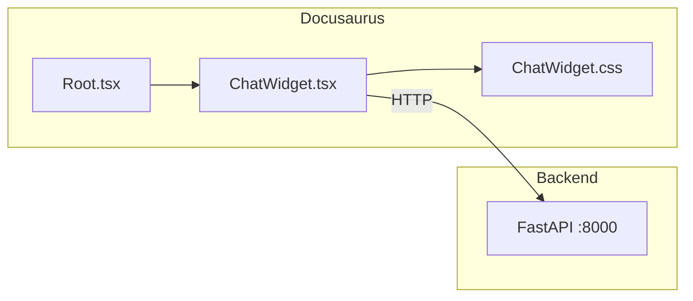

# Frontend Integration

Connect the RAG chatbot to your Docusaurus frontend.

## Chat Widget

The chat widget is a React component that provides an interactive chat interface on every page.



---

## Component Structure

```
src/
├── components/
│   └── ChatWidget/
│       ├── ChatWidget.tsx    # React component
│       └── ChatWidget.css    # Styles
└── theme/
    └── Root.tsx              # Theme wrapper
```

---

## ChatWidget Props

| Prop | Type | Default | Description |
|------|------|---------|-------------|
| `apiUrl` | string | `http://localhost:8000` | RAG backend URL |

---

## Customizing the Widget

### Change API URL

For production, update the API URL in `Root.tsx`:

```tsx title="src/theme/Root.tsx"
const RAG_API_URL = 'https://your-production-api.com';

export default function Root({ children }) {
  return (
    <>
      {children}
      <ChatWidget apiUrl={RAG_API_URL} />
    </>
  );
}
```

### Using Environment Variables

```tsx title="src/theme/Root.tsx"
const RAG_API_URL = process.env.RAG_API_URL || 'http://localhost:8000';
```

---

## Styling Customization

The widget uses CSS variables for easy theming. Edit `ChatWidget.css`:

```css title="src/components/ChatWidget/ChatWidget.css"
/* Change the primary gradient */
.chat-toggle {
  background: linear-gradient(135deg, #your-color-1 0%, #your-color-2 100%);
}

/* Adjust widget size */
.chat-window {
  width: 400px;  /* Default: 380px */
  height: 600px; /* Default: 520px */
}
```

---

## Dark Mode Support

The widget automatically supports Docusaurus dark mode using `[data-theme='dark']` selectors:

```css
/* Light mode */
.message.assistant .message-content {
  background: #f0f2f5;
  color: #1a1a2e;
}

/* Dark mode */
[data-theme='dark'] .message.assistant .message-content {
  background: rgba(60, 60, 80, 0.8);
  color: #e0e0e0;
}
```

---

## Programmatic Usage

Import and use the widget directly in any component:

```tsx
import ChatWidget from '@site/src/components/ChatWidget/ChatWidget';

function MyPage() {
  return (
    <div>
      <h1>My Custom Page</h1>
      <ChatWidget apiUrl="http://localhost:8000" />
    </div>
  );
}
```

---

## CORS Configuration

The FastAPI backend has CORS enabled for all origins (development). For production, restrict to your domain:

```python title="rag-backend/main.py"
app.add_middleware(
    CORSMiddleware,
    allow_origins=["https://your-docusaurus-site.com"],
    allow_credentials=True,
    allow_methods=["*"],
    allow_headers=["*"],
)
```

---

## Deployment Checklist

- [ ] Update `apiUrl` to production backend URL
- [ ] Configure CORS for production domain
- [ ] Set proper environment variables
- [ ] Test chat functionality end-to-end

:::tip
The chat widget appears as a floating button in the bottom-right corner. Users can click it to open the chat interface and ask questions about any topic in the book!
:::
