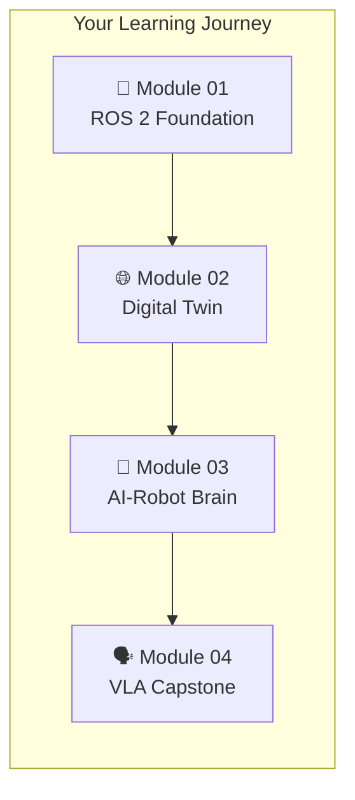

# Physical AI & Humanoid Robotics

Welcome to the comprehensive textbook for building **intelligent humanoid robots**. This course takes you from ROS 2 fundamentals to creating an autonomous voice-controlled robot that understands natural language commands.



## 🎯 What You'll Build

By the end of this course, you'll have created a complete **Autonomous Humanoid** that can:

- ✅ **Listen** to voice commands using OpenAI Whisper
- ✅ **Understand** natural language with LLM reasoning
- ✅ **See** its environment with simulated sensors
- ✅ **Navigate** autonomously between locations
- ✅ **Execute** complex multi-step tasks

## 📚 Course Modules

### [Module 01: The Robotic Nervous System](./robotic-nervous-system/)

Establish the middleware foundation for robot control.

| Topic | Description |
|-------|-------------|
| **ROS 2 Architecture** | Nodes, Topics, Services, and Actions |
| **Python Bridging** | Connect AI to hardware with `rclpy` |
| **Humanoid Anatomy** | URDF robot description |
| **🎯 Deliverable** | Hello Robot node + bipedal URDF |

---

### [Module 02: The Digital Twin](./digital-twin/)

Master physics simulation and high-fidelity environment building.

| Topic | Description |
|-------|-------------|
| **Physics Engines** | Gazebo gravity, friction, collision |
| **Rendering** | Unity for human-robot interaction |
| **Sensor Simulation** | LiDAR, cameras, IMU |
| **🎯 Deliverable** | Robot sensing walls and obstacles |

---

### [Module 03: The AI-Robot Brain](./ai-robot-brain/)

Implement advanced perception and autonomous navigation.

| Topic | Description |
|-------|-------------|
| **Isaac Sim** | Synthetic data generation |
| **Visual SLAM** | Mapping and localization |
| **Navigation** | Nav2 bipedal path planning |
| **🎯 Deliverable** | Map a room, navigate A→B |

---

### [Module 04: Vision-Language-Action](./vision-language-action/)

The convergence of LLMs and Physical Robotics (Capstone).

| Topic | Description |
|-------|-------------|
| **Voice Pipeline** | OpenAI Whisper speech-to-text |
| **Cognitive Logic** | LLM command parsing |
| **🎓 Capstone** | The Autonomous Humanoid |

---

## 🛠️ Prerequisites

Before starting, ensure you have:

- **Ubuntu 22.04 LTS** (recommended) or Windows with WSL2
- **Python 3.10+**
- **ROS 2 Humble** or later
- **NVIDIA GPU** (GTX 1060+ recommended for simulation)
- Basic Python programming knowledge

## 🚀 Quick Start

```bash
# Install ROS 2 Humble
sudo apt install ros-humble-desktop

# Clone course materials
git clone https://github.com/your-repo/physical-ai-robotics.git
cd physical-ai-robotics

# Start with Module 01
cd module-01-ros2
```

## 📖 How to Use This Textbook

1. **Follow sequentially** — Each module builds on the previous
2. **Complete deliverables** — Hands-on projects reinforce concepts
3. **Use the code** — All examples are copy-paste ready
4. **Experiment** — Modify and extend the examples

:::tip Learning Path
Spend approximately **2-3 hours per chapter**. The entire course takes about **40-50 hours** to complete.
:::

## 🎓 Course Outcomes

Upon completion, you will be able to:

| Skill | Application |
|-------|-------------|
| Build ROS 2 nodes | Custom robot behaviors |
| Create URDF models | Any robot geometry |
| Simulate physics | Test before deployment |
| Implement SLAM | Autonomous mapping |
| Integrate LLMs | Natural language control |
| Deploy navigation | Point-to-point autonomy |

---

## 🚀 Begin Your Journey

Ready to build intelligent robots?

**[Start Module 01: The Robotic Nervous System →](./robotic-nervous-system/)**

---

:::info About This Course
This textbook provides a comprehensive guide to Physical AI and Humanoid Robotics, covering the complete stack from ROS 2 middleware to LLM-based reasoning. All code examples are production-ready and extensively documented.
:::
