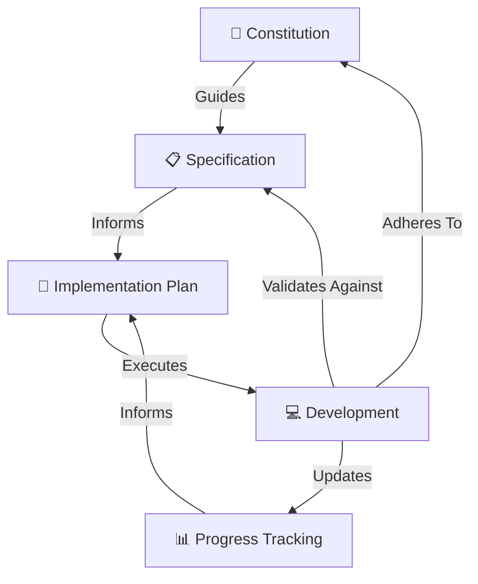

# Project Specifications

This folder contains the foundational specifications for the **Physical AI & Humanoid Robotics** textbook project. These documents follow a **Spec-Driven Development** methodology, ensuring all development is guided by clear, documented requirements.

---

## 📁 Folder Contents

### 1. [`constitution.md`](./constitution.md)
**The Project's Governing Document**

Defines the foundational principles, values, and rules that govern all aspects of the project. This document serves as the supreme reference for:
- Mission statement and core principles
- Technical architecture and constraints
- Quality standards and best practices
- Roles, responsibilities, and governance
- Security and compliance requirements

**When to reference:**
- Before making architectural decisions
- When evaluating new features or changes
- During code reviews and quality checks
- When onboarding new contributors

---

### 2. [`specify.md`](./specify.md)
**The "What" - Detailed Requirements**

Provides comprehensive specifications for what needs to be built, including:
- Project objectives and success criteria
- Target audience and user personas
- System architecture and components
- Content structure and organization
- Technical specifications (frontend, backend, data layer)
- Design specifications (UI/UX, visual design)
- Performance, security, and testing requirements

**When to reference:**
- When planning new features
- During implementation to verify requirements
- When writing tests to ensure coverage
- During acceptance testing

---

### 3. [`plan.md`](./plan.md)
**The "How" - Implementation Strategy**

Outlines the technical approach and execution plan, including:
- Development phases and timeline
- Technical stack details
- Implementation workflow
- Testing and deployment strategy
- Progress tracking and metrics
- Risk management and mitigation

**When to reference:**
- When starting a new development phase
- During sprint planning
- When estimating timelines
- When troubleshooting blockers

---

### 4. Module Specifications
**Detailed Requirements by Module**

Detailed specifications, implementation details, and deliverables for each course module:

| Module | Spec File | Status |
|--------|-----------|--------|
| **01 ROS 2** | [`01-robotic-nervous-system/README.md`](./01-robotic-nervous-system/README.md) | ✅ Complete |
| **02 Digital Twin** | [`02-digital-twin/README.md`](./02-digital-twin/README.md) | 🔄 In Progress |
| **03 AI-Robot Brain** | [`03-ai-robot-brain/README.md`](./03-ai-robot-brain/README.md) | ⏳ Not Started |
| **04 Vision-Language-Action** | [`04-vision-language-action/README.md`](./04-vision-language-action/README.md) | ⏳ Not Started |
| **05 RAG Chatbot** | [`05-rag-chatbot/README.md`](./05-rag-chatbot/README.md) | ✅ Complete |

**When to reference:**
- When working on specific module content
- To check deliverables and code requirements
- To verify learning objectives

---

## 🎯 Spec-Driven Development Workflow

### Process Flow

1. **Reference Constitution** → Understand governing principles
2. **Review Specification** → Understand requirements
3. **Follow Plan** → Execute implementation
4. **Validate** → Ensure adherence to specs
5. **Update** → Keep documents current

---

## 🔄 Document Lifecycle

### Version Control
All specification documents are version-controlled and follow semantic versioning:
- **Major version** (1.0 → 2.0): Breaking changes or fundamental shifts
- **Minor version** (1.0 → 1.1): New features or significant additions
- **Patch version** (1.0.0 → 1.0.1): Clarifications or minor corrections

### Update Process
1. Identify need for change
2. Document rationale
3. Update relevant specification(s)
4. Increment version number
5. Update "Last Modified" date
6. Commit with descriptive message

---

## 📊 Current Status

| Document | Version | Last Updated | Status |
|----------|---------|--------------|--------|
| constitution.md | 1.0 | 2026-01-04 | ✅ Active |
| specify.md | 1.0 | 2026-01-04 | ✅ Active |
| plan.md | 1.0 | 2026-01-04 | ✅ Active |

**Overall Project Completion: ~65%**

---

## 🎓 How to Use These Specs

### For Developers
1. Read `constitution.md` to understand project values
2. Review `specify.md` for feature requirements
3. Follow `plan.md` for implementation guidance
4. Reference specs during development
5. Update specs when requirements change

### For Contributors
1. Start with `constitution.md` to understand the project
2. Check `specify.md` for what needs to be built
3. Review `plan.md` to see current progress
4. Propose changes via pull requests
5. Ensure contributions align with specs

### For AI Agents
1. Always reference `constitution.md` for decision-making
2. Validate implementations against `specify.md`
3. Follow workflows defined in `plan.md`
4. Document all changes and rationale
5. Maintain consistency across all work

---

## 🔗 Related Documentation

- **Project README**: [`../README.md`](../README.md)
- **Content Documentation**: [`../docs/`](../docs/)
- **RAG Backend**: [`../rag-backend/README.md`](../rag-backend/README.md)
- **Development History**: [`../history/`](../history/)

---

## 📝 Contributing to Specs

### Proposing Changes

If you believe a specification needs updating:

1. **Open an Issue**
   - Describe the proposed change
   - Provide rationale
   - Explain impact

2. **Submit Pull Request**
   - Update relevant spec document(s)
   - Increment version number
   - Update "Last Modified" date
   - Provide detailed commit message

3. **Review Process**
   - Maintainers review proposal
   - Community discussion (if needed)
   - Approval or revision
   - Merge and deploy

### Specification Guidelines

When updating specifications:
- ✅ Be clear and specific
- ✅ Use consistent terminology
- ✅ Include examples where helpful
- ✅ Consider downstream impacts
- ✅ Maintain backward compatibility when possible
- ✅ Document breaking changes explicitly

---

## 🌟 Benefits of Spec-Driven Development

### For the Project
- **Clarity**: Everyone understands what's being built
- **Consistency**: All work aligns with defined standards
- **Quality**: Specifications serve as acceptance criteria
- **Efficiency**: Less rework due to clear requirements

### For Developers
- **Guidance**: Clear direction for implementation
- **Confidence**: Know when work is complete
- **Collaboration**: Shared understanding across team
- **Documentation**: Specs serve as living documentation

### For Users
- **Predictability**: Know what to expect
- **Quality**: Consistent, well-thought-out features
- **Transparency**: Understand project direction
- **Trust**: Confidence in project governance

---

## 📞 Questions?

If you have questions about these specifications:
- Open a [GitHub Discussion](https://github.com/Kashi25809/Hackathon-final/discussions)
- File an [Issue](https://github.com/Kashi25809/Hackathon-final/issues)
- Contact maintainers

---

## 📄 License

These specification documents are part of the Physical AI & Humanoid Robotics project and are licensed under:
- **Content**: Creative Commons BY-SA 4.0
- **Code Examples**: MIT License

---

**Last Updated:** January 4, 2026  
**Maintained By:** Project Maintainers  
**Status:** Active Development
